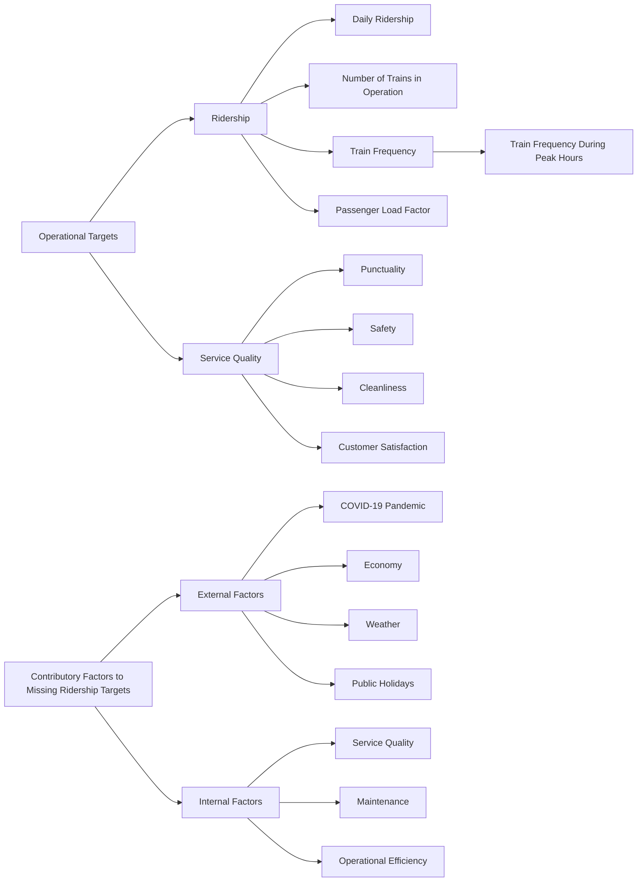
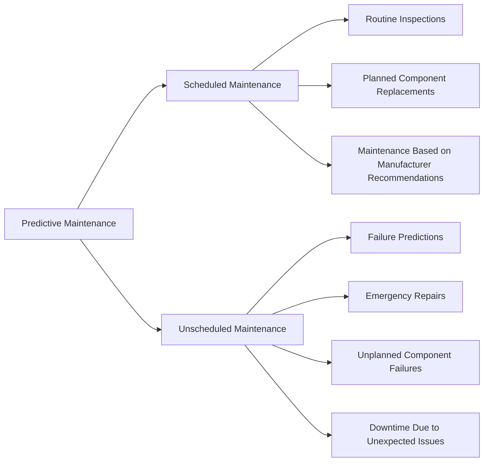

<Note>
  This chapter is developed with a curriculum from the analytics consultants at Supertype, with advice from Bu Damaris Misdyaweni, Learning and Development Head of PT. MRT Jakarta.  
 
  Specific sections may be added over time to better reflect the needs and challenges of incorporating AI in the public rail transportation sector.
</Note>

## Introduction: AI in Public Rail Transportation

The public rail transportation sector is a critical part of urban infrastructure in the Greater Jakarta area, and its 13 stations currently serve over 100,000 passengers daily with [peak daily ridership rising up to 163,162](https://jakartamrt.co.id/id/info-terkini/163162-orang-tercatat-gunakan-ratangga-pada-15-november-2023). 

When compared to other modes of transportation, rail transportation is often considered more efficient, reliable, and environmentally friendly. However, the sector as a whole does face challenges such as congestion, safety, and maintenance, much like other modes of public transportation.

A table depicting the daily ridership of MRT Jakarta vs similar rapid transit systems in neighboring countries:

| Rapid Transit System | Daily Ridership 2023 | Annual Ridership 2023 |
|-----------------------|---------------------|-----------------------|
| MRT Jakarta           | 91,000              | 33.5 million          |
| MRT Kuala Lumpur      | 271,6051 | 92.4 million2|
| MRT Bangkok           | 409,0003 | 149 million           |
| MRT Singapore         | 3.5 million4| 1.3 billion           |

When it comes to operational targets, the public rail transportation sector has two sets of key performance indicators (KPIs) to monitor and improve:

1. **Riderships**
* 1.1 Daily ridership
* 1.2 Number of Operational Trains
* 1.3 Train frequency (typically measured in minutes and also known as headway) 
    * 1.3.1 Train frequency during peak hours
* 1.4 Passenger load factor

2. **Service Quality**
* 2.1 Punctuality
* 2.2 Safety
* 2.3 Customer satisfaction

Understanding these operational objectives is crucial as it helps inform -- and direct -- the use of AI technologies in the public rail transportation sector
toward actual business needs and challenges for MRT Jakarta. 

Instead of focusing on the technology (AI, machine learning, etc.), we want to focus on the business problems and challenges that AI can help solve in the public rail transportation sector.

### The MKBF Framework
MKBF is short for "Mean Kilometers Between Failure (MKBF)" and is a metric used to measure the reliability of a system. It is calculated by dividing the total number of kilometers traveled by the system by the number of failures that have occurred. The higher the MKBF, the more reliable the system is.
For the sake of benchmarking, one million MKBF is considered a gold standard for rail transportation systems worldwide.

To effectively implement MKBF, the public rail transportation sector must have a robust data collection and analysis system in place. It should also adopt a consistent definitions (i.e. what constitutes a failure) and data collection methods to ensure that any incident reporting is timely, accurate and reliable.

> “What is termed as disruption is when the train is stationary for more than five minutes. A more serious disruption is when the train does not move for more than 15 minutes. We may have reduced the number of disruptions, but we are certainly far from satisfied. Hopefully, by 2026, our MKBF will reach one million km.
>
> - Transport Minister Anthony Loke, Malaysia

Building a robust data infrastructure unlocks these opportunities for MRT Jakarta to adopt modern AI technologies, as well as adapting to new frameworks of reliability, such as the MBKF, and position itself 
as a regional leader in public rail transportation.

### Contributory Factors to _Missing_ Ridership Targets

When it comes to missing targets, we can group them into two categories: external and internal factors. External factors are 
generally outside the control of the public rail transportation sector ("_Unsolvable_"), such as the economy, weather, or public holidays. Internal factors, on the other hand, 
are within the control ("Solvable", or "Partially Solvable") of the company and sector, such as service quality, maintenance, and operational efficiency. 

A recent and notable example of an external factor that is **Unsolvable* is the COVID-19 pandemic, which has significantly impacted ridership across all public transportation modes. Take a look at the ridership 
data for MRT Bangkok, and we can observe a steep drop in ridership in 2020, and a gradual recovery over the next three years:

| Year | Total Ridership | Average Daily Ridership |
|------|-----------------|-------------------------|
| 2011 | 69,024,000      | 189,083                 |
| 2012 | 80,575,000      | 220,167                 |
| 2013 | 86,427,000      | 236,833                 |
| 2014 | 92,403,000      | 253,417                 |
| 2015 | 95,044,000      | 260,500                 |
| 2016 | 100,106,000     | 273,583                 |
| 2017 | 107,484,000     | 294,476                 |
| 2018 | 113,355,000     | 310,561                 |
| 2019 | 122,559,000     | 335,778                 |
| 2020 | 94,942,000      | 259,404                 |
| 2021 | 53,319,000      | 146,079                 |
| 2022 | 98,577,000      | 270,073                 |

Examples of internal factors would be out-of-service trains, or trains running behind schedule due to maintenance issues. Even though these are internal factors, they can still be influenced by external factors. For example, a train might be out of service due to a lack of spare parts, which could be caused by supply chain disruptions due to the pandemic.

So while it is fair to classify these factors as internal or external, it is important to remember that they are not always independent of each other, or that they can influence each other in complex ways.

To add to the above points, consider a 2024 report released by the Auditor-General's Department of Malaysia, which found that both MRT1 and MRT2 missed their daily ridership and frequency targets in 2023.

| Rapid Transit System | Daily Ridership 2023 | Ridership Target 2023 | Percent of Target | Target Frequency 2023 | Actual Frequency 2023 |
|-----------------------|---------------------|----------------------|-------------------|----------------------| ----------------------|
| MRT1                | 182,1961 | 520,000              | 35%               | 48 trains, every 3 mins | 32 trains, every 5 mins |
| MRT2                | 89,4091  | 196,000              | 46%               | 45 trains, every 4 mins | 37 trains, every 5 mins |

What was also interesting was the MRT2's frequency target in 2022 was actually met (during peak hours it was able to maintain a 4 minute headway). At the time of the report, the number of trains for MRT2 has 
increased to 49, but only 42 (86%) were operational.
- Two (4.1%) were only deployed during peak hours due to a faulty smoke detector unit
- Four (8.2%) were not used due to vibration issues and cable failures
- One (2.0%) was not used due to damage

The report also revealed that the Mass Rapid Transit Corporation Sdn Bhd (MRT Corp), in its response to the findings, said that factors such as targeted fuel subsidies, the introduction of 
congestion charges and the rise in parking fees around the capital area could help increase ridership on both MRT lines. 

Furthermore, it explained that the number of trains in operation was also afected due to a mismatch in the maintenance parts:

> ... the number of trains in operation did not meet the target due to a mismatch in their profile and the wheels to be used for changing.
>
> The wheel reprofiling process is underway and is expected to be fully completed by November
>

  <Card
    title="Open Ended Discussion"
    icon="dumbbell"
  >
  As an exercise, please split into groups and draw up a list of (1) targets, and (2) contributory factors to missing targets for MRT Jakarta. 
  Be detailed and specific in your answers, and relate these risks to the operational objectives set by the company for 2025.
  </Card>

## Predictive Maintenance
One major area where AI can be applied in the public rail transportation sector is predictive maintenance. Predictive maintenance is the practice of using data and analytics to predict when equipment will fail so that maintenance can be performed just in time. This approach has several advantages over traditional maintenance strategies, 
such as reducing downtime, extending the life of equipment, and lowering maintenance costs.

At Supertype, we have extensive experience with predictive maintenance in the mining and energy industry, and have worked tirelessly with PT. Adaro Mining Technologies and PT. Saptaindra Sejati to implement predictive maintenance solutions that have saved millions of dollars in maintenance costs and increased equipment uptime. Here is how it works:

1. Classifying breakdowns into Solvable and Unsolvable brackets; All machineries are prone to breakdowns, but not all breakdowns are equal. Some breakdowns are due to external factors that are outside the control of the company. Breakdowns that are due to internal factors and solvable include areas such as poor maintenance practices or operator error. By classifying breakdowns into Solvable and Unsolvable brackets, companies can focus their efforts on preventing the breakdowns that are most likely to occur and have the biggest impact on their operations.

2. Data Collection: The first step in implementing a predictive maintenance solution is to collect data from the equipment that needs to be monitored. This data can come from a variety of sources, such as sensors, 
   maintenance logs, historical data, lab tests, and more.

3. Data Processing Pipelines: Once the data has been collected, it needs to be processed and analyzed to extract useful information. This is typically done using a data processing pipeline, which is a series of steps that take raw data and turn it into actionable insights. This pipeline can include steps such as data cleaning, feature engineering, model training, and model evaluation.

4. Pattern Discovery (Unsupervised Learning): One of the key steps in predictive maintenance is to discover patterns in the data that can be used to predict when equipment will fail. This is typically done using unsupervised learning techniques, such as clustering or anomaly detection, which can identify patterns in the data that are not immediately obvious. 

5. Modeling and Prediction: Once the patterns have been discovered, they can be used to build a predictive model that can forecast when equipment will fail. This model can then be used to generate alerts when equipment is at risk of failing, so that maintenance can be performed proactively.

In the diagram above, you should be able to intuit that the "Unscheduled maintenance" is where disruptions to the service occur, and would incur the most costs to the company. 
When we look at opportunities to incorporate AI into the public rail transportation sector, we should focus on the "Unscheduled Maintenance" bracket to reduce costs and improve service reliability, 
and only then move on to the "Scheduled Maintenance" bracket to further optimize maintenance costs.

  <Card
    title="Open Ended Discussion"
    icon="dumbbell"
  >
  As an exercise, brainstorm with your group on the types of data that could be collected to predict when a train is likely to fail. You can extend this exercise into maintenance for station facilities, such as escalators, elevators, and ticketing machines.
  </Card>

## Decision Support Systems
Another area where AI can be applied in the public rail transportation sector is decision support systems. Decision support systems are tools that help people make better decisions by providing them with relevant information and analysis. In the context of the public rail transportation sector, decision support systems can help operators make better decisions about scheduling, maintenance, and resource allocation.

We need not look further than our neighbor to the north, Singapore, where the SMRT's web-based Project Overwatch is deployed 5. 

This project, an award-winning AI-enabled decision support system continuously monitor the rail line in real time and alert staff in the operations control center (OCC) whenever an anomaly is detected. The system uses AI to analyze data from various sources, such as sensors, cameras, and maintenance logs, to detect potential issues before they become serious problems. This allows operators to take corrective action quickly and minimise disruption to commuters. It combines 
video analytics with data analytics of train passenger loading, and anticipate train congestions and delays. SMRT's first deployment of this system was on the Circle Line (CCL), where it manages to reduce by 30 percent in delays of up to 5 minutes. 

It features a dashboard that displays the movements of trains in near real-time, with auto alerts for prolonged train stoppages; A stoppage timer quantifies train stoppage severity by color coding the duration of the stoppage. 
Whenever a train switches out from the fully automated mode (its default settings) into manual mode of operation, Overwatch will automatically trigger a safety alert to prompt the duty controller. Beyond these features, the system also provides information layers such as the train and track fault history and hotspots for train faults.

Also read: [The What and Why of Data Visualization](/data-visualization/dv_introduction.mdx)

> A ticking timer appears above a train in the system’s visualisation of the network when it has stopped for an abnormally long period. The colour of the timer changes as the delays are prolonged, to signal urgency. In a disruption where multiple trains are stalled, this visual cue helps the controller prioritise the recovery effort among the affected trains.
>
> [North-South, East-West MRT lines to get AI-powered system to help improve reliability by end-2024, The Straits Times](https://www.straitstimes.com/singapore/transport/north-south-east-west-mrt-lines-to-get-ai-powered-system-to-help-improve-reliability-by-end-2024)

With the 30 percent drop in delays of up to 5 mins, SMRT claims that the system has contributed to the high reliability of more than 1 million MKBF.

> The CCL was chosen as Overwatch's first deployment in 2020 as being a fully unmanned MRT line posed unique challenges for the OCC in effectively tracking its entire rail operations round-the-clock. 

## Traffic Management and Transportation Planning
Another area where data analytics and AI can be applied is on a more macro level, where urban planners can use data to optimize the public rail transportation system. This can include optimizing train schedules, planning new routes, and improving the overall efficiency of the system.

A starting point for this would be to collect data on passenger demand, train schedules, and station capacities. This data can then be used to build models that predict how changes to the system will impact ridership, travel times, and overall system performance. These include:
- Estimating the number of passengers at each station at different times of the day
- Predicting how changes to train schedules will impact travel times and passenger loads
- Identifying bottlenecks in the system and proposing solutions to alleviate them
- Optimizing train schedules to reduce wait times and improve service reliability
- Planning new routes and stations to better serve the needs of passengers
- Evaluating the impact on delays and disruptions on the overall system
- Determining the "hubness" of each station, and how it can be improved

Singapore, Malaysia and Thailand regularly publish numbers of total passengers on a per station basis, and these numbers are factored into the planning of new routes and stations.

| Rank | Station                  | Line  | Year Total Passengers (2021) |
|------|--------------------------|-------|------------------------------|
| 1    | Sukhumvit                | Blue  | 9,627,729                    |
| 2    | Chatuchak Park           | Blue  | 6,865,636                    |
| 3    | Phra Ram 9               | Blue  | 6,855,613                    |
| 4    | Phetchaburi              | Blue  | 6,791,555                    |
| 5    | Si Lom                   | Blue  | 5,333,875                    |
| ... | ...                      | ...   | ...                          |
| n-2 | Sai Ma             | Purple | 435,570                      |
| n-1 | Sam Yaek Bang Yai  | Purple | 297,085                      |
| n   | Bang Rak Yai       | Purple | 256,539                      |

As observed in the table above, the busiest stations are multiple times busier than the least busy stations. Sometimes, these skews are inevitable as they are located in the city center, or are interchange stations. 
When a station report passenger numbers that are significantly lower than expected, it could be due to a variety of reasons, such as poor accessibility, lack of amenities, or poor connectivity to other modes of transportation. 

In Malaysia, the older and more established mrt line is the Kelana Jaya line. The numbers of passengers for July 2024 for the newer Kajang line is 7,471,333 passengers, coming very close 
to matching the busier, more established Kelana Jaya line (7,559,800 passengers in the same month). This was noteworthy because the 7-year-old Kajang MRT is conceived to serve the underserved corridor between Sungai Buloh and Kajang, and the number of passengers 
validated the anticipated demand for the line by transport planners. 

Beyond correlating passenger numbers with stations or metro lines, we can also correlate passenger numbers with time of day, day of the week, and even weather conditions. This can help planners understand how passenger demand changes over time and how they can adjust train schedules to meet this demand.
Modern day transportation planning also involves the use of simulation models to predict how changes to the system will impact ridership, travel times, and overall system performance, and leveraging big data to correlate them with factors that might impact ridership, such as:
- Incoming tourism numbers (from the Ministry of Tourism), based on the number of tourists arriving at the airport
- Historical data of tourism numbers, to predict future trends
- Weather data, to predict how weather conditions might impact ridership
- Sporting events or concerts in key locations (e.g. Gelora Bung Karno Stadium)
- Changes to working hours, e.g. during the Ramadhan period

## Author
This chapter is written by [Samuel Chan](https://www.linkedin.com/in/chansamuel/), an analytics consultant at Supertype with 
over 11 years of experience of enterprise AI consulting across Singapore, China (DianDian, 600634:SH), Japan (TWP Dai Nippon, TYO:7912; gumi Inc, TWO:3903; SEGA, TYO:6460) 
and Indonesia (Emtek, Adaro Group of Companies, Central Bank of Indonesia, Bursa Efek Indonesia, BCA). He has long-term consulting 
experience with leading financial institutions in the region, and is the co-founder of [Algoritma Data Science Education Center](https://algorit.ma), 
[Supertype](https://supertype.ai), [Sectors](https://sectors.app), and formerly HyperGrowth, a marketing automation and chatbot 
platform startup that he sold in 2016.

Samuel is an avid open source contributor and guest lecturer at several universities across Indonesia and Singapore. He 
is currently ranked #1 in Indonesia (and top 2% worldwide) on Stack Overflow for R and Python topics (with 111 badges and 
contributions exceeding 2 million reach).

## Foot Notes 
- [1](https://www.freemalaysiatoday.com/category/nation/2024/07/04/mrt1-and-2-missed-daily-ridership-frequency-targets-a-gs-report-finds/). In 2023, MRT1 recorded an average daily rideership of 182,196 (35% of the 520,000) target while MRT2 which only began operation the year earlier has a daily ridership percentage of 89,409 against the target of 196,000 for the year. 
- [2](https://myrapid.com.my/bus-train/ridership-archive/). Annual ridership for MRT1 and MRT2 combined, excluding LRT1, LRT2, KL Monorail
- [3](https://en.wikipedia.org/wiki/MRT_(Bangkok)). Does not include the BTS Skytrain.
- [4](https://en.wikipedia.org/wiki/Mass_Rapid_Transit_(Singapore)). Ridership data from Wikipedia page on MRT Singapore.
- 5. [SMRT officially launches Overwatch, to extend international award-winning initiative to NSEWL for enhanced rail reliability](https://www.smrt.com.sg/news-publications/newsroom/media-releases/media-release-smrt-officially-launches-overwatch,-to-extend-international-award-winning-initiative/)