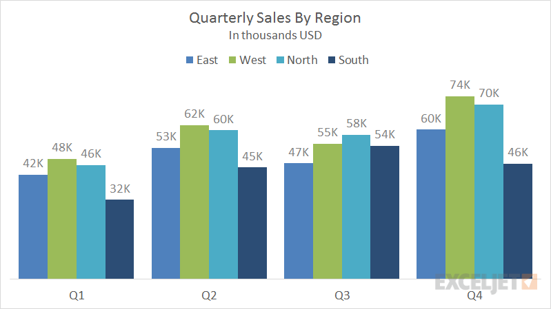
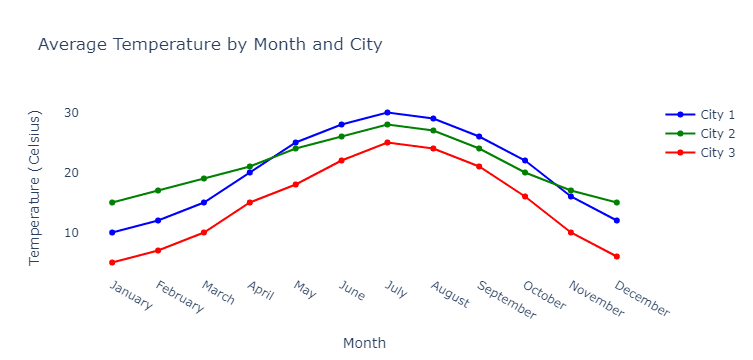
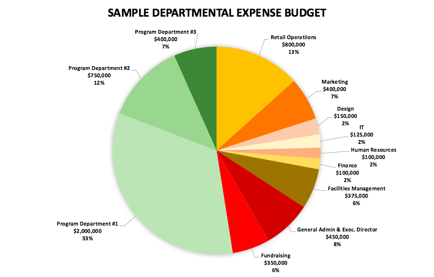
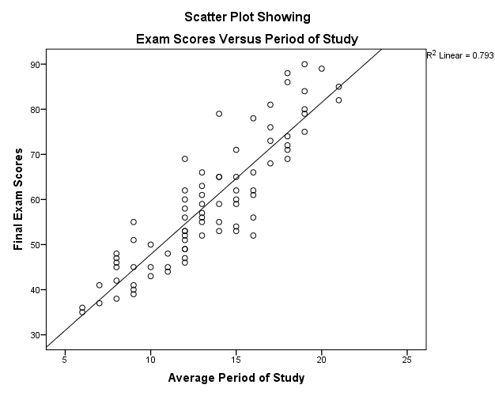
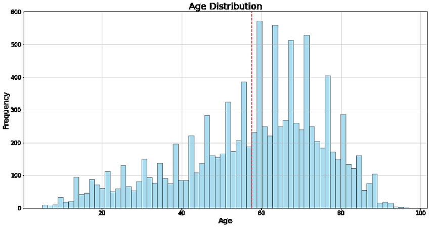
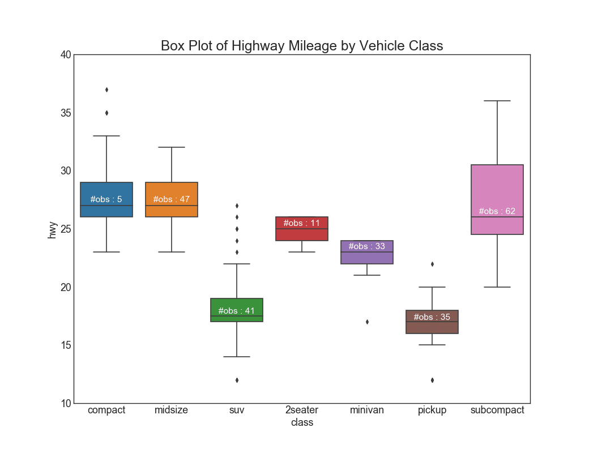
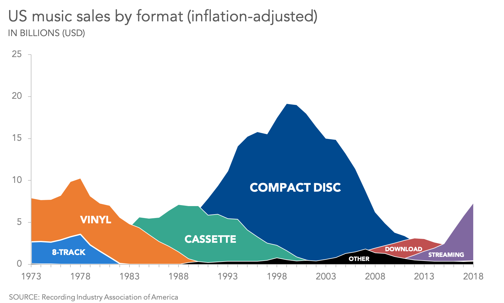

<Note>
  This chapter is constantly being updated by the analytics consultants at Supertype to stay current with the latest trends 
  in enterprise data management. Please check back regularly for updates.
</Note>

## Key Principles of Data Visualization
Effective data visualization involves a set of core principles that ensures that visualizations communicate insights clearly and effectively to the intended audience.

<Accordion title="Know Your Audience">
    - **Definition:** Tailoring your data visualization to the specific background, expertise and expectations of your audience. 
    - **Why It Matters:** Different audiences have varying levels of familiarity with the data and its context. A well-designed visualization considers these differences.
    - **How to Achieve It:** Research and analyze your audience's background and requirements. Customize the level of detail, complexity, and focus of your visualization to cater content that is valuable to them.
</Accordion>
<Accordion title="Keep Things Simple">
    - **Definition:** Simplicity in data visualization means avoiding unnecessary complexity and focusing on presenting only the essential information. 
    - **Why It Matters:** Overly complex visuals can overwhelm viewers and obscure the main points. Stripping away extraneous details and visual elements can help to maintain focus on the crucial aspects of the data.
    - **How to Achieve It:** Prioritize the most important data points and insights, using a clean design with minimalistic elements. 
</Accordion>
<Accordion title="Use the Right Chart Type">
    - **Definition:** By choosing the right chart, you ensure that the visualization helps viewers understand the data’s key features effectively.
    - **Why It Matters:** Using the right type ensures that the visualization effectively illustrates the relationships, trends, or comparisons you want to highlight, making it easier for viewers to grasp the data’s significance.
    - **How to Achieve It:** Choose a chart type that best represents the data’s characteristics, such as using bar charts for comparisons, line charts for trends, or pie charts for proportions.
</Accordion>
<Accordion title="Use Colors Wisely">
    - **Definition:** Colors can differentiate data series, highlight important data points, and improve the overall visual appeal.
    - **Why It Matters:** The strategic use of colors enhances readability and emphasizes key information, drawing attention to critical insights.
    - **How to Achieve It:** Select a color palette that provides clear contrast and supports the visualization’s goals. Be mindful of color blindness and ensure that the color scheme is accessible to all viewers.
</Accordion>
<Accordion title="Highlight the Most Important Information">
    - **Definition:** Emphasizing the most critical data points and insights in a visualization for the audience to grasp the essential insights and take actionable steps based on the information presented.
    - **Why It Matters:** Directs the audience focus to the core message, facilitating quicker comprehension and more effective decision-making.
    - **How to Achieve It:** Use visual techniques such as size, color, or positioning to make key data points stand out. 
</Accordion>
<Accordion title="Avoid Clutter">
    - **Definition:** Avoiding clutter means keeping the design of the visualization clean and focused. 
    - **Why It Matters:** Maintaining a clean design enhances the effectiveness of the visualization. Prevent being overwhelmed by extraneous details.
    - **How to Achieve It:** Remove non-essential elements, simplify data presentation, and use whitespace effectively to create a visually appealing and focused design.
</Accordion>

Adhering to these principles enhances the utility of data visualizations, ensuring not only conveying data accurately but also making it accessible and actionable for your audience.

Additionally, Edward Tufte created a comparison table between friendly and unfriendly visualizations. 
This table serves as a useful guide for understanding the principles of effective data visualization and can help in crafting better visualizations.
| Friendly                                                                                                        | Unfriendly                                                                                                    |
|-----------------------------------------------------------------------------------------------------|---------------------------------------------------------------------------------------------------------------|
| words are spelled out, mysterious and elaborate encoding avoided                                                | abbreviations abound, requiring the viewer to sort through text to decode abbreviations                       |
| words run from left to right, the usual direction for reading occidental languages                              | words run vertically, particularly along the Y-axis; words run in several different directions                |
| little messages help explain data                                                                               | graphic is cryptic, requires repeated references to scattered text                                            |
| elaborately encoded shadings, cross-hatching, and colors are avoided; instead, labels are placed on the graphic itself; no legend is required | obscure codings require going back and forth between legend and graphic                                       |
| graphic attracts viewer, provokes curiosity                                                                     | graphic is repellent, filled with chartjunk                                                                   |
| colors, if used, are chosen so that the color-deficient and color-blind (5 to 10 percent of viewers) can make sense of the graphic (blue can be distinguished from other colors by most color-deficient people) | design insensitive to color-deficient viewers; red and green used for essential contrasts                    |
| type is clear, precise, modest; lettering may be done by hand                                                   | type is clotted, overbearing                                                                                  |
| type is upper-and-lower case, with serifs                                                                       | type is all capitals, sans serif                                                                              |

## Matching Data to Visualization Types
Selecting the right chart or graph is an art on its own. 
It is not just about making data visually appealing—they are powerful tools that can illuminate insights, reveal trends, and tell compelling stories. 
Understanding the strengths and purposes of various chart types will help you craft visuals that elevate the deliverance of the core message.

Imagine you're a detective piecing together clues from a complex case. Each piece of evidence needs to be examined through the right lens to uncover the truth. 
Similarly, choosing the right visualization is about finding the perfect lens to view your data.

### Type of Visualization

#### Bar Chart

**Function:** Comparing different categories or groups.

**Purpose:** Used for comparing values across categories.

**Example:** A company uses a bar chart to compare quarterly revenue across different regions. Each bar represents a region, and the height of the bar represents the revenue for that quarter.

#### Line Chart

**Function:** Showing trends over time.

**Purpose:** Ideal for illustrating trends and changes over time.

**Example:** A weather service uses a line chart to track temperature changes over a year. The x-axis represents months, and the y-axis represents temperature. The line connects the data points for each month, showing the trend.

#### Pie Chart

**Function:** Showing proportions and percentages of a whole.

**Purpose:** Used to illustrate the parts of a whole, showing percentages and proportional data.

**Example:** A non-profit organization uses a pie chart to show the percentage breakdown of their budget allocation, illustrating how funds are distributed across different programs.

#### Scatter Plot

**Function:** Showing relationships between two numerical variables.

**Purpose:** Useful for identifying correlations and patterns between two variables.

**Example:** A researcher uses a scatter plot to examine the relationship between study hours and test scores among students. Each dot represents a student, with study hours on the x-axis and test scores on the y-axis.

#### Histogram

**Function:** Displaying the distribution of a continuous data set.

**Purpose:** Shows the frequency distribution of a continuous dataset, helping to identify patterns and outliers.

**Example:** A fitness trainer uses a histogram to show the distribution of clients' ages. The x-axis represents age ranges, and the y-axis represents the number of clients in each range.

#### Box Plot (Box-and-Whisker Plot)

**Function:** Showing the distribution of a dataset based on a five-number summary.

**Purpose:** Displays the spread and central tendency of a dataset, highlighting the median, quartiles, and potential outliers.

**Example:** A automobile company uses a box plot to compare the highway mileage of cars in different car types. Each box represents a car type, displaying the spread and central tendency of car highway mileage.

#### Area Chart

**Function:** Showing cumulative data trends over time.

**Purpose:** Similar to line charts but with the area under the line filled, useful for emphasizing the magnitude of changes over time.

**Example:** A music company uses an area chart to show the cumulative number of music sales by format over the past year. The x-axis represents years, and the y-axis represents the number of sales in USD.

#### Heat Map

**Function:** Showing intensity of data across a spectrum.

**Purpose:** Displays data where individual values are represented by colors, useful for showing the intensity of data and identifying patterns.

**Example:** A data analyst uses a heat map to show website activity, where the intensity of color represents the number of clicks on different areas of the site.

<Tip>
  By understanding the functions and purposes of different chart types, whether you're dealing with categorical, quantitative, or relational data, you can create visuals that not only capture attention but also enhance comprehension and insight.
</Tip>

### Effective Visualization Techniques

The effectiveness of a visualization hinges on aligning the type of chart with the nature of the data and the message you want to convey.
We’ll also delve into real-world examples and case studies to illustrate how these principles are applied in practice. 

<AccordionGroup>
  <Accordion title="Data Type">
    * **Categorical Data** -> For data that falls into distinct categories (e.g., types of fruit), use bar charts, pie charts, or stacked area charts.
    * **Quantitative Data** -> For numerical data (e.g., sales figures), consider line charts, scatter plots, or histograms.
  </Accordion>
  <Accordion title="Purpose of Visualization">
    * **Comparison** -> To compare different categories or groups, use bar charts or column charts. If comparing parts of a whole, pie charts can work, though bar charts are often clearer.
    * **Trends** -> To show changes over time, use line charts or area charts. They help highlight trends and patterns.
    * **Distribution** -> To display the distribution of data, histograms and box plots are useful. They show how data is spread across different ranges.
    * **Relationship** -> To illustrate relationships between variables, scatter plots and bubble charts are effective. They reveal correlations or patterns between two or more variables.
    * **Composition** -> To show how different parts contribute to a whole, stacked bar charts or pie charts are typically used.
  </Accordion>
</AccordionGroup>

### Avoiding Common Pitfalls
When creating visualizations, it’s important to avoid common pitfalls to ensure your data is accurately represented and easily interpreted.

#### Misleading Visuals

1. **Scale Issues:** Manipulating the scale of axes can distort the data. For instance, truncating the y-axis in a bar chart can exaggerate differences between bars. 
- Always use a consistent scale or start the axis at zero to avoid misleading viewers.
2. **Inappropriate Chart Types:** Using a pie chart for data with too many categories can be confusing. Pie charts work best with a small number of categories. 
- For more categories, consider a bar chart instead.
3. **Cherry-Picking Data:** Selecting only a subset of data to support a specific narrative can be misleading. 
- Ensure your visualization represents the full dataset to provide an accurate picture.

#### Overcomplicating with Too Much Data

1. **Cluttered Visuals:** Including too many data series or categories in a single chart can make it hard to interpret. Keep your visualizations focused and use additional charts if necessary to break down complex data.
2. **Excessive Details:** Adding too many details (e.g., excessive grid lines or labels) can overwhelm the viewer. Use clean, simple designs and only include essential information to ensure clarity.
3. **Complexity Over Clarity:** Sometimes, a simple chart (like a basic bar or line chart) can be more effective than a complex visualization (like a 3D chart or interactive dashboard). Prioritize clarity over complexity to ensure your audience can easily understand the data.

## Data Storytelling
Traditional education often treats creative storytelling and technical analysis as separate skills, but today's job market values professionals who excel in both. 
However, data visualization is a prime example of where these two areas intersect, making it a highly sought-after skill in our data-driven world. 
Data storytelling involves merging solid data with compelling narratives to present insights in a way that resonates with audiences. 
This approach relies on three essential components: data, narrative, and visuals.

1. **Data:** The raw numbers and facts that provide the foundation of the story.
2. **Narrative:** The context and interpretation that give meaning to the data.
3. **Visuals:** The charts, graphs, and other visual aids that illustrate the data and narrative.

By integrating these elements, data storytelling transforms complex data sets into understandable, memorable, and actionable insights. 
The goal is to make the data not just accessible, but also engaging and persuasive, turning dry statistics into a compelling story that drives home key points.

<Card
    title="Example: Good Data Storytelling"
    href="https://projects.fivethirtyeight.com"
  >
    Some good data story telling projects.
</Card>

These are the steps to make a good data story telling
<Steps>
  <Step title="1. Crafting a Data Story">
    <AccordionGroup>
        <Accordion title="Understanding your Audiences">
            Different audience segments might require distinct approaches: executives might prefer high-level insights with clear business implications, while technical teams may appreciate detailed data and methodology. 
            By customizing your story to align with these diverse expectations, you ensure that each segment receives the most relevant and impactful information, ultimately leading to better engagement and more informed decision-making.

            <Tip>
                You can use 5W + 1H formula, to craft your data story 
            </Tip>
        </Accordion>
        <Accordion title="Defining the Purpose">
            By focusing on a central theme or insight, you ensure that your story remains coherent and impactful. 
            Whether your aim is to highlight performance metrics, uncover new opportunities, or address specific challenges, ensuring that your narrative supports the broader objectives of your organization helps in securing buy-in from stakeholders and reinforcing the strategic value of your insights.
        </Accordion>
        <Accordion title="Identifying Key Insights">
            A critical step in crafting a compelling data story is data analysis and insight extraction. 
            The goal is to interpret the data in a way that highlights the most relevant and actionable insights, making it easier for your audience to understand the implications and take informed actions based on your findings.
        </Accordion>
    </AccordionGroup>
  </Step>
    <Step title="2. Building the Narrative">
    <AccordionGroup>
        <Accordion title="Setting the Context">
            This involves providing background information and context for the data, helping your audience grasp why the data matters and how it fits into the larger picture.
        </Accordion>
        <Accordion title="Highlighting Key Insights">
            This means pinpointing the data points that have the greatest significance and potential impact, and then using narrative elements such as anecdotes, analogies, or visual highlights to draw attention to these insights.
        </Accordion>
        <Accordion title="Creating a Flow">
            This involves structuring your narrative with clear transitions and logical sequencing, making it easy for the audience to follow along.
        </Accordion>
    </AccordionGroup>
    </Step>
    <Step title="3. Delivering the Stories">
    <AccordionGroup>
        <Accordion title="Presentation Techniques">
            Presentation techniques play a crucial role in effectively delivering your data story.
            Best practices for presenting data stories include clear articulation of key points, maintaining a logical structure, and using visuals to enhance understanding. 
            Engaging the audience involves not just presenting the data, but also connecting with them through confident delivery, interactive elements, and storytelling techniques that keep their interest. 
            Effective delivery ensures that your audience remains attentive, understands the insights, and is motivated to take action based on your findings.

            <Tip>
                You must also learn about design best practice, such as Visual Hierarchies, Color Theory, Typography, etc.
            </Tip>
        </Accordion>
    </AccordionGroup>
    </Step>
</Steps>

<Note>
    Words, graphics and tables are serves a single purpose - presentating information.
    As written by Edward R. Tufte, "What is sought in design for the display of information is to achieve clear potrayal of complexity. Not the complication of the simple; rather than the task of the designer is to give visual access to the subtle and the difficult - that is the revelation of the complex."
</Note>

### The Role of Data Storytelling in Decision-Making

Data storytelling plays a crucial role in decision-making processes across various fields and industries. Here’s how:

1. **Enhancing Understanding and Clarity**

- **Simplifying Complexity:** Data storytelling simplifies complex data sets and analytical results, making them more accessible to non-experts. This clarity ensures that decision-makers can easily grasp the insights without getting bogged down in technical details.
  
- **Contextualizing Data:** By providing context, data storytelling helps audiences understand why the data matters and how it applies to their specific situation. This contextualization is essential for making informed decisions.

2. **Engaging and Persuading Audiences**

- **Emotional Connection:** Narratives can evoke emotions, making the data more relatable and memorable. This emotional connection can be crucial for persuading stakeholders to take action based on the data.

- **Visual Appeal:** Effective visuals can capture attention and highlight key insights, making the data more compelling. Engaging visualizations help keep the audience interested and focused on the main points.

3. **Driving Action**

- **Highlighting Key Insights:** Data storytelling helps to pinpoint the most important insights, ensuring that decision-makers are focusing on the critical information. Clear, focused stories make it easier to identify what actions need to be taken.

- **Facilitating Communication:** Well-crafted data stories bridge the gap between data analysts and decision-makers. They enable effective communication of data-driven insights across different levels of an organization, ensuring everyone is on the same page.

4. **Supporting Evidence-Based Decision-Making**

- **Building Credibility:** By grounding narratives in solid data, data storytelling builds credibility and trust. Decision-makers are more likely to trust and act on insights that are backed by data.

- **Mitigating Bias:** Data storytelling can help counteract cognitive biases by presenting a balanced view of the data. It encourages decision-makers to rely on evidence rather than intuition or assumptions.

5. **Enabling Collaboration and Discussion**

- **Shared Understanding:** A well-told data story creates a common understanding among stakeholders, facilitating collaborative decision-making. It ensures that everyone involved is working with the same information and insights.

- **Stimulating Discussion:** Data stories can stimulate discussions and debates, encouraging a deeper exploration of the data and potential implications. This collaborative approach often leads to more robust and well-rounded decisions.

## Author
This chapter was authored by [Gerald Bryan](https://www.linkedin.com/in/geraldbryan/), an analytics consultant at Supertype with extensive experience in enterprise AI consulting in Indonesia, 
having worked with companies such as Adaro Group, Central Bank of Indonesia, Bursa Efek Indonesia, and Toyota Astra Motor. 
He also developed [Sectors](https://sectors.app) (a financial market intelligence platform), responsible for the data gathering and its ETL pipelines.

Gerald is a former Apple Developer Academy @Binus Scholar, with one user-centric product available on the App Store. 
He also holds the Microsoft Certified Data Analyst Associate certification, with a focus on using PowerBI for data visualization and storytelling.

### Contributors
- [Evelyn Ong](https://www.linkedin.com/in/ong-evelyn/), project owner at Supertype

## References
1. [ThoughtSpot - 6 most useful data visualization principles for analysts](https://www.thoughtspot.com/data-trends/data-visualization/data-visualization-principles)
2. [ThoughtSpot - Data storytelling: How to tell a great story with data](https://www.thoughtspot.com/data-trends/best-practices/data-storytelling)
3. [Simplilearn - Types Of Data Visualization You Should Know](https://www.simplilearn.com/types-of-data-visualization-article)
4. [Atlassian - How to choose the right data visualization](https://www.atlassian.com/data/charts/how-to-choose-data-visualization)