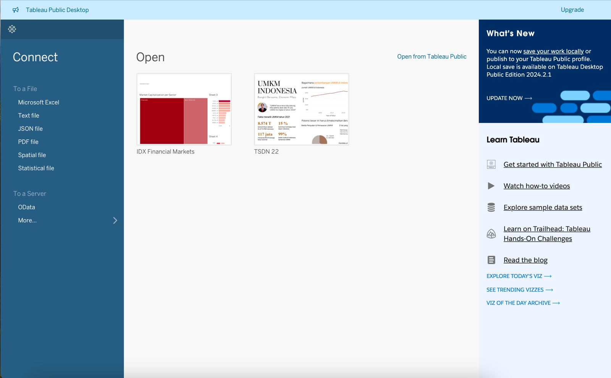
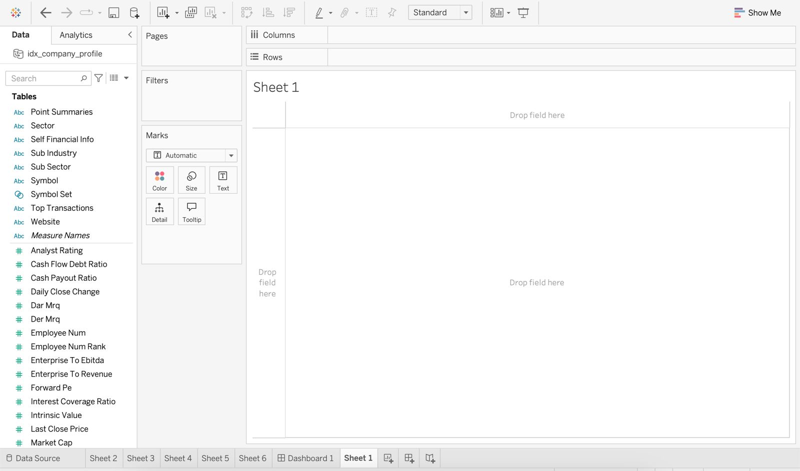
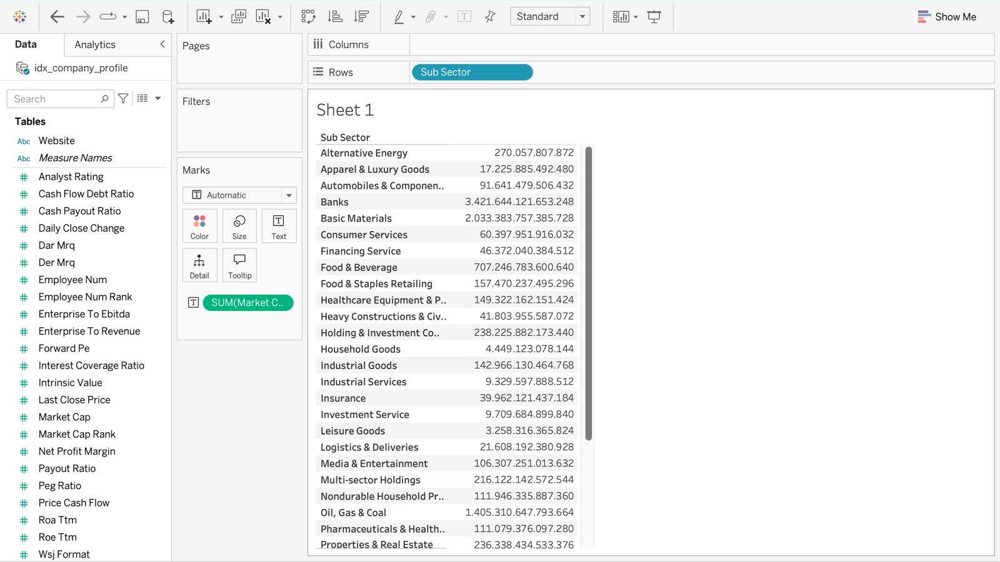
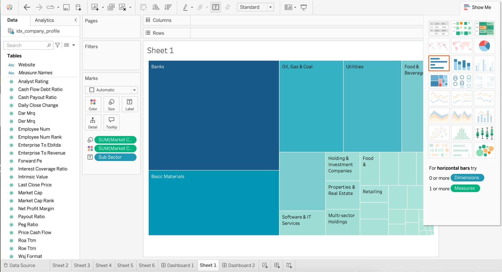
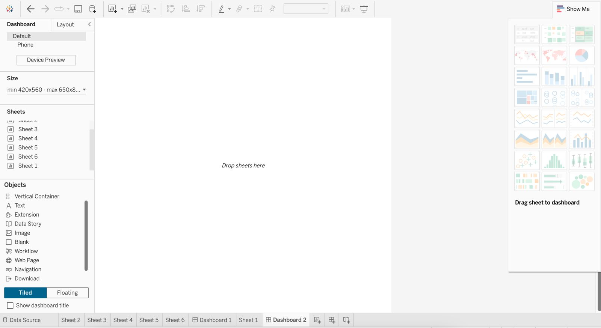
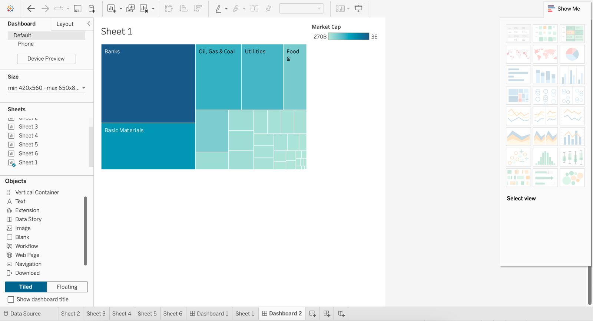

# Data Visualization Tools

In the realm of data analysis and presentation, the right tools can make a significant difference in how effectively insights are communicated. 
"Data Visualization Tools" provides a comprehensive summary of widely-used platforms that transform raw data into visually appealing and easily interpretable graphics. 
This section will explore a variety of tools, highlighting their key features, strengths, and ideal use cases, to help you choose the best one for your data storytelling needs. 
Whether you're a seasoned data analyst or a novice looking to enhance your presentations, understanding these tools will empower you to make data-driven decisions with clarity and impact.

## Spreadsheets

Spreadsheets like Microsoft Excel, Google Sheets, and Apple Numbers are widely-used tools for creating data visualizations. 
These platforms offer built-in features that allow users to generate various types of charts and graphs to visually represent data, making them accessible for both novices and professionals.

### Creating Visualization in Spreadsheets

### Advantages of Using Spreadsheets for Data Visualization

- **Accessibility and Ease of Use:** Spreadsheets are user-friendly and familiar to many, making it easy to start creating visualizations without extensive training.
- **Integration with Data Sources:** They allow for seamless data import and export, and can connect to various data sources, enhancing their functionality.
- **Collaboration and Sharing:** Features like real-time collaboration in Google Sheets enable easy sharing and teamwork on data visualizations.

### Disadvantages of Using Spreadsheets for Data Visualization

- **Performance Issues:** Spreadsheets can experience slowdowns or crashes when dealing with very large datasets, impacting their effectiveness for extensive data analysis.
- **Limited Advanced Features:** They offer fewer advanced features compared to specialized data visualization tools, which may limit complex analyses and customization.
- **Basic Customization:** While useful for creating standard charts, they may not provide the sophisticated or interactive visualizations required for more detailed presentations.

## Data Visualization Using Programming Languages

Programming languages such as Python, R, and JavaScript offer powerful tools for creating custom data visualizations. 
These languages provide a high level of flexibility and control, allowing users to design tailored visualizations that precisely meet their needs. 
Python and R, in particular, benefit from a wide range of specialized packages that facilitate data visualization. 
For Python, libraries like Matplotlib, Seaborn, Plotly, and Altair offer diverse capabilities for crafting detailed and interactive graphics.
Similarly, R provides robust packages such as ggplot2, which is renowned for its versatility in creating complex and aesthetically pleasing plots. 
JavaScript also plays a significant role in web-based visualizations, with libraries like D3.js enabling the development of dynamic and interactive charts. 
Utilizing these programming languages and their associated libraries allows for the creation of highly customized and sophisticated data visualizations, making them ideal for advanced analytical tasks and interactive data exploration.

### Creating Visualization in R and Python
#### R
In the R programming language, the most well-known packages for data visualization are ggplot2 and Plotly. However, in the following tutorial, the visualizations go beyond static plots; an animated plot is also created. The aim is to use this plot as content for our Instagram, making the animation to create more engaging content for our users.

<Card
    title="R Financial Data Visualization"
    icon="R"
    href="https://github.com/supertypeai/sectors-kb/blob/main/recipe/animated_plots_in_r/03_financial_comparison_animation_plot.md"
  >
    A glimpse of usage of ggplot in R.
  </Card>


#### Python
In Python there are several visualization packages, in this section, I'll try to explain to you the packages that I usually used, which is Matplotlib. 

##### Matplotlib
In the Data Analysis with Pandas section, all of you must already know about the pandas as how to gather data with API in Python. In this section, at first we need to gather the data using the API key that you've obtained from sectors.app.

For a context, in this part we will analyze the price of TLKM.JK after Starlink announce their operation in Indonesia

```python
import pandas as pd
import datetime
from datetime import timedelta
import requests

import matplotlib.pyplot as plt

df_daily_hist = pd.DataFrame()

api_key = "CHANGE WITH YOUR OWN API KEY"

def get_date_list(start_date):
    start_date = datetime.datetime.strptime(start_date, '%Y-%m-%d')

    end_date = datetime.datetime.today()

    date_list = []

    while start_date < end_date:
        date_list.append(start_date)
        start_date += timedelta(days=90)

    date_list.append(end_date)

    return date_list

date = get_date_list("2024-04-01")

for i in ["TLKM.JK"]:
    for j in range (0,len(date)-1):
        if j==0:
            start_date = date[j]
            start_date = start_date.strftime('%Y-%m-%d')
            
            end_date = date[j+1]
            end_date = end_date.strftime('%Y-%m-%d')
        else:
            start_date = date[j]+ timedelta(days=1)
            start_date = start_date.strftime('%Y-%m-%d')
            
            end_date = date[j+1]
            end_date = end_date.strftime('%Y-%m-%d')

        url = f"https://api.sectors.app/v1/daily/{i}/?start={start_date}&end={end_date}"
        

        headers = {
            "Authorization": api_key
        }

        response = requests.get(url, headers = headers)

        if response.status_code == 200:
            data = response.json()
        else:
            # Handle error
            print(response.status_code)

        df_daily_hist = pd.concat([df_daily_hist,pd.DataFrame(data)])

        print(f"Finsih collect data for stock {i} from {start_date} to {end_date}")
```

Using the code above, we will have a daily transaction data of those 4 companies which we will to do the analysis. Here is the glimpse of the data.

| symbol   | date       | close | volume    | market_cap      |
|----------|------------|-------|-----------|-----------------|
| TLKM.JK  | 2024-04-01 | 3510  | 248116300 | 347708338470912 |
| TLKM.JK  | 2024-04-02 | 3490  | 233071700 | 345727083479040 |
| TLKM.JK  | 2024-04-03 | 3420  |1502657000 | 338792724561920 |
| TLKM.JK  | 2024-04-04 | 3450  | 205184000 | 348760504795136 |
| TLKM.JK  | 2024-04-05 | 3460  | 116057100 | 339783352057856 |

```python
df_tlkm = df_daily_hist[df_daily_hist.symbol == "TLKM.JK"]

plt.figure(figsize=(14, 10))
plt.plot(df_tlkm['date'], df_tlkm['close'], linewidth=2)

# Formatting the plot
plt.xlabel('Date')
plt.ylabel('Value')
plt.title('TLKM.JK Daily Price Since 1 April 2024')
plt.tight_layout()
```
Using the code above, here are the result of the plot.


```python
# Convert date to datetime
df_tlkm['date'] = pd.to_datetime(df_tlkm['date'])

# Define the color change dates
yellow_date = pd.Timestamp('2024-05-02')
red_date = pd.Timestamp('2024-05-19')

# Plotting the data with conditional coloring
plt.style.use('dark_background') 
plt.figure(figsize=(14, 10))

# Plot each segment with the appropriate color
for i in range(len(df_tlkm) - 1):
    start_date = df_tlkm['date'].iloc[i]
    end_date = df_tlkm['date'].iloc[i + 1]
    if end_date > red_date:
        color = 'red'
    elif end_date > yellow_date:
        color = 'yellow'
    else:
        color = 'white'
    
    plt.plot(df_tlkm['date'].iloc[i:i+2], df_tlkm['close'].iloc[i:i+2], color=color, linewidth=2)

# Formatting the plot
plt.xlabel('Date')
plt.ylabel('Value')
plt.title('TLKM.JK Daily Price Since 1 April 2024')
plt.tight_layout()

# Create custom legend
import matplotlib.lines as mlines

blue_line = mlines.Line2D([], [], color='white', linewidth=2, label='Before Starlink Rumours')
yellow_line = mlines.Line2D([], [], color='yellow', linewidth=2, label="After First Starlink's Rumour News Emerged")
red_line = mlines.Line2D([], [], color='red', linewidth=2, label='After Starlink Official Announcement in Indonesia')

plt.legend(handles=[blue_line, yellow_line, red_line])

# Show the plot
plt.show()
```

and here is the plot result of the code above.


### Advantages of Using Programming Languages for Data Visualization

- **Customization and Flexibility:** Programming languages like Python, R, and JavaScript offer a high degree of customization, allowing users to create highly tailored visualizations that meet specific requirements.
- **Advanced Features:** Libraries such as Matplotlib, Seaborn, Plotly, ggplot2, and D3.js provide advanced features and capabilities, enabling complex and interactive visualizations that go beyond basic charting options.
- **Integration with Data Analysis:** These languages seamlessly integrate with data analysis workflows, allowing for sophisticated data manipulation and visualization in a unified environment.

### Disadvantages of Using Programming Languages for Data Visualization

- **Steeper Learning Curve:** Programming languages require a certain level of expertise and familiarity, which can be challenging for users without a coding background.
- **Development Time:** Creating custom visualizations can be time-consuming, especially when developing complex or highly interactive graphics.
- **Maintenance and Debugging:** Code-based visualizations may require ongoing maintenance and debugging, which can be demanding and may require technical skills to resolve issues effectively.

## Business Intelligence Tools
### Data Visualization Using BI Tools

Business Intelligence (BI) tools like Tableau, Power BI, Looker, and Qlik offer powerful solutions for data visualization and analysis. 
These tools are designed to simplify the process of creating interactive and insightful visualizations without extensive programming knowledge. 
They provide a range of pre-built templates, drag-and-drop interfaces, and integration capabilities that streamline the process of transforming raw data into actionable insights. BI tools enable users to generate a variety of charts, dashboards, and reports that can be easily shared and explored, making them suitable for both individual analysis and collaborative decision-making.

### Advantages of Using BI Tools for Data Visualization
- **User-Friendly Interfaces:** BI tools offer intuitive drag-and-drop interfaces and pre-built templates that make it easy for users with varying levels of technical expertise to create effective visualizations.
- **Integration and Connectivity:** They integrate seamlessly with various data sources, including databases, spreadsheets, and cloud services, facilitating real-time data updates and comprehensive analysis.
- **Interactive and Collaborative Features:** BI tools provide interactive dashboards and collaboration features that allow users to explore data dynamically and share insights with team members effortlessly.

### Disadvantages of Using BI Tools for Data Visualization
- **Cost:** Many BI tools come with significant licensing or subscription fees, which can be a barrier for smaller organizations or individuals.
- **Limited Customization:** While BI tools offer many pre-built options, they may not provide the same level of customization as programming languages for highly specialized or unique visualizations.
- **Learning Curve:** Although user-friendly, BI tools still require a learning curve to master their full range of features and functionalities, which may necessitate training or onboarding for effective use.

# Introduction to Tableau
## Overview of Tableau

Tableau is a premier Business Intelligence (BI) and data visualization tool widely recognized for its ability to transform raw data into meaningful insights. 
Founded in 2003 and later acquired by Salesforce, Tableau has grown to become a key player in the BI market, empowering users to analyze and visualize their data with ease and precision.

At the heart of Tableau’s appeal is its user-friendly interface, which allows even those with limited technical skills to create interactive and shareable dashboards. 
The software employs a simple drag-and-drop functionality that makes it easy to build a wide variety of visualizations, from basic charts and graphs to complex multi-dimensional views. 
This ease of use enables users to quickly turn data into actionable insights, fostering a data-driven culture within organizations.

One of Tableau’s standout features is its ability to connect to multiple data sources, ranging from traditional databases like SQL Server and Oracle to cloud-based sources such as Google Analytics and Salesforce. 
This versatility ensures that users can seamlessly integrate data from different platforms, providing a comprehensive view of their business landscape. 
Additionally, Tableau supports real-time data analysis, allowing users to monitor and respond to changes as they happen, which is crucial for dynamic and fast-paced environments.

Tableau’s powerful visualization capabilities are complemented by its advanced analytics features. 
Users can perform sophisticated calculations, apply statistical models, and incorporate machine learning algorithms directly within the tool. 
These features enable deeper insights and more precise forecasting, helping organizations to make informed decisions based on robust data analysis.

Collaboration is another key strength of Tableau. 
The tool allows for easy sharing of dashboards and visualizations within teams and across organizations. 
Users can publish their work to Tableau Server or Tableau Online, enabling colleagues to interact with the data and derive their own insights. 
This collaborative approach ensures that everyone in the organization can benefit from shared data insights, fostering a unified and informed decision-making process.

Moreover, Tableau offers extensive customization options. 
Users can tailor dashboards to fit their specific needs, adjusting layouts, colors, and styles to create visually appealing and effective presentations. 
This customization capability ensures that visualizations are not only functional but also aligned with the organization’s branding and communication standards.

## Different Types of Tableau

Tableau offers several products tailored to meet the diverse needs of users, from individuals to large organizations. Each type of Tableau product has unique features and capabilities designed to facilitate data visualization, analysis, and sharing.

**1. Tableau Desktop**

Tableau Desktop is a powerful data visualization tool designed for individual use. It allows users to connect to various data sources, create detailed visualizations, and develop interactive dashboards.

- **Features:**
  - Connects to multiple data sources, including databases, spreadsheets, and cloud services.
  - Provides advanced analytics and visualization capabilities.
  - Offers extensive customization options for creating detailed and tailored visualizations.
  - Allows users to create and publish dashboards to Tableau Server or Tableau Online for sharing.

**2. Tableau Server**
Tableau Server is an enterprise-level solution for sharing and collaborating on data visualizations. It enables organizations to publish dashboards and reports created in Tableau Desktop and share them securely within their network.

- **Features:**
  - Facilitates centralized data management and collaboration.
  - Allows users to interact with dashboards and reports via a web browser.
  - Provides robust security and governance features to control access and permissions.
  - Supports real-time data connectivity and automatic data refresh.

**3. Tableau Online**
Tableau Online is a cloud-based version of Tableau Server. It offers similar functionality but is hosted by Tableau, eliminating the need for organizations to manage their own infrastructure.

- **Features:**
  - Provides the same collaboration and sharing capabilities as Tableau Server.
  - Simplifies setup and maintenance with a cloud-based infrastructure.
  - Allows users to access dashboards and reports from anywhere with an internet connection.
  - Offers scalability to accommodate growing data needs without additional hardware investments.

**4. Tableau Public**
Tableau Public is a free version of Tableau designed for public data sharing. It allows users to create and publish interactive data visualizations on the web.

- **Features:**
  - Offers a free platform for creating and sharing visualizations with the public.
  - Visualizations are hosted on Tableau’s public server and accessible to anyone.
  - Ideal for journalists, bloggers, and anyone interested in sharing data insights publicly.
  - Limited to public data only, with no option for private data storage or sharing.

**5. Tableau Prep**
Tableau Prep is a data preparation tool that helps users clean, combine, and shape their data before analysis. It simplifies the process of preparing data for visualization in Tableau Desktop or Tableau Online.

- **Features:**
  - Provides a visual interface for data cleaning and transformation.
  - Supports data blending from multiple sources.
  - Allows users to create repeatable data preparation workflows.
  - Integrates seamlessly with Tableau Desktop for analysis and visualization.

## Creating First Visualization in Tableau Public

Before diving into exploring Tableau and its data visualization capabilities, it’s important to familiarize ourselves with some key terms to better understand the platform.

In Tableau, two crucial terms are Worksheets and Dashboards. Unlike Looker Studio or PowerBI, Tableau doesn't allow direct creation of visualizations on the dashboard canvas. Instead, you must first create individual visualizations in Worksheets and then combine multiple Worksheets into a Dashboard. The table below summarizes the differences between Worksheets and Dashboards.

|                         | Worksheets                                                                                             | Dashboards                                                                                               |
|-------------------------|--------------------------------------------------------------------------------------------------------|----------------------------------------------------------------------------------------------------------|
| **Definition**          | A Tableau worksheet is a single view that contains one type of visualization, such as a chart or graph.| A Tableau dashboard is a collection of multiple worksheets and elements combined into one view.          |
| **Features**            | - **Single Visualization:** Shows one chart or graph.                                                  | - **Multiple Visualizations:** Displays several charts or graphs together.                               |
|                         | - **Customization:** Allows you to adjust colors, labels, and axes.                                    | - **Interactivity:** Links visualizations with filters and actions.                                      |
|                         | - **Interaction:** Includes features like filtering and tooltips.                                      | - **Layout Options:** Arranges visualizations and elements for better presentation.                      |                                                            |
| **Use Case**            | Used to create individual visualizations for specific data analysis.                                   | Used to provide an overall view and interactive exploration of data, ideal for presentations and reports.|

After know the difference between worksheet and dashboard, let's start 
### Importing Data

Once you’ve installed Tableau Public, we can open it and load the data. There are severals data type that we can load to Tableau Public. However, since we only use three free version of Tableau, there are some limitation in load data options.
If you want to import csv file, you’ll need to first download the CSV file, and then save it as a text file, click ‘Text File’ in the left menu and open your text file. The new page shows the data preview and the corresponding fields of the dataset.

### Create Visualization in Worksheet


Tableau has a relatively gentle learning curve. At the top of Tableau, there are areas for columns and rows. 
As the name suggests, we may drag the variables we wish to see in this area. I drag the sub_sector in rows area and sum of the market cap into the marks area to show a table of total market capitalization per sub sector.


We can change the type of visualization using the "Show Me" button in the top right of the menu. And in this case, I want to change it into treemap chart. Moreover, you can also change the color, the label size, and other aesthetic setting in this section.


Once you finished creating all the chart you want to make, you can create a new dashboard as a canvas or place to combine all the visualization you've made. In the dashboard, you can customize the size of the canvas, and select all the sheets (worksheet or visualization) that you want to show in that dashboard. 


In our case we only have one visualization and we only select that chart to be shown in the dashboard. However, you can add multiple chart/visualization here, and you can also customize the size of each chart and add some text in the dashboard.


## Hands-On practice

After seeing a mini tutorial on how creating a visualization and dashboard in Tableau, now we will directly create a dashboard using actual data. The [dataset](https://docs.sectors.app) can be downloaded from here. For the dashboard that we will create will be like the image below.

## Author
This chapter was authored by [Gerald Bryan](https://www.linkedin.com/in/geraldbryan/), an analytics consultant at Supertype with extensive experience in enterprise AI consulting in Indonesia, 
having worked with companies such as Adaro Group, Central Bank of Indonesia, Bursa Efek Indonesia, and Toyota Astra Motor. 
He also developed [Sectors](https://sectors.app) (a financial market intelligence platform), responsible for the data gathering and its ETL pipelines.

Gerald is a former Apple Developer Academy @Binus Scholar, with one user-centric product available on the App Store. 
He also holds the Microsoft Certified Data Analyst Associate certification, with a focus on using PowerBI for data visualization and storytelling.