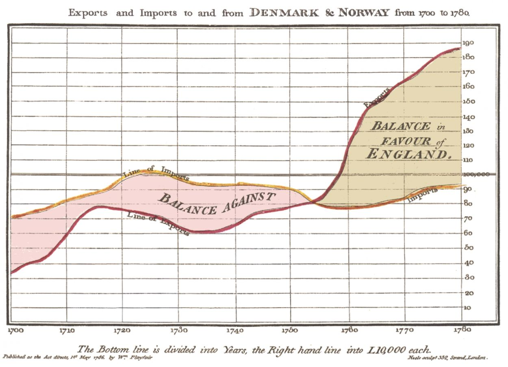
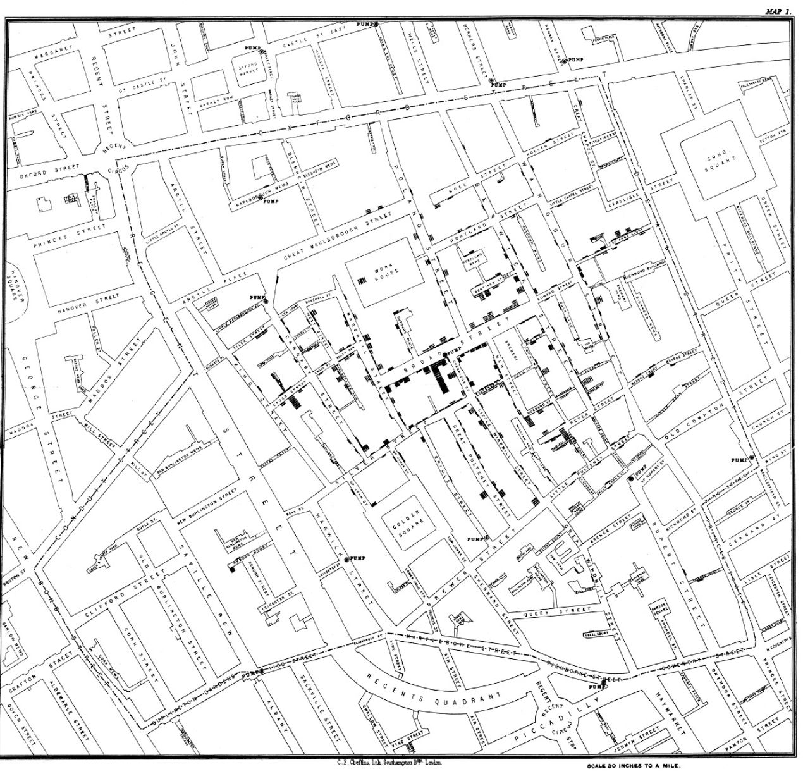
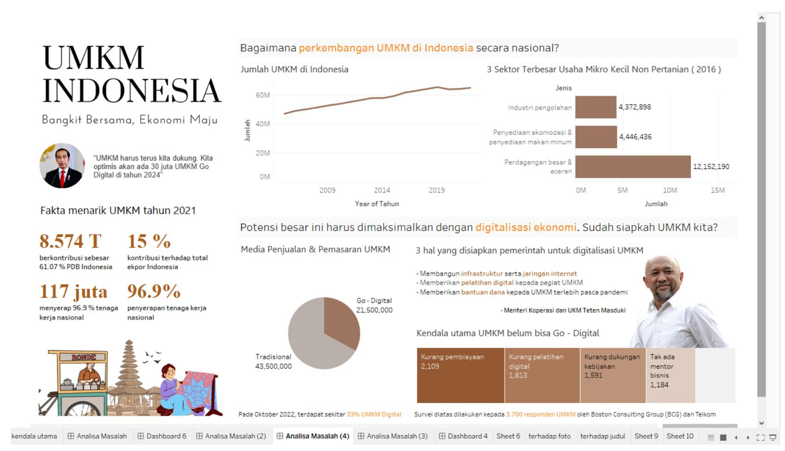
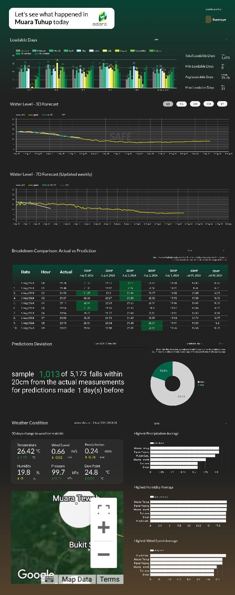

<Note>
  This chapter is constantly being updated by the analytics consultants at Supertype to stay current with the latest trends 
  in enterprise data management. Please check back regularly for updates.
</Note>

## What is data visualization?
In the era of big data, businesses can easily extract valuable insights from data. However, the sheer volume of data can make it time-consuming to gather and summarize these insights. This is where data visualization comes into play. 

But what exactly is data visualization?

Data visualization is the graphical representation of information and data. By using visual elements like charts, graphs, and maps, these tools provide an accessible way to identify trends, outliers, and patterns in the data. Additionally, they help employees or business owners present data to non-technical audiences in a clear and understandable manner, reducing confusion.

In the context of Big Data, data visualization tools and technologies are essential for analyzing large amounts of information and facilitating data-driven decision-making.

However, before we dive deeper into data visualization, let's learn first into some era of data visualization to know why it is important to human being.

## History of Data Visualization

As we know, mankind has used visualizations to instruct, convey messages and tell stories since the dawn of time. 
Visual representations are a fundamental component of human learning and understanding.

<Tip>
  There are 2 common types of visual representation that human being know:

  - **Presentation:** Uses data visuals to communicate.
  - **Visualization:** Uses visuals to think.
</Tip>

### The Dawn of Human Visualization

Before the 17th century, data visualization was mainly confined to maps, showing landmarks, cities, roads, and resources. 
It wasn’t until 1644 that Michael Florent Van Langren, a Flemish astronomer, created what is considered the first visual representation of statistical data. 
He plotted a one-dimensional line graph displaying twelve different estimates of the longitude difference between Toledo and Rome, attributed to various astronomers. 
This graphical approach, as opposed to a table, strikingly highlighted the wide variations in these estimates.

### The Foundation of Statistical Charts

The 18th century marked the beginning of thematic mapping, encompassing geologic, economic, and medical data. 
This era introduced abstract graphs of functions, measurement errors, and empirical data collections. 
William Playfair, often regarded as the father of many popular graph types we use today, such as line, bar, and pie charts, emerged during this period. 
One of his notable works from 1821 depicted the price of wheat, weekly wages, and reigning monarchs over 250 years, illustrating the power of statistical charts for historical analysis.

Statistical graphics soon found their way into public health, famously used by Dr. John Snow during London’s cholera outbreak in 1855. 
By plotting cholera cases as dots on a map, Snow demonstrated that the majority of cases were clustered around a specific water pump on Broad Street. 
This compelling visual evidence persuaded city officials to remove the pump handle, effectively curbing the epidemic.

### The Rebirth of Data Visualization
The latter half of the 20th century saw a renaissance in data visualization, driven by the advent of computer processing. 
Computers allowed for the collection and storage of vast amounts of data and facilitated quick and easy visualization. 
Pioneers like John W. Tukey in the United States and Jacques Bertin in France advanced the science of information visualization. 
In the early 1980s, Edward Tufte's seminal work, "The Visual Display of Quantitative Information," became a cornerstone in data visualization education. 
Tufte introduced the sparkline, a small, space-efficient graph that conveys trends effectively.

With computers, data visualization reached new heights. 
Spreadsheets transformed how data was visualized, generating graphs and charts from tables without manual effort. 
This innovation made creating, updating, formatting, and editing visualizations faster and easier. 
Various enterprise data visualization software solutions soon followed, introducing new charting techniques and styles.

### 21st Century Business Intelligence (BI) Dashboards

Today, BI dashboards have become essential tools for organizations, enabling users to interact with and comprehend data effortlessly. 
They display critical metrics and key performance indicators on a single screen, helping organizations make informed, data-driven decisions. 
BI dashboards promote a data-driven culture at all organizational levels, clearly communicate business performance relative to targets, and simplify the visualization of complex relationships. 
This makes them indispensable across different industries for strategic decision-making.

## Why Data Visualization is Important?
Since humans rely heavily on visual perception to analyze data, making it more engaging and easier to interpret is crucial for its utility. 
The importance of data visualization is straightforward: it enables people to see, interact with, and better understand data.
Whether dealing with simple or complex information, the right visualization can align everyone's understanding, regardless of their expertise.

It's challenging to find a professional field that doesn't benefit from making data more comprehensible. 
Every STEM field, as well as sectors like government, finance, marketing, history, consumer goods, service industries, education, and sports, gains from improved data understanding. 
The practical applications of data visualization in real-life scenarios are undeniable. 
Visualization is also one of the most valuable professional skills to develop. 
The better you can visually convey your points, whether in a dashboard or a slide deck, the more effectively you can leverage that information. 

The concept of the citizen data scientist is growing. Skill sets are evolving to meet the demands of a data-driven world. 
It is increasingly valuable for professionals to make data-driven decisions and use visuals to tell stories, illustrating the who, what, when, where, and how of data insights.

Traditional education often separates creative storytelling from technical analysis, but the modern professional landscape values those who can bridge the gap. 
Data visualization lies at the intersection of analysis and visual storytelling, making it an essential skill in today’s data-centric world.

## Benefit of Effective Data Visualization in Decision Making and Communication

Effective data visualization is a powerful tool that significantly enhances decision-making and communication by transforming complex data into clear, engaging visuals. Here are some key advantages:

1. **Simplifies Complex Data**: Data visualization converts intricate data sets into easy-to-understand visual formats like charts, graphs, and maps. This simplification helps individuals quickly grasp important insights without getting lost in the details.

2. **Reveals Trends and Patterns**: Visual representations make it easier to identify trends, patterns, and correlations that might be hidden in raw data. For instance, line graphs can highlight upward or downward trends over time, while scatter plots can reveal relationships between variables.

3. **Enhances Decision-Making**: By providing a clear view of the data, visualization aids in making informed decisions. It allows decision-makers to see the big picture, compare different metrics, and evaluate various scenarios effectively.

4. **Improves Communication**: Visuals are more engaging and easier to interpret than text or tables. They help convey complex information quickly and clearly, making it accessible to a wider audience, including those without a technical background. This is particularly useful in presentations and reports.

5. **Identifies Outliers and Anomalies**: Data visualization helps spot outliers and anomalies that might indicate errors or unique insights. For example, a spike in a bar chart might signal an unusual event worth investigating further.

6. **Facilitates Data-Driven Culture**: Organizations that leverage data visualization foster a data-driven culture. This approach encourages employees at all levels to use data in their daily decision-making processes, promoting transparency and accountability.

7. **Supports Storytelling**: Effective data visualization combines analysis with storytelling, making data more relatable and compelling. Visuals can tell a story about the data, illustrating the who, what, when, where, and how, which aids in persuasion and understanding.

8. **Increases Efficiency**: Visual tools and dashboards allow for real-time data analysis and monitoring. This enables quick responses to changes and timely adjustments to strategies, enhancing overall efficiency.

In summary, effective data visualization is essential for transforming data into actionable insights. It simplifies complex information, reveals hidden patterns, enhances decision-making, improves communication, identifies anomalies, fosters a data-driven culture, supports storytelling, and increases efficiency. By mastering data visualization, individuals and organizations can better leverage their data to achieve their goals.

source:
Dr. Jock Mackinlay, Director of Visual Analysis - Tableau Software
