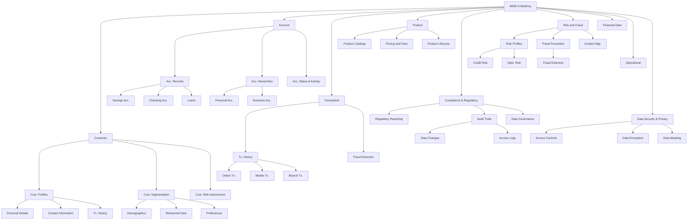

<Note>
  This chapter is constantly being updated by the analytics consultants at Supertype to stay current with the latest trends 
  in enterprise data management. Please check back regularly for updates.
</Note>

## The Enterprise Analytics Landscape
Today's enterprise analytics landscape is characterized by a diverse array of data sources. Organizations now deal with data from cloud platforms, 
on-premises databases, big data systems, IoT devices, social media, and more. 

An interesting case study I like to point to is BCA (Bank Central Asia), a leading bank in Indonesia. Their customer hotline service, known as Halo BCA,
receives inbound enquiries from more than 110,000 customers daily1, most of it via phone calls but also through email and social media. BCA 
enlist the help of data solutions to launch VIRA2, an AI chatbot available on Facebook Messenger, LINE messenger and WhatsApp that can answer
customer queries with an emphasis on speed and accuracy. 

Defying most conventional definitions of banking operations, these services are examples of how varied and heterogeneous
enterprise data management has become. Just 10 years ago, one wouldn't consider a scenario where financial institutions and banks 
would have to architecturally provision for these varied forms of data sources, from audio recordings of phone calls, to text messages on social media 
and chatbots.

In the following subsections, we will take a closer look at the key components that make up 
a modern enterprise data management system, with practical examples sprinkled throughout to illustrate
how these components are applied in real-world scenarios.

By the end of the lesson, you should have a good understanding of the overarching principles of enterprise data management,
and how these principles translates to the design and implementation of effective processes that 
support analytics adoption in organizations.

## Modern Enterprise Data Management
Enterprise Data Management is a set of processes, policies and technologies that enable organizations 
to **precisely define**, **easily integrate** and **effectively retrieve** data for both internal 
applications and external communication. It encompasses the full lifecycle of data management, from
data creation and capture, to data storage, retrieval, and analysis.

<AccordionGroup>
  <Accordion title="Defining Enterprise Data Management, Tableau's perspective">
    Enterprise data management (EDM) is the process of inventorying and governing your business's data 
    and getting your organization onboard with the process. In other words, EDM is 
    as much about managing people as it is about managing data. Data management means making sure your 
    people have the accurate and timely data they need, and that they follow your standards for 
    storing quality data in a standardized, secure, and governed place.

    -- Tableau
  </Accordion>
  <Accordion title="Data Management, as defined by SAP">
    Data management is the practice of collecting, organising, managing, and accessing 
    data to support productivity, efficiency, and decision-making.

    -- SAP
  </Accordion>
  <Accordion title="7 areas of service in Enterprise Data Management by Oracle">
    1. Connect disparate enterprise applications
    2. Model changes to enterprise master data elements
    3. Coauthor changes in real time
    4. Engage stakeholders with adaptive inference workflows
    5. Rationalize differences across business perspectives
    6. Distribute changes to consuming users and applications
    7. Audit data and metadata changes

    -- Oracle Enterprise Data Management 
  </Accordion>
</AccordionGroup>

As seen above, vendors and solution providers have varying definitions of what constitutes enterprise data management, 
and what its objectives are. Through its various engagements with Indonesia's leading enterprises, Supertype has distilled
a set of key objectives and key components that are common across these many definitions, and are essential to the overarching goal of 
enterprise data management, irrespective of vendor-specific applicability.

### Objectives of Enterprise Data Management
The good of a good enterprise data management system is to provide a **single source of truth** that 
where its data is trusted to be accurate, consistent, and up-to-date.

When organizations like Bank BCA make data management a priority, users in their organization benefit from:

- **Accuracy**: They trust that the data they're using is correct, and when surveyed, responded that they are confident in the data they use.
- **Security and Compliance**: They know that the data they're using is secure and compliant with regulations such as those 
  set by the Indonesian Central Bank and the Financial Services Authority (Otoritas Jasa Keuangan, or "OJK").
- **Efficient**: They know where exactly to locate the data they need quickly and easily, easily integrating and consolidating it into 
  downstream applications and analytics tools.
- **Consistent**: Employees across the organization are speaking the same language when it comes to data, and 
  are able to make decisions based on the same set of facts, standardized and governed according to the organization's data management policies.

## Key Components of Enterprise Data Management
With the primary objective of enterprise data management being trust and confidence in the data's accuracy and consistency, 
it is no wonder that companies invest considerable resources into solutions centered around a 
paradigm called "Master Data Management" (MDM).

### Master Data Management (MDM)
Master Data Management can be thought of as a sub-discipline of enterprise data management that is centered around
the **creation and maintenance** of a **single, accurate, and consistent version of the truth** for an organization's
most important data entities. These entities, known as "master data", are typically shared across multiple systems
and business processes.

#### Single Version of the Truth
When we call MDM a "single version of the truth", we typically mean it in the sense that there is no competing 
versions of the data. For example, in a bank, the customer's name, address, and contact information should be
consistent across all systems and applications that use this data -- not always straightforward, considering the number of systems 
that interact with customer data in a bank (mobile banking, internet banking, ATM, branch tellers, etc).

<Tip>
A good way to know if your organization needs MDM is to ask yourself: "Do we have multiple versions of the same data entity
across different systems, and do these versions often conflict with each other?"
</Tip>

It's a short and simple litmus test, but holding more than one copy of the same data entity across different systems is a
clear indicator that at some point, some competing versions of truth will emerge. 

Consider the common example of a scenario where a bank customer has recently taken 
out a home ownership loan through KPR ("Kredit Pemilikan Rumah"), typically managed by a special business unit ("BU") within the 
Consumer Banking division. The marketing officer who manages the customer's relationship begins to send marketing materials on 
home insurance or home renovation loans, unaware that the customer does in fact have an existing loan account held jointly 
with their spouse. As separate BUs within the bank, the lack of a single version of truth across 
these systems lead to the customer receiving multiple, sometimes conflicting, messages from the bank. In our 
example above, separate BUs within the bank are unable to agree if the customer should be 
considered a new lead for consumer loans, or if they should be considered an existing customer with an ongoing loan.

With the existence of a MDM system, business units within the bank can instead of rely on **record linkage** to match 
the customer in one database (e.g. new leads for consumer loans) to the same customer in another database (e.g. existing loans under consumer banking). 
Commonly, this is done through a unique identifier, such as the NIK (nomor induk kependudukan) in Indonesia, printed on the KTP (Kartu Tanda Penduduk, or "identity card").

### MDM in Banking
To begin constructing a MDM strategy, we typically start by identifying the key data entities that are shared across
multiple systems and business processes. Think of this exercise as one that produces a "data inventory" of sorts, 
or a requirements document that identify the necessary fields and inputs to our MDM system. 

These fields might be fed from various sources, including external tools and systems. It is a first step in starting to 
catalog your data, and to understand the relationships between these entities. We will dive into the [Entity Relationship Diagram](exercise_erd.mdx) 
in a future section, so this exercise should be seen as a precursor to that.

To help you get started, I've created a simplified overview of the key data entities in a typical MDM system for a bank:

1. Customer Data Management
    - Customer Profiles: Centralizing customer information such as personal details, contact information, and transaction history to create a single, accurate view of each customer.
    - Customer Segmentation: Grouping customers based on demographics, behavioral data, and preferences to tailor marketing and service offerings.
    - Customer Risk Assessment: Integrating customer data from various sources to assess risk levels and comply with regulatory requirements such as Know Your Customer (KYC) and Anti-Money Laundering (AML) regulations3.

2. Account Data Management
    - Account Records: Maintaining accurate and up-to-date records of all types of accounts (e.g., savings, checking, loans) across different banking systems.
    - Account Hierarchies: Managing relationships between different accounts, such as personal accounts linked to business accounts or joint accounts.
    - Account Status & Activity: Ensuring consistency in account status (e.g., active, dormant, closed) and tracking account activities across various platforms.

3. Transaction Data Management
    - Transaction History: Aggregating transaction data from multiple channels (e.g., online banking, mobile apps, branch transactions) to ensure a complete and accurate history.
    - Fraud Detection: Using MDM to enhance fraud detection by consolidating transaction data and applying analytics to identify suspicious activities.
    - Data Reconciliation: Ensuring consistency between transaction records in different systems (e.g., core banking systems, payment processing systems).

4. Product Data Management
    - Product Catalogs: Centralizing information about banking products (e.g., loans, credit cards, investment products) including features, terms, and conditions.
    - Pricing and Fees: Managing and standardizing pricing, fees, and interest rates across various banking products to ensure accuracy and compliance.
    - Product Lifecycle: Tracking and managing the life cycle of banking products from introduction to retirement, including updates and modifications.

5. Compliance & Regulatory Data Management
    - Regulatory Reporting: Consolidating and managing data required for regulatory reporting, including Basel III compliance4,5, stress testing, and other regulatory frameworks.
    - Audit Trails: Maintaining detailed audit trails of data changes, access logs, and compliance activities to support regulatory audits and investigations.
    - Data Governance: Establishing policies, procedures, and controls to ensure data quality, integrity, and security in compliance with regulatory requirements.

6. Risk and Fraud Management
    - Risk Profiles: Centralizing data on risk assessments, credit scores, and exposure limits to enhance risk management strategies.
    - Fraud Prevention: Integrating data from various sources to detect and prevent fraudulent activities and ensure data consistency across fraud detection systems.
    - Incident Management: Managing data related to fraud incidents, including details of the event, actions taken, and outcomes.

7. Financial Data Management
   - General Ledger: Ensuring accuracy and consistency in general ledger data, including account balances, transactions, and financial statements.
   - Financial Reporting: Centralizing data for financial reporting purposes, such as income statements, balance sheets, and cash flow statements.
   - Cost Allocation: Managing data related to cost allocation and budgeting to ensure accurate financial planning and analysis.

8. Operational Data Management
    - Branch and ATM Data: Centralizing data related to branch operations, ATM locations, and operational statuses to enhance service delivery and operational efficiency.
    - Staff and Employee Data: Managing information about bank employees, including roles, departments, and performance metrics.
    - Service Requests: Aggregating data on customer service requests, complaints, and resolutions to improve customer service and operational efficiency.

9. Integration and Data Synchronization
    - System Integration: Implementing MDM to integrate data across various banking systems (e.g., core banking systems, CRM, ERP) for a unified view.
    - Data Quality Management: Ensuring data quality by implementing data validation, cleansing, and enrichment processes across all systems.

10. Data Security and Privacy
    - Access Controls: Managing and monitoring access to master data to ensure that only authorized personnel can view or modify sensitive information.
    - Data Encryption: Implementing encryption techniques to protect sensitive data both at rest and in transit.
    - Data Masking: Using data masking techniques to obscure sensitive data for non-production environments or for specific use cases.

### Implementation Challenges in Practice 
Implementing MDM across a large enterprise, especially one as complex as a banking institution, can 
be daunting. In the Enterprise Analytics model, Supertype describes this as a local optimization problem, where
each business unit within the bank is incentivized to optimize their own operations, often affirming the need 
of a BU-specific definition. 

Consider the product hierarchy in a bank, where the consumer marketing division might classify each loan products
in a way that maximizes their marketing efforts and return-on-investment frameworks. The risk management division, 
on the other hand, is unconcerned with marketing ROI, but rather with the risk exposure of each loan product. The 
two divisions might hence keep separate records of product hierarchies, tailored to their respective local optimization
objectives at the expense of overall effectiveness in the bank's MDM system.

### Data Governance 
Data governance is the establishment of policies and principles for managing data assets. We can look to the principles laid 
out from the DAMA-DMBOK6 (Data Management Body of Knowledge) to guide us in the establishment of data governance policies.

I have adapted the DAMA-DMBOK principles into a 6-step process for implementing data governance in banks and financial institutions:

#### DAMA-DMBOK: Data Governance in Banks
<Steps>
  <Step title="1. Establish a Data Governance Framework">
    **Purpose**: Develop a structured approach to managing data assets, ensuring they are accurate, secure, and used effectively.
    <AccordionGroup>
    <Accordion title="Components">
    Components:
      - Data Governance Charter: Define the scope, objectives, and authority of the data governance program. This includes outlining roles, responsibilities, and decision-making processes.
      - Data Governance Council: Form a cross-functional team comprising stakeholders from different departments (e.g., IT, compliance, risk management, business units). This council oversees data governance activities, sets priorities, and resolves conflicts.
    </Accordion>
    <Accordion title="Implementation">
    Implementation:
      - Define Objectives: Align data governance goals with the bank's strategic objectives, regulatory requirements, and operational needs.
      - Set Governance Policies: Develop policies for data quality, data security, and data usage that comply with OJK and Bank Indonesia regulations.
    </Accordion>
    </AccordionGroup>
  </Step>
  <Step title="2. Develop Data Governance Policies and Standards">
    **Purpose**: Ensure that data is managed consistently and complies with legal and regulatory requirements.
    <AccordionGroup>
    <Accordion title="Components">
    Components:
      - Data Quality Standards: Establish criteria for data accuracy, completeness, consistency, and timeliness. This includes creating data quality metrics and monitoring procedures.
      - Data Security Policies: Define measures to protect data from unauthorized access, breaches, and misuse. This includes data encryption, access controls, and data masking.
      - Data Privacy Policies: Ensure compliance with data protection laws and regulations by implementing privacy practices, including data anonymization and secure data handling.
    </Accordion>
    <Accordion title="Implementation">
    Implementation:
      - Create Policy Documents: Draft and approve policies for data management, security, and privacy.
      - Communicate Policies: Disseminate policies to all relevant stakeholders and provide training to ensure understanding and adherence.
    </Accordion>
    </AccordionGroup>
  </Step>
  <Step title="3. Implement Data Governance Processes">
    **Purpose**: Ensure that data governance policies are applied effectively across the organization.
    <AccordionGroup>
    <Accordion title="Components">
    Components:
      - Data Lifecycle Management: Define processes for managing data throughout its lifecycle, including data creation, usage, archiving, and deletion.
      - Data Classification: Classify data based on its sensitivity and importance (e.g., confidential, restricted, public) to apply appropriate security and management measures.
      - Data Change Management: Implement procedures for managing changes to data, including updates, deletions, and modifications, to maintain data integrity.
    </Accordion>
    <Accordion title="Implementation">
    Implementation:
      - Develop Procedures: Create detailed procedures for data lifecycle management, classification, and change management.
      - Automate Processes: Utilize technology to automate data management tasks, ensuring consistency and efficiency.
    </Accordion>
    </AccordionGroup>
  </Step>

  <Step title="4. Monitor and Enforce Data Governance">
    **Purpose**: Track adherence to data governance policies and address any issues or deviations.
    <AccordionGroup>
    <Accordion title="Components">
    Components:
      - Data Quality Monitoring: Regularly assess data quality through automated tools and manual reviews to identify and correct data issues.
      - Compliance Audits: Conduct periodic audits to ensure compliance with regulatory requirements and internal policies.
      - Issue Resolution: Establish a process for reporting and resolving data-related issues, including a clear escalation path for critical problems.
    </Accordion>
    <Accordion title="Implementation">
    Implementation:
      - Deploy Monitoring Tools: Use data governance and data management tools to monitor data quality and compliance in real-time.
      - Review and Adjust: Regularly review data governance practices and adjust policies and procedures as needed to address emerging issues or changes in regulatory requirements.
    </Accordion>
    </AccordionGroup>
  </Step>
  <Step title="5. Promote Data Governance Culture">
    **Purpose**: Foster a culture that values and adheres to data governance principles.
    <AccordionGroup>
      <Accordion title="Components">
      Components:
        - Training and Awareness: Provide ongoing training for employees on data governance principles, policies, and best practices.
        - Communication: Promote the importance of data governance through internal communications, including newsletters, workshops, and leadership messages.
        - Incentives and Recognition: Recognize and reward employees who contribute to effective data governance and demonstrate a commitment to data stewardship.
      </Accordion>
      <Accordion title="Implementation">
      Implementation:
        - Develop Training Programs: Create and deliver training sessions on data governance and data management practices.
        - Engage Leadership: Ensure that senior management actively supports and promotes data governance initiatives.
      </Accordion>
    </AccordionGroup>
    </Step>
    <Step title="6. Leverage Technology for Data Governance">
      **Purpose**: Utilize technology solutions to support and enhance data governance efforts.
      <AccordionGroup>
          <Accordion title="Components">
          Components:
            - Data Governance Tools: Implement tools for data cataloging, data lineage, and data quality management to support data governance activities.
            - Integration Solutions: Use integration platforms to ensure seamless data flow between systems and maintain data consistency.
            - Analytics Platforms: Employ analytics tools to gain insights into data usage, quality, and governance effectiveness.
          </Accordion>
          <Accordion title="Implementation">
          Implementation:
            - Select and Deploy Tools: Choose and implement technology solutions that align with the bank's data governance needs and regulatory requirements.
            - Integrate Systems: Ensure that data governance tools are integrated with existing systems for comprehensive data management.
          </Accordion>
        </AccordionGroup>
    </Step>
</Steps>

As we've seen above, implementing data governance using the DAMA-DMBOK principles involves 
establishing a robust framework, developing comprehensive policies, and at the right maturity level, 
introducing technology solutions to support data governance activities.

It is a long term commitment, and one that requires the buy-in of senior management responsible for 
setting the tone for data governance practices across the organization. I've also summarized the 6-step 
process into a table format for easy reference:

| **Action Area**                     | **Action Item**                                                                                                                      | **Details**                                                                                                            | **Responsible Party**       | **Timeline**   | **Status**    |
|------------------------------------|----------------------------------------------------------------------------------------------------------------------------------------|------------------------------------------------------------------------------------------------------------------------|-----------------------------|----------------|---------------|
| **Data Governance Framework**      | Develop Data Governance Charter                                                                                                       | Define the scope, objectives, and authority of the data governance program, including roles and responsibilities.      | Data Governance Council     | Q1 2025        | Not Started    |
|                                    | Establish Data Governance Council                                                                                                     | Form a cross-functional team to oversee data governance activities and resolve conflicts.                              | Senior Management           | Q1 2025        | Not Started    |
|                                    | Appoint Data Stewards                                                                                                                  | Designate individuals to manage data quality and enforce policies within specific data domains.                        | Data Governance Council     | Q2 2025        | Not Started    |
| **Policies and Standards**          | Create Data Quality Standards                                                                                                         | Define metrics and procedures for data accuracy, completeness, and consistency.                                        | Data Stewards                | Q2 2025        | Not Started    |
|                                    | Develop Data Security Policies                                                                                                        | Establish protocols for data protection, including encryption, access controls, and data masking.                      | IT Security Team             | Q2 2025        | Not Started    |
|                                    | Implement Data Privacy Policies                                                                                                       | Ensure compliance with data protection laws by defining privacy practices and data handling procedures.               | Compliance Team             | Q2 2025        | Not Started    |
| **Governance Processes**            | Define Data Lifecycle Management Procedures                                                                                          | Develop processes for data creation, usage, archiving, and deletion.                                                   | Data Stewards                | Q3 2025        | Not Started    |
|                                    | Implement Data Classification Scheme                                                                                                 | Classify data based on sensitivity and importance to apply appropriate management measures.                             | Data Governance Council     | Q3 2025        | Not Started    |
|                                    | Establish Data Change Management Procedures                                                                                           | Create procedures for managing data updates, deletions, and modifications.                                             | Data Stewards                | Q3 2025        | Not Started    |
| **Monitoring and Enforcement**      | Deploy Data Quality Monitoring Tools                                                                                                  | Use tools to assess data quality and identify issues.                                                                   | IT Department                | Q4 2025        | Not Started    |
|                                    | Conduct Compliance Audits                                                                                                              | Perform regular audits to ensure adherence to regulations and internal policies.                                       | Internal Audit Team         | Q4 2025        | Not Started    |
|                                    | Develop Issue Resolution Process                                                                                                      | Create a process for reporting and addressing data-related issues.                                                       | Data Governance Council     | Q4 2025        | Not Started    |
| **Culture and Training**            | Develop and Deliver Training Programs                                                                                                 | Provide training on data governance principles and policies to all relevant employees.                                 | HR Department                | Q1 2025        | Not Started    |
|                                    | Promote Data Governance Awareness                                                                                                     | Use internal communications to emphasize the importance of data governance.                                             | Communications Team         | Q1 2026        | Not Started    |
|                                    | Implement Incentives and Recognition Program                                                                                        | Recognize and reward employees who contribute to effective data governance.                                             | HR Department                | Q2 2026        | Not Started    |
| **Technology Integration**          | Select and Implement Data Governance Tools                                                                                           | Choose tools for data cataloging, lineage, and quality management.                                                       | IT Department                | Q1 2026        | Not Started    |
|                                    | Integrate Data Governance Tools with Existing Systems                                                                                 | Ensure that data governance tools are integrated with the bank’s current systems.                                       | IT Department                | Q2 2026        | Not Started    |
|                                    | Utilize Analytics Platforms for Insights                                                                                             | Employ analytics tools to monitor data usage, quality, and governance effectiveness.                                   | Analytics Team              | Q2 2026        | Not Started    |

#### Control Documents for Financial Institutions 
Erecting a data governance framework in a bank or financial institution is a complex process. I've 
compiled a list of control documents that might be helpful in seeing this process through.

| **Document**                           | **Purpose**                                                                                                                        | **Plan** | **Acquire** | **Process/Maintain** | **Publish/Share** | **Retain** |
|----------------------------------------|------------------------------------------------------------------------------------------------------------------------------------|----------|-------------|-----------------------|-------------------|------------|
| **Data Governance Framework**          | Define the structure and policies for managing and overseeing data across the bank. This includes data ownership, stewardship, and accountability to ensure data quality, integrity, and compliance with OJK and Bank Indonesia regulations. | ●        | ●           | ●                     | ●                 | ●          |
| **Enterprise Data Management Plan**    | Outline the methods and strategies for managing data across the bank's operations. This plan includes data integration, data quality management, and data lifecycle management to ensure that data is accurate, consistent, and accessible while adhering to regulatory requirements.                      | ●        | ●           | ●                     | ●                 | ●          |
| **Data Quality Management Plan**       | Establish procedures and standards for maintaining high data quality within the bank. This includes defining data quality metrics, implementing data validation processes, and conducting regular data quality assessments to ensure that data used in analytics and reporting meets regulatory and operational standards. | ●        | ●           | ●                     | ●                 | ●          |
| **Enterprise Analytics Strategy**       | Define the approach and methodologies for leveraging data analytics to drive business insights and decision-making. This includes establishing analytical frameworks, tools, and processes for reporting, predictive modeling, and performance measurement in alignment with regulatory requirements. | ●        | ●           | ●                     | ●                 | ●          |
| **Regulatory Compliance Analytics Plan** | Detail the processes for using data analytics to monitor and ensure compliance with OJK and Bank Indonesia regulations. This includes developing analytical models for regulatory reporting, risk assessment, and compliance tracking to meet the regulatory obligations effectively.         | ●        | ●           | ●                     | ●                 | ●          |
| **Data Privacy and Security Policy**    | Define the protocols and measures to protect sensitive financial data from unauthorized access and breaches. This policy includes data encryption, access controls, and privacy practices to ensure compliance with data protection regulations and safeguard customer information. | ●        | ●           | ●                     | ●                 | ●          |

## Summary 
In this chapter, we've explored the key components of enterprise data management, with a focus on Master Data Management (MDM) and 
Data Governance in the context of banking and financial institutions. We've discussed the importance of establishing a single source of truth
for critical data entities, and the challenges and benefits of implementing MDM and data governance practices in a complex enterprise environment.

Finally, I've included a 6-step process for implementing data governance tailored to the requirements of banks and financial institutions. These 
requirements are not always unique, but are often more stringent due to the regulatory environment in which they operate. If you are 
working in a sector with less stringent regulatory requirements, you might find that the 6-step process can be adapted to suit your
organization's data management needs. To close off, I've also included a list of control documents 
that can serve as a guide as your organization embarks on the journey of establishing a robust data governance framework.

By following these guidelines and best practices, companies can enhance data quality, security, and compliance while leveraging data analytics to 
drive business growth and innovation.

### References

1. [Strategi BCA Tekankan Prinsip Customer First lewat HaloBCA, Marketeers](https://www.marketeers.com/strategi-bca-tekankan-prinsip-customer-first-lewat-halobca/)
2. [VIRA, BCA's Virtual Assistant](https://www.bca.co.id/id/Individu/layanan/Customer-Service/Vira)
3. [Know Your Customer and Anti Money Laundering](https://ojk.go.id/en/kanal/perbankan/Pages/Prinsip-Mengenal-Nasabah-dan-Anti-Pencucian-Uang.aspx)
4. [Implementing Basel di Indonesia](https://ojk.go.id/id/kanal/perbankan/implementasi-basel/Pages/Quantitative-Impacts-Study.aspx)
5. [Implementing Basel](https://ojk.go.id/id/kanal/perbankan/implementasi-basel/Pages/Road-Map.aspx)
6. [DAMA International. 2017a. DAMA-DMBOK: Data Management Book of Knowledge, 2nd ed.]()

## Author
This chapter is written by [Samuel Chan](https://www.linkedin.com/in/chansamuel/), an analytics consultant at Supertype with 
over 11 years of experience of enterprise AI consulting across Singapore, China (DianDian, 600634:SH), Japan (TWP Dai Nippon, TYO:7912; gumi Inc, TWO:3903; SEGA, TYO:6460) 
and Indonesia (Emtek, Adaro Group of Companies, Central Bank of Indonesia, Bursa Efek Indonesia, BCA). He has long-term consulting 
experience with leading financial institutions in the region, and is the co-founder of [Algoritma Data Science Education Center](https://algorit.ma), 
[Supertype](https://supertype.ai), [Sectors](https://sectors.app), and formerly HyperGrowth, a marketing automation and chatbot 
platform startup that he sold in 2016.

Samuel is an avid open source contributor and guest lecturer at several universities across Indonesia and Singapore. He 
is currently ranked #1 in Indonesia (and top 2% worldwide) on Stack Overflow for R and Python topics (with 111 badges and 
contributions exceeding 2 million reach).

### Contributors
- Ahmad Nawaz, customer success architect (UK & IMEA) at Hewlett Packard Enterprise
- Gerald Bryan, senior analytics consultant at Supertype
