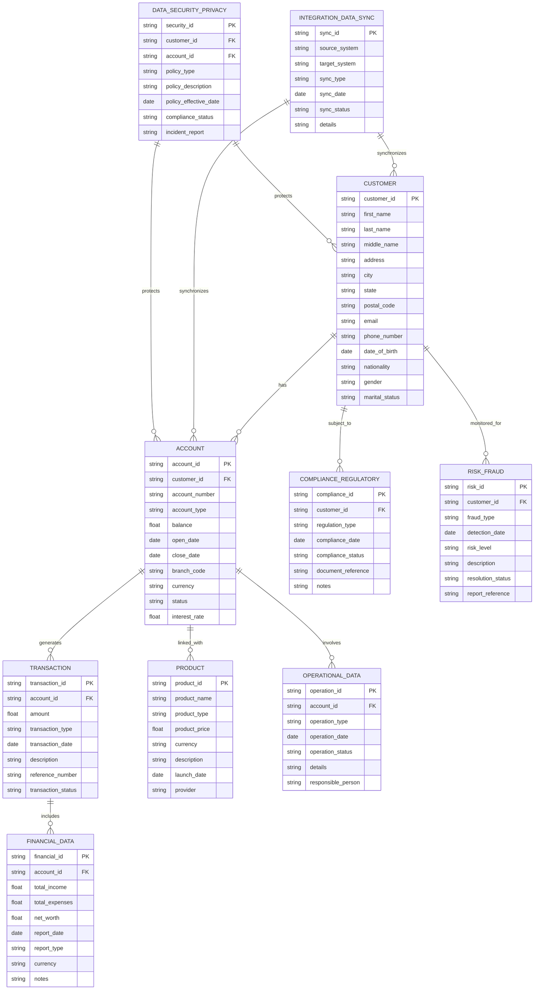

<Note>
  This chapter is constantly being updated by the analytics consultants at Supertype to stay current with the latest trends 
  in enterprise data management. Please check back regularly for updates.
</Note>

## ERD for a Loan Management System
Here is an example of an Entity Relationship Diagram (ERD) for a database schema of a financial institution. You 
may use it as a base reference to create your own ERD for a loan management system.

