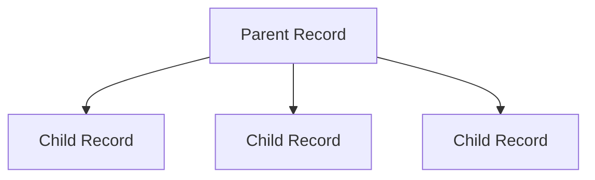
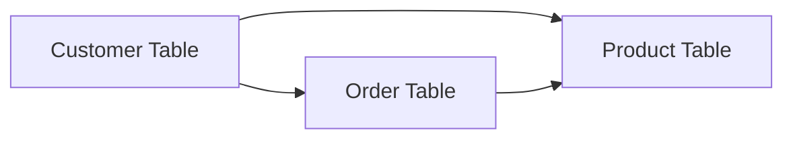
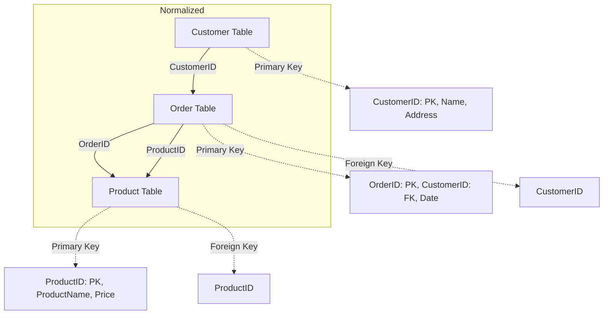
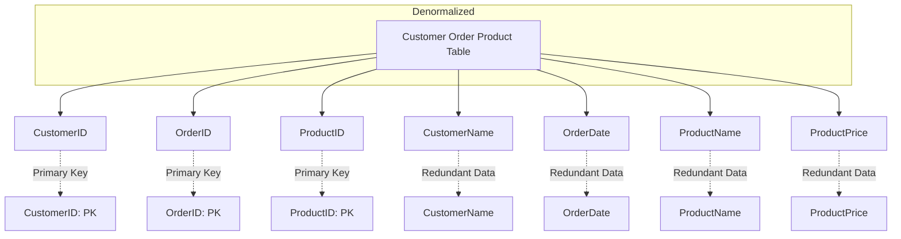

<Note>
  This chapter is constantly being updated by the analytics consultants at Supertype to stay current with the latest trends 
  in enterprise data management. Please check back regularly for updates.
</Note>

## Historical Context of Enterprise Data Management
Enterprise Data Management (EDM) used to be more homogeneous. In an era dominated by large, mature 
solutions such as Oracle, IBM, and Microsoft, the data management landscape was relatively simple. Companies 
would typically use a single database management system (DBMS) to store all their data, and a single
enterprise resource planning (ERP) system to manage their business processes. 

I've broken down some of the defining characteristics of this era in the following subsections.

### Centralized, Monolithic Systems
For a long time, organizations employed a well-staffed IT department to manage large monolithic systems that 
were responsible for all data processing and storage throughout the company. This style of 
data management architecture is sometimes referred to as "centralized" or "monolithic", since their operational
model relies on data being stored and handled from a single location or system. 

What makes a data management system "monolithic"? 

<Icon icon="x" iconType="solid" /> Wrong: It's a system that is large and complex.

<Icon icon="check" iconType="solid" /> Correct: Data storage and processing are interconnected and tightly integerated into 
a single system, which is typically a large database server or mainframe. These parts are not easily 
separable or independently managed, and are often designed to be operated as a single unit.

There were a lot of advantages to a centralized, monolithic approach, such as:
- **Simplicity**: Having a single system to manage all data made it easier to maintain and troubleshoot.
- **Single Point of Control**: A centralized system affords a single point of control where data is stored, 
  processed, and managed. All data-related activities are channeled through one central system, often a large 
  database server or mainframe.
- **Unified Management**: Since all data is stored in one place, it greatly simplifies the administration of 
  data-management administration tasks such as backups, security, and disaster recovery. It also ensures a level 
  of consistency in data management practices across the organization.
- **Resource Efficiency**: Centralization allows for efficient resource utilization, as the related resources 
  (processing power, storage, software, and personnel) are concentrated in one location, which can be helpful 
  in reducing duplication of effort and yielding higher economies of scale.

### Fewer Tools, Higher Standardization
Data management and the analytics function in general were, unsurprisingly, highly standardized across 
the organization, primarily because of the limitation of the existing systems but also 
due to the centralized nature of data management.

As a result, reporting was typically rigid and inflexible, relying instead on the ERP system's pre-defined 
templates and options. This made it difficult for IT to be responsive to the changing business needs or even 
be supportive of any analytical requirements that fell outside the scope of the ERP system.

This higher standardization extends to the tools and business processes across the organization. Since there 
is a strong reliance on a single system, companies adopt a uniform data model for different business processes.

<Tip>
  Of course, part of how centralized systems came to define this era of enterprise data management also stems 
  from the limitations of technology at the time - both in terms of hardware and software. That, coupled with 
  the relatively low volume of data that organizations had to manage, made centralized systems the most
  practical and cost-effective solution.

  Additionally, organizations also have far fewer choices in terms of data management solutions.
</Tip>

### Proprietary, All-Encompassing Platforms
The vendor market was dominated by a few large, mature technology companies such as IBM, Microsoft and 
Oracle (later, this included SAP). 
These companies had established a strong foothold by offering broad, all-encompassing enterprising solutions that 
span multiple data management functions, including databases, reporting, and simple built-in analytics. Specialization 
within the enterprise data management space was less pronounced, with these vendors offering a one-size-fits-all
solutions that are broadly applicable to a wide range of industries and use cases.

It is also notable that these data management solutions during this era were largely proprietary, meaning that
they were fully developed and maintained by the vendor, and were not open-source or based on open standards.

Organizations that adopted these solutions were often locked into a long-term relationship with the vendor,
as the cost and effort of migrating to a different system were often prohibitive. Crucially, they were also 
dependent on the vendor for support and maintenance, and often had little to no support for integration with 
other technologies or systems outside of the vendor-specific ecosystems. 

## A note on Hierarchical Database Model
Depends on how far back we move along the enterprise data management timeline, we might discover that, contrary to 
popular belief, the omnipresent relational database model was not the first dominant paradigm in data management.

That honor goes to the hierarchical database model like IBM's Information Management System (IMS), which was
developed in the 1960s and was widely used in the 1970s and 1980s. The hierarchical model is based on a tree-like
structure where data is organized in a parent-child relationship, with each parent record having one or more child
records, and each child record having only one parent record, creating a somewhat rigid structure 
for data storage and retrieval.

In the context of a financial institution, for example, a hierarchical database might be used to store customer
information, where each customer record is the parent record, and each account record is a child record. This
structure is well-suited for representing data that has a natural hierarchical relationship, such as organizing 
financial transactions by customer account, or representing the organizational structure of a company.

### Characteristics of Hierarchical Database Model:

- **Parent-Child Relationship**: Data is stored in a hierarchical structure where each record (node) is linked to others through parent-child relationships. This makes it suitable for applications with a clear hierarchical relationship, such as organizational structures or parts catalogs.
- **Rigid Structure**: The hierarchical model is inherently rigid in terms of data relationships. Relationships between 
records are fixed and cannot be easily modified, making it challenging to accommodate changes in data structure or relationships.
- **Queries Patterns**: The hierarchical model is optimized for certain types of queries, such as traversing the tree structure from parent to child records. 
However, because queries often require navigating the hierarchy from the top down, any complex queries involving multiple 
relationships or non-hierarchical in nature can be cumberson and inefficient.

<Accordion title="Did you know" icon="question">
  IBM designed the IMS with Rockwell and Caterpillar starting in 1966 for the Apollo program, where it was used to inventory the very large bill of materials (BOM) for the Saturn V Moon rocket and Apollo space vehicle.
</Accordion>

### Limitations of the Hierarchical Database Model:
- **Complexity in Queries**: Performing complex queries or joining data from different branches of the hierarchy can be challenging and inefficient.
- **Scalability Issues**: As applications evolved and data complexity increased, the limitations of hierarchical databases became more apparent. Managing (and querying) data beyond simple hierarchical relationships became increasingly difficult
  which led to reluctance in any schema changes even as business requirements changed. 

### Transition to Relational Database Model
The transition from hierarchical databases like IBM's Information Management System (IMS) to relational 
database systems represents a significant shift in enterprise analytics paradigms. 

An example of a relational database:

The concept of a relational database was first introduced by Edgar Codd in the 1970s, which see data 
being organized into tables ("relations") consisting of rows and columns. The relational model allows
for more flexible data relationships, where data can be linked across tables using foreign keys, and queries can
be performed using a structured query language (SQL) to retrieve and manipulate data. With SQL, users can
perform complex queries that involve joining multiple tables (`JOIN`), filtering data (`WHERE`), and aggregating
data (`GROUP BY`, `SUM`, `COUNT`, etc.) in a more intuitive manner compared to the hierarchical model.

#### Normalization and Denormalization
One of the key principles of the relational model is normalization, which involves organizing data into
multiple tables to reduce redundancy and improve data integrity. Normalization helps to minimize data
duplication and inconsistencies by breaking down data into smaller, more manageable units, and establishing
relationships between them.

- Customer Table: Contains customer details with a primary key (CustomerID).
- Order Table: Contains order details with primary keys (OrderID) and foreign keys (CustomerID, ProductID).
- Product Table: Contains product details with a primary key (ProductID).
- Relationships: The Customer Table is related to the Order Table via CustomerID, and the Order Table is related to the Product Table via ProductID.

Denormalization is the process of combining normalized tables back into a single table to improve query
performance and simplify data retrieval. Denormalization is often used in data warehousing and analytics
applications where read performance is a priority, and data integrity is less of a concern.

- Customer Order Product Table: Combines all relevant data into one table.
- Data Columns: Includes CustomerID, OrderID, ProductID, and redundant data like CustomerName, OrderDate, ProductName, and ProductPrice.
- Redundancy: Data is repeated for each row, which can lead to redundancy and potential anomalies.

Common scenarios where denormalization is used include:
- **Reporting and Analytics**: Denormalization can improve query performance by reducing the number of
  joins required to retrieve data. This is especially useful in data warehousing and business intelligence
  applications where complex queries are common.
- **Data Aggregation**: Denormalization can simplify data aggregation tasks by pre-computing and storing
  aggregated values in the denormalized table. This can improve query performance for analytical queries
  that involve aggregating large volumes of data.
- **Data Migration**: Denormalization can be used during data migration to consolidate data from multiple
  sources into a single table. This can simplify the migration process and reduce the complexity of data
  transformation tasks.

As computing power improved and data technology advanced, newer data management systems and paradigms such as 
NoSQL databases, data lakes, and cloud-based data platforms emerged, with each offering specialized, unique capabilities 
to address the evolving needs of modern organizations. Today, most organizations have some form of 
heterogeneous data environment, with a mix of relational and non-relational databases, disbursed data sources,
and a variety of data management tools and technologies to support their enterprise analytics needs.

## Summary 
The historical context of enterprise data management provides valuable insights into the evolution of data
management practices and technologies over time. From the centralized, monolithic systems of the past to the
distributed, heterogeneous environments of today, the landscape of enterprise data management has undergone
significant changes driven by advancements in technology, changing business requirements, and evolving data
management paradigms. Importantly, this evolution has also served to show how current data management practices build
upon many past lessons to better meet the needs of today's data-driven business environment.

Over the next few sections, we will explore the key components of modern enterprise data management, including
data governance, data quality, master data management, metadata management, and data integration, and discuss
how these components work together to support the data-driven decision-making processes of organizations today.

## Author
This chapter is written by [Samuel Chan](https://www.linkedin.com/in/chansamuel/), an analytics consultant at Supertype with 
over 11 years of experience of enterprise AI consulting across Singapore, China (DianDian, 600634:SH), Japan (TWP Dai Nippon, TYO:7912; gumi Inc, TWO:3903; SEGA, TYO:6460) 
and Indonesia (Emtek, Adaro Group of Companies, Central Bank of Indonesia, Bursa Efek Indonesia, BCA). He has long-term consulting 
experience with leading financial institutions in the region, and is the co-founder of [Algoritma Data Science Education Center](https://algorit.ma), 
[Supertype](https://supertype.ai), [Sectors](https://sectors.app), and formerly HyperGrowth, a marketing automation and chatbot 
platform startup that he sold in 2016.

Samuel is an avid open source contributor and guest lecturer at several universities across Indonesia and Singapore. He 
is currently ranked #1 in Indonesia (and top 2% worldwide) on Stack Overflow for R and Python topics (with 111 badges and 
contributions exceeding 2 million reach).

### Contributors
- Gerald Bryan, senior analytics consultant at Supertype
