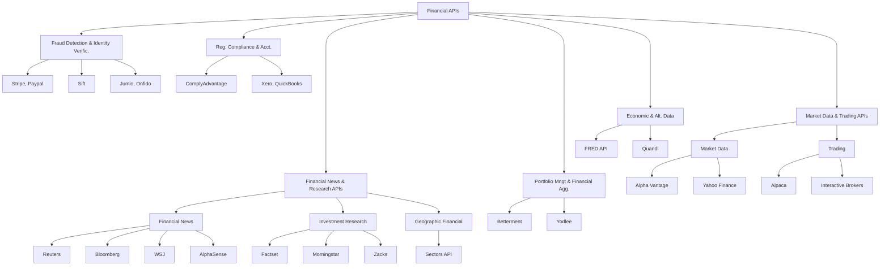

<Note>
  To make the most out of this guide, you should have a basic understanding of Python programming and have 
  obtained your API keys from [Sectors](https://sectors.app). If you haven't done so, please refer to the
    [Python Programming](/essentials/python-programming#new-to-working-with-apis) guide.
</Note>

## What is the deal with APIs?
The modern day financial industry is driven by data. Lots of it. And these data are 
sitting on servers all around the world, some idle, some being used extensively in 
trading algorithms, risk management systems, credit scoring models and more.

Some of these data are made available to external parties (or in some cases, the public)
through APIs. When an investor wants to know the latest stock price of BBRI (Bank 
Rakyat Indonesia), they require data that help them analyze the stock price, volume, 
and other critical pieces of information central to their investment thesis. This is 
where APIs (Application Programming Interfaces) come into play.

APIs are a set of rules and protocols that allow one software application to interact
with data from another software application. You can think of them as gateways that 
allow you to access data from a server, using a predefined set of rules that the 
server understands.

Beyond the financial industry, APIs are used in a wide range of industries, from
social media to e-commerce, and even in industrially-driven sectors like manufacturing
and logistics. A sensor installed in a mining site on Kalimantan, for example, can send data to a remote
server some kilometers away, in west Java, where a team of data scientists and 
engineers can analyze the data in real-time.

### Learning to Program with APIs
If you're a beginner in programming, APIs can be a bit intimidating. I strongly recommend 
that you stick with it, as the rewards are immense. Instead of working through yet another
data science course using pre-cleaned, pre-processed toy datasets from Kaggle (titanic anyone? iris?)
you'll be working with real-world data, in real-time, from real servers.

You'll build programs that are able to integrate with the latest data, and your programs 
are in turn more valuable to the end-users and organizations. As you graduate from this 
program, you'll be able to build more powerful analysis workflows and tools that combine
and integrate data from multiple sources. 

|                            | **Out-of-Date Toy Datasets**                                    | **Real Financial APIs**                                              |
|---------------------------------------|---------------------------------------------------------------------|----------------------------------------------------------------------|
| **Data Freshness**                    | Data is static and may be outdated. Requires manual updates.       | Data is real-time and continuously updated from live sources.        |
| **Relevance**                         | May not reflect current market conditions or recent events.         | Provides up-to-date information reflecting current market conditions.|
| **Data Volume**                       | Limited to the data available at the time of download.              | Can access large volumes of data and historical data if needed.       |
| **Automation**                        | Requires manual updates and reprocessing to stay current.            | Data is automatically updated via API requests, reducing manual work. |
| **Application in Real-World Scenarios**| Limited to predefined datasets with value masking or other pre-cleaned processing. Often outdated. | Direct application of data in real-time scenarios, useful for financial analysis and decision-making.|
| **Value for End Users**               | Applications may become outdated quickly, reducing their value.      | Applications remain valuable with current, real-time insights and data.|

### Financial APIs are pivotal to the industry

When categorizing financial data APIs by their function and purpose, these are the main three:

<AccordionGroup>
    <Accordion title="Market Data and Trading APIs">
        - Market Data APIs: Provide real-time and historical market data including stock prices, forex rates, and commodity prices. Examples: Alpha Vantage, IEX Cloud, Yahoo Finance. To some 
        extend, Bursa Efek Indonesia (IDX) and other stock exchanges also provide connections to their data. They are 
        typically not used directly by retail investors, but by financial institutions and data vendors.

        Burse Efek Indonesia currently do not provide any API access -- their market data is available through
        Network Serivce Provider ("NSP") or distributor like Refinitiv, Bloomberg, and Factset. 

        We've built [Sectors API Platform](https://sectors.app/) as the unofficial API for Indonesia's stock market.

        - Trading APIs: Enable programmatic trading and portfolio management, allowing users to execute orders and manage investments. Examples: Alpaca, Interactive Brokers, E*TRADE. 
    </Accordion>
    <Accordion title="Financial News and Research APIs">
        - Financial News APIs: Deliver news and sentiment analysis related to financial markets and economic events. Examples: AlphaSense, Thomson Reuters.
        - Investment Research APIs: Offer access to research reports, financial modeling, and valuation metrics. Examples: FactSet, Morningstar, Zacks.
    </Accordion>
    <Accordion title="Economic and Alternative Data APIs">
        - Economic Data APIs: Provide macroeconomic indicators such as GDP, inflation rates, and employment statistics. Examples: FRED (Federal Reserve Economic Data), World Bank Data, OECD Data.
        - Alternative Data APIs: Supply non-traditional data sources like social media and forum sentiment. Examples: Quandl
    </Accordion>
</AccordionGroup>

However, outside of using APIs for financial data retrieval, there are also APIs that are used for fraud detection, identity verification, portfolio management, financial aggregation, and regulatory compliance.
Here is an overview of the APIs that enable the financial industry to build 
innovative services leveraging other APIs:



## Pulling BBRI financial data w/ API
You're a data analyst asked to perform some analysis on Bank Rakyat Indonesia (BBRI) stock. 

Before you begin writing code, let's talk about the developer workflow 
whenever you're working with APIs. Many tutorials and guides will, for the sake of 
simplicity, ask you to write code directly in a Jupyter notebook with your API keys
pasted in the code. You've probably heard the "obviously, don't do this in production"
line more than once. 

### A structured project workflow

At Supertype, we advocate not getting into the habit of poor code hygiene at all. Instead, 
we will be following the best practices in software development, and start off with 
a clean, well-structured project meant for actual production use.

1. Fire up your code editor and create a new Python script. Call it `python_0.py`.
2. Import the necessary libraries: `os`, `requests`, and `dotenv`. 
3. Create a new file and name it `.env`. This file will store your API key.
4. Add your API key to the `.env` file.
5. Create a new file and name it `.gitignore`. This file will prevent your `.env` file from being pushed to your repository.

Your file directory should look like this:

```plaintext
.
├── python_0.py
├── .env
└── .gitignore
```

With that out of the way, you're now ready to write some code! 

### Writing code to acquire financial data

In your Python file (`python_0.py`), you'll write a function that retrieves financial data
from the external API using `requests`.

```python python_0.py
import os
import requests
from dotenv import load_dotenv

load_dotenv()

SECTORS_API_KEY = os.getenv("SECTORS_API_KEY")

def get_info():
    url = f"https://api.sectors.app/v1/company/report/BBRI/"
    response = requests.get(url, headers={"Authorization": SECTORS_API_KEY})
    return response.json()

response = get_info()
print(response)
```

Step-by-step, this is what the code does:

<AccordionGroup>
    <Accordion title="1. Importing modules">
       ```python
        import os
        import requests
        from dotenv import load_dotenv
       ```
        - `import os`: This module provides a way to interact with the operating system, including accessing environment variables.
        - `import requests`: This module allows us to send HTTP requests, which is useful for interacting with web APIs.
        - `from dotenv import load_dotenv`: This imports the load_dotenv function from the dotenv module, which helps load environment variables from a .env file into the program.
    </Accordion>
    <Accordion title="2. Retrieve our API Key">
        ```python
        load_dotenv()
        SECTORS_API_KEY = os.getenv("SECTORS_API_KEY")
        ```
        - `load_dotenv()`: This function loads the environment variables from the .env file into the program.
        - `SECTORS_API_KEY = os.getenv("SECTORS_API_KEY")`: This retrieves the value of the SECTORS_API_KEY environment variable from the .env file.
    </Accordion>
    <Accordion title="3. Defining our retriever function">
        ```python
        def get_info():
            url = f"https://api.sectors.app/v1/company/report/BBRI/"
            response = requests.get(url, headers={"Authorization": SECTORS_API_KEY})
            return response.json()
        ```
        - `def get_info()`: This function sends a GET request to the Sectors API to retrieve financial data for BBRI.
           A function is a reusable block of code that performs a specific task.
        - `url = f"https://api.sectors.app/v1/company/report/BBRI/"`: This is the URL of the API endpoint we want to access.
        - `response = requests.get(url, headers={"Authorization": SECTORS_API_KEY})`: 
            This sends a GET request to the API endpoint with the Authorization header containing our API key.
        - `return response.json()`: This returns the JSON response from the API.
    </Accordion>
    <Accordion title="4. Calling the function!">
        ```python
        response = get_info()
        print(response)
        ```
        - `response = get_info()`: This calls the get_info function to retrieve the financial data for BBRI.
        - `print(response)`: This prints the JSON response from the API to the console.
    </Accordion>
</AccordionGroup>

<Tip>
    JSON (JavaScript Object Notation) is a common data format used to exchange data between a server and a client. It is easy for humans to read and write and easy for machines to parse and generate. JSON is a text format that is completely language-independent but uses conventions that are familiar to programmers of the C family of languages, including C, JavaScript, Python, and many others.
</Tip>

Take your time to slow down and understand each part of the code. If you're new to programming or APIs in general, 
it can take several reads to fully grasp what's happening. Once you understand it, you can appreciate how 
environment variables, HTTP requests, and JSON responses wok together to take -- _almost any_ -- data into 
your program. That's an enormously powerful concept as a data professional.

### Running your Python script

If you have completed [the quickstart](/quickstart.mdx) guide, you should be able to run your Python script now. Remember 
to replace the `SECTORS_API_KEY` with your actual API key.

If you've saved the script as `python_0.py`, you can run it from the command line using the following command:

```bash
python python_0.py 
# or: python3 python_0.py 
# (depending on your Python installation)
```

If the file cannot be located, you may need to navigate to the directory where the file is saved.

```bash
cd path/to/directory-with-python_0.py
```

### Refactoring `get_info` for flexibility
This is our current implementation of the data retrieval function:

```python
def get_info():
    url = f"https://api.sectors.app/v1/company/report/BBRI/"
    response = requests.get(url, headers={"Authorization": SECTORS_API_KEY})
    return response.json()
```

This function is hardcoded to retrieve data for BBRI. What if we want to retrieve 
data for other companies or different sections of the report? We can refactor the 
function to accept parameters for the `stock` symbol and the `section` of the report 
we want to retrieve.

This encourages code reusability and makes the function more flexible. The alternative 
of creating multiple functions for different stocks or sections would be inefficient, 
lead to code duplication, and make maintenance more challenging.

<Tip>
In software development, the DRY (Don't Repeat Yourself) principle states that duplication in logic should be eliminated by abstraction. This means that information should be stored in a single, unambiguous place. If you find yourself writing the same code multiple times, it's a sign that you should refactor it into a reusable function or module.
</Tip>

Here is a refactored version of the `get_info` function, which accepts `stock` and `section` parameters:
```python
headers = {"Authorization": SECTORS_API_KEY}

def get_info(stock, section):
    url = f"https://api.sectors.app/v1/company/report/{stock}/?sections={section}"
    try:
        response = requests.get(url, headers=headers)
        response.raise_for_status()  # Raise an exception for HTTP errors
        return response.json()
    except:
        return {"error": "An error occurred while fetching the data."}
```

- We've moved the `headers` definition outside the function to make it a global variable.
- The `get_info` function now accepts `stock` and `section` as parameters.
- We've added a `try-except` block to handle exceptions that may occur during the API request.
- If an error occurs, the function returns a dictionary with an error message.

You can now call the `get_info` function with different stock symbols and sections to retrieve the desired data.

```python
response = get_info("BBRI", "financials")
print(response)
```

As you continue to work with APIs, you'll encounter different scenarios where you need to handle errors, 
parse responses, and make your code more flexible and reusable. These are essential skills for 
working with APIs effectively. 

Before you move on to the next section, consult the documentation on [retrieving an IDX Company Report](https://docs.sectors.app/api-references/report/company)
and pay attention to the valid sections you can retrieve for a company report.

Try to run `python_0.py` with a few different combinations of `stock` and `section` parameters to see how the function behaves.

### Docstrings and Optional Typing

In Python, docstrings are used to document functions, classes, and modules. They are enclosed in triple quotes 
and provide information about the purpose of the code, its parameters, and return values.

When we invest additional time in writing clear and concise docstrings, we make our code more readable, 
maintainable, and help other developers understand how to use our functions.

Here's an example of a docstring for the `get_info` function:

```python
def get_info(stock, section):
    """
    Retrieve financial data for a specific stock and section from the Sectors API.
    """
    url = f"https://api.sectors.app/v1/company/report/{stock}/?sections={section}"
    try:
        response = requests.get(url, headers=headers)
        response.raise_for_status()  # Raise an exception for HTTP errors
        return response.json()
    except:
        return {"error": "An error occurred while fetching the data."}
```

In Python, you can also use optional typing to specify the types of function parameters and return values.
Note that this is optional and not enforced by the Python interpreter, but just like docstrings, it can help
improve code readability, maintainability and catch potential errors during development.

Here's an example of adding optional typing to the `get_info` function:

```python
from typing import Dict

headers = {"Authorization": SECTORS_API_KEY}

def get_info(stock: str, section: str) -> Dict:
    """
    Retrieve financial data for a specific stock and section from the Sectors API.
    """
    url = f"https://api.sectors.app/v1/company/report/{stock}/?sections={section}"
    try:
        response = requests.get(url, headers=headers)
        response.raise_for_status()  # Raise an exception for HTTP errors
        return response.json()
    except Exception as e:
        print(f"An error occurred: {e}")
        return {"error": "An error occurred while fetching the data."}

get_info("BBRI", "financials")
```

This function looks similar to the previous versions, but we've added type hints to the function parameters and return value.

### Default Values and Assertions

Let's pass in a default value of `overall` to the `section` parameter to make it optional:

```python
def get_info(stock: str, section: str = "overview") -> Dict:
    ... # Rest of the function remains the same
```

By using default values, we make the `section` parameter optional. If no value is provided, the function will retrieve all available sections by default.

The function can now be called with just the `stock` parameter:

```python
get_info("BBRI", "financials") # still works; retrieving financials section as it is provided
get_info("BMRI") # also works; retrieves overview section
```

Additionally, we can add an assertion to check:
- If the `stock` parameter is a valid stock symbol
- If the `section` parameter is a valid section, according to the [API documentation](https://docs.sectors.app/api-references/report/company)

```python

def get_info(stock: str, section: str = "overview") -> Dict:
    assert len(stock) == 4, "Stock symbol must be 4 characters long"
     valid_sections = [
        "overview",
        "valuation",
        "future",
        "peers",
        "financials",
        "dividend",
        "management",
        "ownership",
    ]
    assert section in valid_sections, f"Invalid section: {section}. Must be one of {valid_sections}"
```

<Tip>
    Default values are useful when you want to provide a default behavior for a function parameter. This can make the function more flexible and easier to use, as users can choose to provide the parameter or rely on the default value.
    Assertions are functionally similar to exceptions, but they are used to check for conditions that should always be true. If the condition is false, an AssertionError is raised. Assertions are often used to catch programming errors and ensure that the code behaves as expected.

    An alternative is to use the if-else statement to check if the parameter meets your expectation. 
    However, using assertions is a more concise and Pythonic way to achieve the same result.
</Tip>

### Code Reference

<CodeGroup>
```python python_0.py
import os
from typing import Dict, Optional
import requests
from dotenv import load_dotenv

load_dotenv()

SECTORS_API_KEY = os.getenv("SECTORS_API_KEY")

headers = {"Authorization": SECTORS_API_KEY}


def get_info(stock: str, section: Optional[str] = "overview") -> Dict:
    """
    Retrieve financial data for a specific stock and section from the Sectors API.
    """
    assert len(stock) == 4, "Stock symbol must be 4 characters long"

    url = f"https://api.sectors.app/v1/company/report/{stock}/"    
    if section:
        valid_sections = [
            "overview",
            "valuation",
            "future",
            "peers",
            "financials",
            "dividend",
            "management",
            "ownership",
        ]
        assert section in valid_sections, f"Invalid section: {section}. Must be one of {valid_sections}"
        url += f"?sections={section}"

    try:
        response = requests.get(url, headers=headers)
        response.raise_for_status()  # Raise an exception for HTTP errors
        return response.json()
    except Exception as e:
        print(f"An error occurred: {e}")
        return {"error": "An error occurred while fetching the data."}


response = get_info("BBRI", "financials")
response2 = get_info("BMRI")
print(response)
print(response2['overview'])
```

```txt .env
```

```txt .env
SECTORS_API_KEY="ca31a............................."
```

```txt .gitignore
.env
```
</CodeGroup>

In the code above, we've added assertions to check the length of the `stock` symbol and the validity of the `section` parameter.
We've also made the `section` parameter optional by providing a default value of `overview`. This allows users to call the function without specifying the section, in which case the overview section will be retrieved by default.

Run the exercises above in your own code editor and experiment with different stock symbols and sections to see how the function behaves.

<Tip>
    It is very important that you do not write your API key directly in your code. 
    Instead, use a `.env` file to store your API key. This way, you can keep your API key secure 
    and prevent it from being exposed in your code. 

    To use the `.env` file, you need to install the `python-dotenv` package. You can install it using
    `pip install python-dotenv`. This file should also be added to your `.gitignore` file to prevent
    it from being pushed to your repository.
</Tip>


## Summary 
Whew! That was a lot of information to digest. Let's recap what we've covered in this chapter, starting from 
the first version of a working Python script to retrieve financial data from the Sectors API:

```python
def get_info():
    url = f"https://api.sectors.app/v1/company/report/BBRI/"
    response = requests.get(url, headers={"Authorization": SECTORS_API_KEY})
    return response.json()
```

Notice that, at the heart of it all, a function is a reusable block of code that performs a specific task. Python 
is often touted as a language that is easy to read and write, and this is evident in how simple it is to define
a working function that retrieves data from an API.

Over time, we've refactored the function to make it more flexible and reusable, adding optional parameters,
type hints, docstrings, assertions, and error handling. When you're applying data science routines with toy datasets, 
you might not need to worry about these details. But as a data analyst working with real-world data from APIs, these
are highly encouraged practices that will make your code more robust and maintainable.

| Feature           | Explanation                                                                                                            |
|-------------------|------------------------------------------------------------------------------------------------------------------------|
| **Docstrings**    | Docstrings provide clear explanations of what functions do, including their parameters and return values. This is essential for understanding and using financial APIs correctly and efficiently. |
| **Type Hints**    | Type hints specify the expected data types for function inputs and outputs, reducing errors and improving code clarity. They help ensure data consistency when working with complex financial data. |
| **Assertions**    | Assertions validate that inputs meet expected criteria before processing. They help catch mistakes early, such as ensuring a stock symbol is the correct length, which is crucial for accurate API requests. |
| **Error Handling**| Error handling ensures your code can manage unexpected issues like network errors or invalid API responses gracefully. This improves reliability and provides useful feedback when something goes wrong. |


## Author
This chapter is written by [Samuel Chan](https://www.linkedin.com/in/chansamuel/), an analytics consultant at Supertype with 
over 11 years of experience of enterprise AI consulting across Singapore, China (DianDian, 600634:SH), Japan (TWP Dai Nippon, TYO:7912; gumi Inc, TWO:3903; SEGA, TYO:6460) 
and Indonesia (Emtek, Adaro Group of Companies, Central Bank of Indonesia, Bursa Efek Indonesia, BCA). He has long-term consulting 
experience with leading financial institutions in the region, and is the co-founder of [Algoritma Data Science Education Center](https://algorit.ma), 
[Supertype](https://supertype.ai), [Sectors](https://sectors.app), and formerly HyperGrowth, a marketing automation and chatbot 
platform startup that he sold in 2016.

Samuel is an avid open source contributor and guest lecturer at several universities across Indonesia and Singapore. He 
is currently ranked #1 in Indonesia (and top 2% worldwide) on Stack Overflow for R and Python topics (with 111 badges and 
contributions exceeding 2 million reach).

### Contributors
- Gerald Bryan, senior analytics consultant at Supertype
