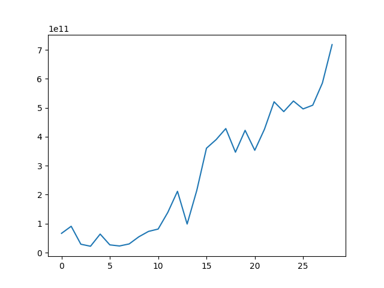
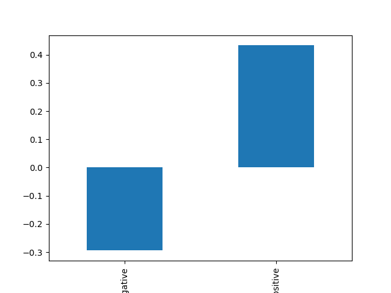

## Introduction to Pandas
Pandas is a powerful and flexible Python library designed for data manipulation and analysis. It provides data structures and functions needed to work with structured data seamlessly. For financial bankers, Pandas offers a way to perform complex data analysis tasks efficiently, making it an invaluable tool for exploring and interpreting financial data.

Pandas introduces two primary data structures that are central to data analysis:

1. Series:
    - Description: A one-dimensional array-like object that can hold various data types (e.g., integers, strings, floats). It is similar to a column in a spreadsheet.
    - Usage Example: A Series can represent stock prices over time.

```python
import pandas as pd
stock_prices = pd.Series([100, 101, 99, 98], index=['Jan', 'Feb', 'Mar', 'Apr'])
```

2. DataFrame:
    - Description: A two-dimensional tabular data structure that can hold multiple data types (e.g., Series, lists, dictionaries). It is similar to a spreadsheet or SQL table.
    - Usage Example: A DataFrame can represent a financial dataset with multiple columns (e.g., stock prices, trading volume, market capitalization).

```python
data = {
    'Date': ['2024-01-01', '2024-01-02', '2024-01-03'],
    'Stock': ['BMRI', 'BMRI', 'BMRI'],
    'Close': [6800.0, 6750.0, 6920.0]
}
df = pd.DataFrame(data)
```

### Core Functions and Methods
Pandas provides a range of functions and methods to facilitate data analysis:

1. **Data Loading**:
   - **Read CSV**: Import data from CSV files, which are commonly used in financial reporting.

     ```python
     df = pd.read_csv('financial_data.csv')
     
     # read it from a remote URL
     url = "https://raw.githubusercontent.com/supertypeai/idx_total_historical_1995/main/market_cap_history.csv"
     df = pd.read_csv(url)
     ```

   - **Read Excel**: Load data from Excel spreadsheets.

     ```python
     df = pd.read_excel('financial_data.xlsx')
     ```

2. **Data Exploration**:
   - **View Data**: Quickly view the first few rows of a DataFrame to understand its structure.

     ```python
     print(df.head())
     ```

   - **Summary Statistics**: Get a quick summary of numerical data.

     ```python
     print(df.describe())
     ```

3. **Data Cleaning**:
   - **Handling Missing Values**: Identify and handle missing data, which is crucial for accurate analysis.

     ```python
     df = df.dropna()  # Drop rows with missing values
     ```

   - **Data Transformation**: Modify data, such as converting data types or normalizing values.

     ```python
     df['Date'] = pd.to_datetime(df['Date'])
     ```

4. **Data Analysis**:
   - **Filtering Data**: Extract subsets of data based on conditions.

     ```python
     bbri = df[df['Stock'] == 'BBRI']
     ```

   - **Grouping and Aggregation**: Summarize data by grouping and calculating statistics.

     ```python
     monthly_avg = df.groupby(df['Date'].dt.to_period('M')).mean()
     ```

5. **Data Visualization**:
   - **Basic Plotting**: Create simple plots directly from a DataFrame to visualize trends and patterns.

     ```python
     df.plot(x='Date', y='Harga Saham', kind='line')
     ```

### **Advantages of Using Pandas for Data Analysis**

1. **Efficiency**: Pandas can handle large datasets efficiently, which is essential for financial data analysis involving extensive historical records or real-time data streams.

2. **Flexibility**: It supports various data formats and allows for complex manipulations, making it suitable for diverse financial data needs.

3. **Integration**: Pandas integrates well with other Python libraries such as NumPy for numerical operations, Matplotlib for plotting, and Scikit-learn for machine learning, creating a robust data analysis ecosystem.

4. **Data Handling**: It provides powerful tools for cleaning, transforming, and analyzing data, helping to ensure that your analysis is accurate and meaningful.

## Using `Pandas` to measure the growth of IDX

The following is code you've seen (and hopefully executed) in the [quickstart](/quickstart#python-programming-environment) section. It reads a CSV file containing the historical market capitalization of the Indonesian Stock Exchange (IDX) and plots the market capitalization over time.

```python
import pandas as pd
import matplotlib.pyplot as plt

url = 'https://raw.githubusercontent.com/supertypeai/idx_total_historical_1995/main/market_cap_history.csv'

df = pd.read_csv(url)
df['market_cap'].plot()
plt.show()
```
<Accordion title="Sample Output">
      <Frame>
        
      </Frame>
</Accordion>

What you see here is us creating a `DataFrame` object from a CSV file hosted remotely on GitHub. 

We then plot the market capitalization data using the `plot()` method from Pandas, 
and display the plot using `plt.show()` from Matplotlib. With `pandas`, we use the 
square bracket notation `bbri_nasabah[]` to access columns in the DataFrame.

### Indexing by Columns

- `df['market_cap']` or `df.market_cap` selects the 'market_cap' column from the DataFrame.
  - In cases where the column name has spaces or special characters, you can use `df['column name']` to access the column, 
  but outside of those cases, you can use `df.column_name` as well.
- To select multiple columns, you can pass a list of column names: `df[['currency', 'market_cap']]`.

When you select a single column from a DataFrame, you get a `Series` object in return. 
This is **in constrast to selecting multiple columns**, which returns another DataFrame with 
the selected columns.

```python
market_cap_series = df['market_cap']
# inspect the type of the object
print(type(market_cap_series))
# Output: <class 'pandas.core.series.Series'>
```

Indexing by columns is useful when you want to perform operations on specific columns or when you need to extract a subset of the data for analysis.
It is also useful when you want to reorder columns in the DataFrame since you can pass 
a list of column names in the order you want them to be displayed. 

```python
df[['market_cap', 'currency', 'year']]
```

It is important to note the lack of any assignment operator in the above code snippet, 
which means that the DataFrame is not modified in place. If you want to save the
reordered DataFrame, you need to assign it to a new variable or overwrite the existing DataFrame.

```python
df = df[['market_cap', 'currency', 'year']]
print(df.columns)
# Output: Index(['market_cap', 'currency', 'year'], dtype='object')
```

### Indexing by Rows
To select data ("slicing") by rows, you can use the `loc` and `iloc` accessors. To select
a single row, you can use the `loc` accessor with the row index label. Just like indexing 
a single column, this returns a Series object.

```python
df.loc[17]
# Output: 
# market_cap    428222560000
# currency               USD
# year                  2012
# Name: 17, dtype: object
```

When it's inconvenient to use the row index label, or when it is yet unknown, you can 
use the `iloc` accessor to select rows by their integer index. 

```python
# returns the first row
df.iloc[0]

# returns the last row
df.iloc[-1]
```

To select multiple rows, you can pass a list of row index labels or integers to the `loc` or `iloc` accessors, respectively.

```python
df.loc[[0, 1, 2, 3, 4]]

# or:
df.iloc[:5]
```

### Dropping Rows and Columns
To drop rows or columns from a DataFrame, you can use the `drop()` method. The `drop()` method returns a new DataFrame with the specified rows or columns removed. 

```python
# drop the first row
df.drop(0)

# drop the 'currency' column
df.drop('currency', axis=1)
# or:
# df.drop(columns='currency')
# or with multiple columns:
# df.drop(columns=['currency', 'market_cap'])
```

### `pandas` DataFrames Attribute
What we've seen above are accessors to the DataFrame object. These are shortcuts 
that help you slice out specific parts of the DataFrames. 

In this section, we'll shift our attention to the DataFrame object itself, starting 
with the `shape` attribute. The `shape` attribute returns a tuple representing the
dimensions of the DataFrame, with the first element being the number of rows and
the second element being the number of columns.

```python
print(df.shape)
# Output: (29, 3)
```

Another useful attribute is `columns`, which returns the column labels of the DataFrame.

```python
print(df.columns)
# Output: Index(['year', 'currency', 'market_cap'], dtype='object')
```

The `dtypes` attribute returns the data types of each column in the DataFrame.

```python
print(df.dtypes)
# Output:
# year           int64
# currency      object
# market_cap     int64
# dtype: object
```

The `.values` attribute returns the underlying NumPy array of the DataFrame.
This could be useful when you need to perform operations that are easier with NumPy
arrays, such as matrix multiplication or reshaping.

The `.T` attribute returns the transpose of the DataFrame, which swaps the rows and columns, 
making it more readable when you have a large number of columns relative to rows.

```python
df.loc[:3].T

# Output: 
#                    0            1            2            3
# market_cap  66584940000  90997080000  29050020000  22077860000
# currency            USD          USD          USD          USD
# year               1995         1996         1997         1998
```

But remember, these attributes are read-only and do not modify the DataFrame in place, much like
the indexing methods we've seen earlier.

The last attribute we'll cover is `.index`, which provides the row labels of the 
DataFrame. This index is like a list of row labels. In spreadsheets, this would be
the row numbers on the leftmost column. When we read in a CSV file, the index is
automatically generated as a `RangeIndex` object, unless we specify a column to be the index 
through `index_col` parameter in `pd.read_csv()`.
  
```python
print(df.index)
# Output: RangeIndex(start=0, stop=29, step=1)
```

In our case, it does make sense to set the index to the 'year' column, as it is unique
and immediately clear what that row represents. 

```python
df.set_index('year', inplace=True)
# or: 
# df = df.set_index('year')
```

With that, our slicing and indexing operations will be more intuitive, as we can now
use the year as the row label to access data.

```python
df.loc[2022]

# Output:
# market_cap    585567160730
# currency               USD
# Name: 2022, dtype: object

df.loc[2020:2023]
# Output:
# year                       
# 2020  496086050000      USD
# 2021  508910310810      USD
# 2022  585567160730      USD
# 2023  717936458435      USD
```

When we combine the above with the `.drop()` method, remember to now use the new index (row name) 
in the `drop()` method.

```python
df.loc[2020:2023].drop(2021)

# Output:
#         market_cap currency
# year                       
# 2020  496086050000      USD
# 2022  585567160730      USD
# 2023  717936458435      USD
```

We can, of course, chain these `.drop()` operations together, but remember that the DataFrame is not modified in place
unless you reassign it to the same variable.

```python
df.loc[2020:2023].drop(2021).drop(columns='currency')

# Output:
#         market_cap
# year              
# 2020  496086050000
# 2022  585567160730
# 2023  717936458435
```

And to reset the index back to the default `RangeIndex`, you can use the `reset_index()` method.

```python
df.reset_index(inplace=True)
# or:
# df = df.reset_index()
```

### Creating new columns
Being creative in data analysis can help unlock insights that are not immediately obvious. In the 
field of machine learning, this is sometimes referred to as feature engineering.

For example, supposed we would like to train a machine learning model to predict the 
movement of the commodities market based on the market capitalization of the IDX. We could
create a new column that represents the percentage change in market capitalization from the previous year.

```python
df['market_cap_change_%'] = df['market_cap'].pct_change()

# or using the .diff() method
df['market_cap_change_billion'] = df['market_cap'].diff() / 1e9
```

Then, we can create a new column that returns either 'positive' or 'negative' based on the
percentage change in market capitalization.

```python
df['change_direction'] = df['market_cap_change_%'].apply(lambda x: 'positive' if x > 0 else 'negative')

# or without using lambda:
def change_direction(x):
    if x > 0:
        return 'positive'
    else:
        return 'negative'

df['change_direction'] = df['market_cap_change_%'].apply(change_direction)
```

You probably won't be using `lambda` functions a great deal when starting out 
with Python and Pandas, but it's good to know that they exist and can be used
to write concise code. 

- `.apply(lambda x: ...)`: Applies a function to each element of the column
    - Lambda Function: `lambda x: 'positive' if x > 0 else 'negative'`

- `df['change_direction']`: Creates a new column in the DataFrame named `change_direction` and
 assigns the results of the `.apply()` method to this column.

### Checkpoint

Up to this part of the exercise, you should be able to:
- Use `pandas` to read in data from CSV files and Excel spreadsheets.
- Access columns in a DataFrame using the square bracket notation.
- Use the `loc` and `iloc` accessors to select rows in a DataFrame.
- Drop rows and columns from a DataFrame using the `drop()` method.
- Access DataFrame attributes like `shape`, `columns`, `dtypes`, `values`, `T`, and `index`.
- Set and reset the index of a DataFrame.
- Create new columns in a DataFrame using existing columns.

Putting everything together, here's a full example of what's been covered so far:

```python
import pandas as pd

url = 'https://raw.githubusercontent.com/supertypeai/idx_total_historical_1995/main/market_cap_history.csv'

df = pd.read_csv(url, index_col='year')
df = df.drop(columns='currency')

df['market_cap_change_%'] = df['market_cap'].pct_change()
df['market_cap_change_billion'] = df['market_cap'].diff() / 1e9
df['change_direction'] = df['market_cap_change_%'].apply(lambda x: 'positive' if x > 0 else 'negative')
```

### Boolean Indexing 
Boolean indexing is a powerful feature in Pandas that allows you to filter data based on conditions.
You can use boolean arrays to filter rows based on specific criteria. 


```python
neg_years = df[df['change_direction'] == 'negative']
# take a look at the first 5 rows
neg_years.head()
```

You can also combine multiple conditions using logical operators like `&` (and) and `|` (or).

```python
# filter for years with negative market capitalization change and market capitalization greater than 100 billion
cond1 = df['change_direction'] == 'negative'
cond2 = df['market_cap'] > 100e9

neg_cap_100b = df[cond1 & cond2]
neg_cap_100b.tail()
```

When you want to filter for the year when the market capitalization change has 
declined the most, you can use the `idxmin()` method to get the index of the minimum value.
Similarly, the `idxmax()` method can be used to get the index of the maximum value.

```python
min_change_year = df['market_cap_change_%'].idxmin()
print(min_change_year)
# Output: 1997
```

1997 being the year where IDX has shrunk the most in terms of market capitalization shouldn't 
come as a surprise to anyone who still has vivid memories of the Asian Financial Crisis.

You can verify the number above by using conditional indexing to filter for the year with the
minimum market capitalization change.

```python
df[df['market_cap_change_%'] == df['market_cap_change_%'].min()]
```

Another common use case of a boolean-indexed DataFrame is to count the number of rows that satisfy a condition.

```python
# count the number of years with negative market capitalization change
num_neg_years = df[df['change_direction'] == 'negative'].shape[0]
print(num_neg_years)

# Output: 10
```

## Helpful methods for DataFrames

Pandas provides a wide range of methods to help you explore and manipulate your data. Here are some commonly used methods:

- `head()`: Returns the first `n` rows of the DataFrame.
- `tail()`: Returns the last `n` rows of the DataFrame.
- `describe()`: Generates descriptive statistics that summarize the central tendency, dispersion, and shape of a dataset's distribution.
- `info()`: Prints a concise summary of a DataFrame, including the index dtype and column dtypes, non-null values, and memory usage.
- `unique()`: Returns unique values in a column.
- `value_counts()`: Returns a Series containing counts of unique values.
- `sort_values()`: Sorts the DataFrame by the values along either axis.
- `dropna()`: Removes missing values from the DataFrame, either by dropping rows (`axis=0`) or columns (`axis=1`).

I'll demonstrate the use of `value_counts()` and `sort_values()` on the DataFrame that 
we've been working with.

```python
# count the number of years with positive and negative market capitalization change
df['change_direction'].value_counts()

# Output:
# positive    19
# negative    10
# Name: change_direction, dtype: int64
```

And sorting the DataFrame by the market capitalization change percentage in descending order.

```python
df
  .dropna()
  .sort_values(by='market_cap_change_%', ascending=False)
  .tail()

# Output:
#         market_cap  market_cap_change_%  market_cap_change_billion change_direction
# year                                                                               
# 2013  346673810000            -0.190435                  -81.54875         negative
# 1998   22077860000            -0.240005                   -6.97216         negative
# 2008   98760600000            -0.533472                 -112.93237         negative
# 2000   26812500000            -0.581347                  -37.23217         negative
# 1997   29050020000            -0.680759                  -61.94706         negative
```

## Group By and Aggregation
We've seen how to filter and sort data in a DataFrame. To summarize data, we can use the `groupby()` method to group data based on one or more columns and then apply an aggregation function to each group.

A common aggregation function is `mean()`, which calculates the average value for each group. 

```python
# group the data by the 'change_direction' column and calculate the mean market capitalization change
df.groupby('change_direction')['market_cap_change_%'].mean()

# Output:
# change_direction
# negative   -0.294289
# positive    0.433214
# Name: market_cap_change_%, dtype: float64
```

If you have `matplotlib` installed, you can visualize the results using a bar plot.

```python
df
  .groupby('change_direction')['market_cap_change_%']
  .mean()
  .plot(kind='bar')
```

<Accordion title="Sample Output">
  <Frame>
    
  </Frame>
</Accordion>

## Summary 
You have just learned a tremendous amount of information about Pandas, a powerful library for data manipulation and analysis in Python. You now know how to:

- Load data from CSV files and Excel spreadsheets.
- Access columns and rows in a DataFrame using indexing and slicing.
- Drop rows and columns from a DataFrame.
- Use DataFrame attributes to get information about the DataFrame.
- Create new columns in a DataFrame.
- Filter data using boolean indexing.
- Use helpful methods for exploring and manipulating DataFrames, such as `value_counts()` and `sort_values()`.
- Group data and perform aggregation using `groupby()`.

### Exercises
To solidify these learnings, you might be required to answer a few questions with a completely new dataset. The 
recommended time for the graded quiz is 45 minutes, but feel free to take as much time as you need.

<Tip>
  To attempt these questions, make sure you've run the code snippets provided in this chapter.
  Your dataset should have all the necessary columns (4, after dropping `currency`) and rows (29) for the exercises.
</Tip>

<CardGroup cols={2}>
  <Card
    title="Google Classroom Graded Assignment"
    icon="graduation-cap"
  >
    Head over to Google Classroom or the assigned learning management system to
    complete the exercises and submit your work.
  </Card>
  <Card
    title="Lab: Data Manipulation and Analysis w/ Pandas"
    icon="flask"
    href="/financial-data-analytics/lab_pandas"
  >
    Using Pandas, perform a series of data manipulation and analysis tasks on Indonesia banking sector data provided by Sectors.
  </Card>
</CardGroup>

<Accordion title="Graded Quiz" icon="question">

1. Take the first 10 rows of the DataFrame, what is the median of the 'market_cap_change_billion' column?
1. What is the year where IDX has increased the most in terms of market capitalization change as a percentage? (market_cap_change_%)
1. In how many years did IDX experience a market cap change that is lower than -50%? Note that 
    the market capitalization change is calculated as the percentage change in market capitalization 
    from the previous year, and so your filter should be on the `market_cap_change_%` column with (-0.5) 
    used in the condition.
1. Taking only the 5 years between 2019 to 2023 (inclusive of both), at what rate did the market capitalization of IDX grow on average?
1. Grouped by the 'change_direction' column, what is the median market capitalization change in billion USD for each group?

</Accordion>

## Author
This chapter is written by [Samuel Chan](https://www.linkedin.com/in/chansamuel/), an analytics consultant at Supertype with 
over 11 years of experience of enterprise AI consulting across Singapore, China (DianDian, 600634:SH), Japan (TWP Dai Nippon, TYO:7912; gumi Inc, TWO:3903; SEGA, TYO:6460) 
and Indonesia (Emtek, Adaro Group of Companies, Central Bank of Indonesia, Bursa Efek Indonesia, BCA). He has long-term consulting 
experience with leading financial institutions in the region, and is the co-founder of [Algoritma Data Science Education Center](https://algorit.ma), 
[Supertype](https://supertype.ai), [Sectors](https://sectors.app), and formerly HyperGrowth, a marketing automation and chatbot 
platform startup that he sold in 2016.

Samuel is an avid open source contributor and guest lecturer at several universities across Indonesia and Singapore. He 
is currently ranked #1 in Indonesia (and top 2% worldwide) on Stack Overflow for R and Python topics (with 111 badges and 
contributions exceeding 2 million reach).

### Contributors
- Gerald Bryan, senior analytics consultant at Supertype
