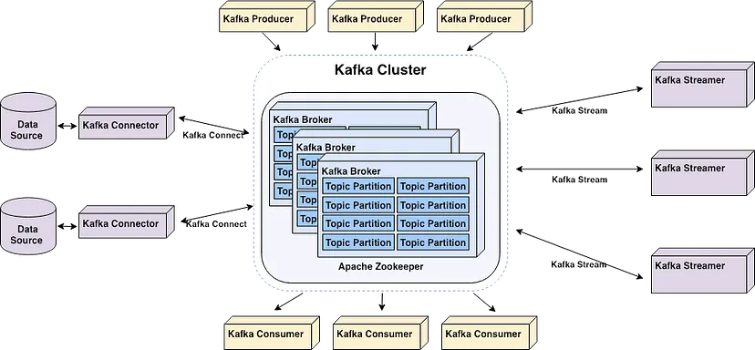

<Note>
  This chapter is constantly being updated by the analytics consultants at Supertype to stay current with the latest trends 
  in enterprise data management. Please check back regularly for updates.
</Note>

## Overview
As the emergence of big data drives the rapid growth of microservices and event-driven applications, the need for real-time data streaming and processing has become more critical than ever. 
This shift marks a departure from the traditional batch processing era, where data was handled in large, infrequent loads. In this new landscape, the ability to process and react to data in real-time is essential for maintaining competitive advantage and operational efficiency. 

**Apache Kafka**, with its robust, scalable, and low-latency architecture, is at the forefront of this transformation. 
By enabling seamless, real-time data streaming, Kafka empowers organizations to build event-driven systems that can process vast amounts of data instantaneously, supporting the complex demands of modern microservices architectures and big data applications.

## Core Components of Kafka

### Kafka Topics

    In Kafka, the core unit of organization is the topic—think of it as a table in a relational database. 
    Topics are where events are stored, and as a developer, you’ll interact with them frequently. Different topics can be created to store various types of events or 
    even filtered and transformed versions of the same event.

    A Kafka topic is essentially a log -- a simple, append-only data structure where new events are always added to the end. 
    This structure is easy to understand and highly efficient, supporting high throughput and ensuring that once an event is written, it remains immutable. 
    You can read from a log by seeking a specific point and scanning through sequential entries, which is a straightforward process.

    Kafka’s logs are also durable, storing data on disk rather than just buffering it temporarily like traditional messaging systems. 
    You can configure topics to retain data for as long as needed—whether that’s seconds, years, or indefinitely. This durability and simplicity are central to Kafka’s reliability and performance in modern data infrastructure. However, these are just the foundational elements of what makes Kafka so powerful.

### Kafka Brokers

    These are the servers that form the backbone of the Kafka cluster, storing and managing data streams. 
    Brokers coordinate with each other to ensure data is consistently replicated and available even during failures.
    Essentially, Brokers are the component responsible for transferring messages/events from *Kafka Producer* to *Kafka Consumer*.

### Kafka Producers

    These are the data sources that send records (or messages) to Kafka topics. Producers are highly scalable and can handle large volumes of data with low latency.

### Kafka Consumers

    On the other side, we have Kafka Consumers. Consumers subscribe to the broker, then proceed to read data from Kafka topics. 
    They can operate in consumer groups, allowing multiple instances to consume the same data in a coordinated manner, which enables parallel processing.

### Kafka Connect

    Kafka Connect is a robust framework for streaming data between Apache Kafka and other data systems. It simplifies the process of integrating Kafka with a variety of data sources and sinks, such as databases, file systems, and cloud storage services. 
    Kafka Connect provides a scalable and fault-tolerant solution for ingesting large volumes of data into Kafka and exporting data from Kafka to external systems.

    With a rich ecosystem of pre-built connectors by [Confluent](https://www.confluent.io/hub/), Kafka Connect allows you to quickly set up data pipelines without writing custom code. 
    It also supports both standalone and distributed modes, making it flexible enough for a range of use cases, from simple tasks on a single machine to complex, large-scale deployments. 
    Additionally, Kafka Connect handles schema management and data transformation tasks, ensuring that data flows smoothly between Kafka and other systems while maintaining compatibility and integrity.

### Kafka Streams

    Kafka Streams is a powerful, lightweight library for building real-time stream processing applications that consume and process data directly from Kafka topics. 
    Unlike Kafka Connect, which focuses on data integration, Kafka Streams is designed for complex event processing, data transformations, and real-time analytics.

    With Kafka Streams, you can develop stateful and stateless processing logic using simple, declarative APIs. 
    The library allows you to filter, aggregate, join, and transform data as it flows through Kafka, enabling you to build sophisticated streaming applications. 
    Kafka Streams also integrates seamlessly with Kafka's underlying infrastructure, ensuring high availability, scalability, and fault tolerance.

    To note, it is also possible to use other frameworks to process Kafka data, including *Apache Spark* and *Apache Beam*.

### Schema Registry

    

    Schema Registry is a standalone service that operates separately from Kafka brokers, maintaining a database of all schemas associated with topics in the Kafka cluster it manages. 
    This "database" is actually stored in an internal Kafka topic and cached within the Schema Registry itself for quick, low-latency access. 
    The Schema Registry can be configured for high availability, ensuring that the service remains operational even if one instance goes down.

    In addition to its role as a schema database, Schema Registry provides an API that enables producers and consumers to verify schema compatibility before producing or consuming messages. 
    When a producer is configured to use the Schema Registry, it interacts with the Schema Registry REST API to check the schema of the new message. If the schema matches the last message produced or adheres to the topic's compatibility rules, the message is accepted. 
    If the schema violates these rules, the message production will fail in a way that the application can handle.
    On the consumer side, if a message with an incompatible schema is encountered, the Schema Registry will prevent the consumer from processing it.

## Key Benefits
### Scalability and Performance

Apache Kafka is renowned for its exceptional scalability and performance, making it a powerhouse in data processing. Designed with a distributed architecture, Kafka allows for:

- **Seamless Horizontal Scaling:** By adding more brokers to a cluster, Kafka can handle increasing data volumes, enabling concurrent data processing across multiple nodes.
- **High Throughput and Fault Tolerance:** Kafka is engineered to deliver high message throughput while maintaining resilience against failures, ensuring continuous and reliable data flow even under heavy load.
- **Efficient Large-Scale Data Handling:** Whether processing raw input or managing complex data streams, Kafka's architecture is built to handle substantial volumes of data with ease.

When examining Kafka's performance metrics, it's clear why it stands out. Kafka excels in high message throughput, optimal broker resource utilization, minimal consumer lag, low latency, and efficient handling of producer and consumer requests. In benchmark tests, Kafka has demonstrated the ability to process an astonishing 2 million writes per second, with a throughput of 821,557 records per second (78.3 MB/sec).

### Fault Tolerance and Durability

Kafka’s fault tolerance is another cornerstone of its reliability. 
This is primarily achieved through **partition replication**, where each partition in Kafka is replicated across multiple servers (replicas), ensuring data durability and consistency.

This replication mechanism not only safeguards data against server failures but also ensures uniform data processing and continuous operation. Kafka's fault tolerance goes beyond simple data replication; it's built to be resilient, maintaining uninterrupted service without a single point of failure. In the event of a broker failure, other brokers within the cluster automatically take over, ensuring seamless continuity. This robustness extends to handling:

- **Malformed Events**
- **Producer Defects**
- **Broker and Disk Failures**

Kafka’s ability to manage such scenarios with offline processing ensures that service disruption is minimized, preserving the integrity of the data pipeline.

### Flexibility and Integration

Flexibility and integration are key advantages of Apache Kafka, allowing it to serve as a versatile backbone for data flow across diverse systems. Kafka’s distributed streaming platform creates a central event hub, enabling applications to process and consume data in numerous ways. Its broad compatibility with various data systems enhances its adaptability across different industries.

Kafka seamlessly connects with a wide array of data sources, including:

- **Cloud Data Warehouses:** Like BigQuery and Snowflake.
- **Relational Databases:** Such as Oracle, Postgres, MySQL, and ClickHouse.
- **External Systems:** Supporting comprehensive analytics and ETL processes.

In real-world scenarios, Kafka often replaces traditional message brokers, offering superior throughput, built-in partitioning, replication, and fault tolerance. This adaptability makes Kafka a go-to solution for businesses needing reliable data integration and real-time analytics.

### Speed

Speed is a defining feature of Apache Kafka, underpinned by its distributed architecture, efficient partitioning, and optimization for both write and read operations. This combination enables Kafka to process data with impressive speed and low latency. Kafka's performance shines when handling massive data streams, capable of processing:

- **2 Million Writes Per Second**
- **Throughput of 821,557 Records Per Second (78.3 MB/sec)**

Kafka’s speed makes it an ideal choice for real-time analytics and decision-making. Its low-latency processing, combined with fault tolerance and a robust data architecture, empowers organizations to gain near real-time insights, driving faster and more informed business decisions.

## Limitations

With all the benefits and strengths Kafka have to offer, there are also certain limitations and cases where using Kafka would not be the best choice there is.

### Small Datasets
Apache Kafka is a powerful tool designed to handle large-scale, high-throughput data streams, but it may not be optimal for small datasets for several reasons:

1. **Overhead of Kafka’s Architecture**

    **Cluster Management**: Kafka’s distributed architecture involves setting up and managing multiple brokers, zookeeper nodes, and replication mechanisms. 
    For small datasets, the overhead of maintaining this infrastructure may outweigh the benefits. Setting up and maintaining Kafka can be complex, 
    and the effort may not be justified when dealing with small amounts of data.
    
    **Resource Consumption**: Kafka’s brokers are designed to handle high-throughput data streams and therefore consume significant system resources (CPU, memory, disk I/O). 
    When dealing with small datasets, Kafka’s resource requirements can be overkill, 
    leading to inefficient use of hardware and potentially higher costs.
2. **Latency Considerations**
    
    **Write and Read Latency**: Kafka is optimized for throughput rather than low-latency operations. 
    For small datasets where low-latency access to data is crucial, Kafka’s focus on batching and durability can introduce unnecessary delays. This might be problematic for applications requiring immediate access to small amounts of data.
    
    **Start-Up Time**: The start-up time for Kafka producers and consumers, as well as the time taken to establish connections, may be relatively high compared to the time taken to process small datasets. 
    This initial overhead can make Kafka seem sluggish for small, quick tasks.
3. **Complexity in Setup and Management**
    
    **Operational Complexity**: Kafka requires careful tuning and monitoring to function efficiently, especially in production environments. 
    For small datasets, this complexity might not be justifiable, and simpler alternatives may be more suitable. 
    Managing Kafka involves dealing with partitioning, replication, and fault tolerance, which can be overkill for small-scale data processing.
    
    **Integration Complexity**: Kafka’s integration with other systems (e.g., connectors, stream processing frameworks) adds another layer of complexity. 
    For small datasets, simpler solutions like traditional databases, lightweight message queues, or in-memory data stores may be more straightforward and effective.
4. **Alternative Solutions**
    
    **Lightweight Alternatives**: For small datasets, lightweight message queues (like RabbitMQ or Redis), relational databases, or in-memory databases (like SQLite or Redis) might be more appropriate. 
    These alternatives can offer lower latency, easier setup, and less overhead while still fulfilling the requirements for small-scale data processing.
    
    **Batch Processing**: In some cases, simple batch processing or file-based systems (like CSV or JSON files) may be sufficient, avoiding the need for a complex event streaming platform like Kafka.
5. **Cost vs. Benefit**
    
    **Economic Justification**: Kafka’s robustness and scalability are best utilized in scenarios where data volume and velocity are high. 
    For small datasets, the cost of deploying and maintaining Kafka infrastructure may not be economically justifiable when simpler solutions can achieve the same results with less overhead and expense.

In summary, while Kafka excels in handling large-scale, high-throughput data streams, its architecture, resource requirements, and complexity make it less optimal for small datasets where the overhead and costs can outweigh the benefits.

### Complex Processing and Transformations

While Apache Kafka is powerful for real-time data streaming, it’s not specifically designed for complex message transformations. 
Kafka Connect can handle simple transformations as messages pass through, but when it comes to executing more intricate, interconnected transformations, Kafka's capabilities are limited. 
For such heavy ETL (Extract, Transform, Load) operations, a tool like *Spark Streaming* is often more appropriate. Spark Streaming offers robust APIs for real-time data processing and is better suited for complex transformations, providing more advanced features and flexibility than Kafka.

### Kafka is *Not* a Database

Apache Kafka excels at real-time data streaming but is not intended to replace traditional databases. 
It lacks essential database features such as long-term data storage, advanced indexing, and support for complex concurrency. 
Without indexes and transactional capabilities, Kafka cannot efficiently query or maintain data consistency in the way databases do.

While Kafka can be integrated with databases to manage specific tasks, it should not be seen as a direct replacement. 
Its design is focused on high-throughput data streams, not on serving as a database. 
Therefore, using Kafka in place of a traditional database can lead to significant limitations and challenges.

## References

1. [Kafka Explained by Confluent](https://developer.confluent.io/what-is-apache-kafka/)
2. [Kafka Explained by DoubleCloud](https://medium.com/doublecloud-insights/what-is-apache-kafka-used-for-real-world-applications-and-scenarios-b33f9fab41f2)

## Author
This chapter is written by [Vincentius Christopher Calvin](https://www.linkedin.com/in/vincentiuscalvin/), a partner at Supertype, where he leads critical projects across the company. 
His work includes managing key initiatives for Adaro groups, such as AMT's Real-Time Water Level Monitoring & Forecasting and SIS's Predictive Maintenance projects. 
He has also served as a consultant for major clients like IDX (Bursa Efek Indonesia) and Bank Indonesia, and is also a lead at [Sectors API Platform](https://sectors.app/api).

Calvin specializes in Machine Learning Ops (MLOps), Backend Engineering, and API development. 
He is a certified TensorFlow Developer and has a strong passion for creating user-centric products, including apps published on the App Store. 