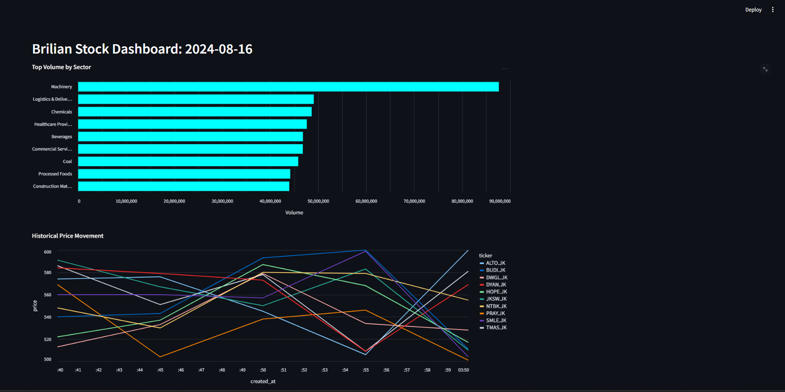

## Pre-Lab Preparation & Prerequisites
<CardGroup cols={2}>
  <Card icon="gears" title="Docker" href="https://docs.docker.com/get-started/get-docker/">
    Install Docker on your machine, follow the guides depending on the OS your device is running.
  </Card>
  <Card icon="youtube" title="Docker Fundamentals" href="https://youtu.be/ZlLwDN9_Gwg?si=7J0cZzeRMvLkfNYU">
    You will need to have a basic understanding of Docker, especially on Docker Compose.
  </Card>
  <Card icon="key" title="Introduction to NoSQL" href="/kafka-redis/nosql">
    Review the module to familiarize yourself with the NoSQL paradigm.
  </Card>
  <Card icon="key" title="Introduction to Kafka" href="/kafka-redis/kafka">
    Review the module to understand the key concepts of Kafka as a data streaming tool.
  </Card>
</CardGroup>

## Overview
In the previous section, we have learned the theoretical concept of Apache Kafka and its role in real time data streaming. 
You will put the theory into practice in this lab, where we will explore the power of open-source technologies (Kafka, Spark Structured Streaming, Cassandra and MySQL) 
to build a robust and scalable streaming data processing pipeline. We will begin by producing simulated raw stock price data using a producer and sending it to Kafka. 
Leveraging the microbatch processing capabilities of [Spark Structured Streaming](https://spark.apache.org/docs/latest/structured-streaming-programming-guide.html), we will load the raw data into [Cassandra](https://cassandra.apache.org/_/index.html), a distributed NoSQL database, for real-time transaction processing (OLTP). 
Simultaneously, we will aggregate the data and store it in [MySQL](https://www.mysql.com/), a relational database, for analytical processing (OLAP). 
To bring the insights to life, we will then visualize the aggregated data in the form of a dynamic dashboard using [Streamlit](https://streamlit.io/), an open-source Python library to build custom web apps. 
This comprehensive architecture allows organizations to extract (near) real-time insights from streaming data, enabling informed decision-making and improved business performance.

## Project Environment
To start the project, we will create a new directory named `streaming_data_processing` or any name you would like to identify the project as. 
Next, make a new file named `docker-compose.yml` in the project directory and copy the following into the file:

```yaml docker-compose.yml
version: '1'

services:
  zookeeper:
    image: bitnami/zookeeper:3.9.2
    container_name: zookeeper
    ports:
      - "2181:2181"
    environment:
      - ALLOW_ANONYMOUS_LOGIN=yes
    volumes:
      - zookeeper-data:/bitnami/zookeeper

  kafka:
    image: bitnami/kafka:3.5.2
    container_name: kafka
    ports:
      - "29092:29092"
    environment:
      - ALLOW_PLAINTEXT_LISTENER=yes
      - KAFKA_ENABLE_KRAFT=no
      - KAFKA_CFG_ZOOKEEPER_CONNECT=zookeeper:2181
      - KAFKA_CFG_LISTENERS=INTERNAL://:9092,EXTERNAL://:29092
      - KAFKA_CFG_ADVERTISED_LISTENERS=INTERNAL://kafka:9092,EXTERNAL://localhost:29092
      - KAFKA_CFG_LISTENER_SECURITY_PROTOCOL_MAP=INTERNAL:PLAINTEXT,EXTERNAL:PLAINTEXT
      - KAFKA_INTER_BROKER_LISTENER_NAME=INTERNAL

    volumes:
      - kafka-data:/bitnami/kafka
    depends_on:
      - zookeeper
    restart: always

  spark:
    image: bitnami/spark:3.5.2
    container_name: spark
    environment:
      - SPARK_MODE=master
    ports:
      - "8080:8080"
      - "4040:4040"
    volumes:
      - ./spark_script:/spark_script
      - ./spark-defaults.conf:/opt/bitnami/spark/conf/spark-defaults.conf
    depends_on:
      - zookeeper
      - kafka
      - cassandra
    command: bash -c "python -m pip install py4j==0.10.9.7 && tail -f /dev/null"

  spark-worker:
    image: docker.io/bitnami/spark:3.5.2
    container_name: spark-worker
    environment:
      - SPARK_MODE=worker
      - SPARK_MASTER_URL=spark://spark:7077
      - SPARK_WORKER_MEMORY=1G
      - SPARK_WORKER_CORES=1
    ports:
      - "8081:8081"
    volumes:
      - ./spark-defaults.conf:/opt/bitnami/spark/conf/spark-defaults.conf
    depends_on:
      - zookeeper
      - kafka
      - cassandra
    command: bash -c "python -m pip install py4j==0.10.9.7 && tail -f /dev/null"

  cassandra:
    image: cassandra:5.0
    container_name: cassandra
    ports:
      - "9042:9042"
    volumes:
      - cassandra-data:/var/lib/cassandra

  mysql:
    image: mysql:9.0.1
    container_name: mysql
    ports:
      - "3307:3306"
    environment:
      MYSQL_ROOT_PASSWORD: root
    volumes:
      - mysql-data:/var/lib/mysql

volumes:
  zookeeper-data:
  kafka-data:
  cassandra-data:
  mysql-data:
```
Don't feel intimidated with the contents of the Docker Compose file. We will go through each of the services in the next section.

Next, we will create a new file named `spark-defaults.conf` in the project directory, which contains the Spark application configuration properties. We will populate the file later, so for now we can leave it empty.

Last, we will create a new folder `spark_script` in the project directory, which will be used to store the Spark application script. For now, we can leave the folder empty.

After you have completed through all the steps, the project structure will now look like this:

```tree
streaming_data_processing
├── docker-compose.yml
├── spark-defaults.conf
└── spark_script
```

## Understanding Docker
The `docker-compose.yml` file include seven services: `zookeeper`, `kafka`, `spark`, `spark-worker`, `cassandra`, and `mysql`. 
For each service, we define the service name and other configurations such as `image`, `container_name`, `ports`, `environment`, `volumes`, `depends_on`, `restart`, and `command`. 
Below is a brief description of each configuration.

* **service name** is used to identify and reference a specific service within the Docker Compose file.
* **image** configuration specifies the Docker image to be used for the service which will be pulled from Docker Hub.
* **container_name** configuration allows us to assign a custom name to the container created from the image. Although it doesn’t have to match the service name, it is recommended to keep them consistent.
* **ports** configuration defines the port mappings between the host machine and the container. It allows us to access services running inside the container from the host using specified ports.
* **environment** configuration is used to set environment variables specific to the container.
* **volumes** configuration is used to mount either Docker volumes or bind mounts inside the container. Docker volumes provide a means to persist data generated by the container by creating and managing storage entities that are independent of the host’s filesystem. On the other hand, bind mounts establish a direct mapping between a directory on the host and a directory inside the container. This allows us to retain data even after the container is removed.
* **depends_on** configuration specifies the service that the current service depends on, which ensures that the current service will not start until all the dependencies are started.
* **restart** configuration determines the restart policy for a container. By default, it is set to no, which means the container will not automatically restart if it stops or encounters an error.
* **command** configuration specifies the command that will be executed when the container starts.

Now, let's discuss each service and some of the important configurations in details.

### Zookeeper

```yaml
zookeeper:
  image: bitnami/zookeeper:3.9.2
  container_name: zookeeper
  ports:
    - "2181:2181"
  environment:
    - ALLOW_ANONYMOUS_LOGIN=yes
  volumes:
    - zookeeper-data:/bitnami/zookeeper
```

The zookeeper service is a centralized coordinator for managing metadata and maintaining the overall state of the Kafka cluster. 
It keeps track of the broker's metadata, such as which brokers are alive, what topics they are handling, and how partitions are distributed across brokers.
Zookeeper is also responsible for electing the leader broker among the available brokers and ensuring that this leadership is maintained or reassigned if the leader broker fails.

For the environment configuration, we set `ALLOW_ANONYMOUS_LOGIN` to yes so that we can connect to the zookeeper service without authentication. 
Note that this is **not recommended** for production environments. In the provided configuration, the volumes demonstrates the usage of Docker volumes (not bind mounts).

### Kafka 

```yaml
kafka:
  image: bitnami/kafka:3.5.2
  container_name: kafka
  ports:
    - "29092:29092"
  environment:
    - ALLOW_PLAINTEXT_LISTENER=yes
    - KAFKA_ENABLE_KRAFT=no
    - KAFKA_CFG_ZOOKEEPER_CONNECT=zookeeper:2181
    - KAFKA_CFG_LISTENERS=INTERNAL://:9092,EXTERNAL://:29092
    - KAFKA_CFG_ADVERTISED_LISTENERS=INTERNAL://kafka:9092,EXTERNAL://localhost:29092
    - KAFKA_CFG_LISTENER_SECURITY_PROTOCOL_MAP=INTERNAL:PLAINTEXT,EXTERNAL:PLAINTEXT
    - KAFKA_INTER_BROKER_LISTENER_NAME=INTERNAL

  volumes:
    - kafka-data:/bitnami/kafka
  depends_on:
    - zookeeper
  restart: always
```

* `ALLOW_PLAINTEXT_LISTENER=yes`

  This allows Kafka to accept connections over a plaintext (unencrypted) protocol. By default, Kafka might require secure connections, but setting this variable to "yes" allows plaintext communication.
  While enabling plaintext listeners can be convenient for local development or testing, it's not recommended for production environments due to the lack of encryption. For production, use secure communication protocols like SSL/TLS.

* `KAFKA_ENABLE_KRAFT=no`
  
  KRaft (Kafka Raft Metadata Mode) is a new way of managing metadata without Zookeeper. Setting this to "no" disables KRaft, making Kafka rely on Zookeeper.
  
* `KAFKA_CFG_ZOOKEEPER_CONNECT=zookeeper:2181`

  This variable specifies the hostname and port of the Zookeeper server. Since we are using Docker Compose, we can use the service name zookeeper as the hostname and the default Zookeeper port 2181.

We also need to configure two listeners, one for internal client (other services within the Docker network) and another one for external client (clients outside the Docker network, 
i.e. the host machine). We will name the listener for the internal client as INTERNAL, and the listener for the external client as EXTERNAL. 
These listeners are defined using the following environment configurations:

* `KAFKA_CFG_LISTENERS=INTERNAL://:9092,EXTERNAL://:29092`

  This sets up Kafka listeners on two different interfaces: one internal and one external. INTERNAL://:9092 listens on port 9092 for internal traffic, and EXTERNAL://:29092 listens on port 29092 for external traffic.
  Here we don’t specify any hostname or IP address for both listeners, which means Kafka will listen on all network interfaces within the specified port. 
  Use different listeners for internal and external traffic to separate traffic flow. Consider using secure protocols (e.g., SSL) for the external listener to protect data in transit.

* `KAFKA_CFG_ADVERTISED_LISTENERS=INTERNAL://kafka:9092,EXTERNAL://localhost:29092`

  These are the addresses Kafka advertises to clients for connecting. Internal clients should connect to kafka:9092, while external clients connect to localhost:29092.

* `KAFKA_CFG_LISTENER_SECURITY_PROTOCOL_MAP=INTERNAL:PLAINTEXT,EXTERNAL:PLAINTEXT`

  The security protocol used for each listener. In our case, we are using the PLAINTEXT protocol for both listeners, indicating that no authentication is required.

* `KAFKA_INTER_BROKER_LISTENER_NAME=INTERNAL`

  The name of the listener used for communication between brokers. Typically the listener for the internal client is used for inter-broker communication.

For the ports configuration, we need to expose the external listener port 29092 to the host machine so that we can connect to the kafka service from the host machine.

Since the kafka service depends on the zookeeper service, we specify zookeeper in the `depends_on` configuration to ensure that the zookeeper service is started before the kafka service. 
As of the authors' experiences, there are several occurences where kafka service stopped unexpectedly, so we should set restart configuration to **always** to ensure that the kafka service will be restarted automatically if it stops or encounters an error.

### Spark

```yaml
spark:
  image: bitnami/spark:3.5.2
  container_name: spark
  environment:
    - SPARK_MODE=master
  ports:
    - "8080:8080"
    - "4040:4040"
  volumes:
    - ./spark_script:/spark_script
    - ./spark-defaults.conf:/opt/bitnami/spark/conf/spark-defaults.conf
  depends_on:
    - zookeeper
    - kafka
    - cassandra
  command: bash -c "python -m pip install py4j==0.10.9.7 && tail -f /dev/null"

spark-worker:
  image: docker.io/bitnami/spark:3.5.2
  container_name: spark-worker
  environment:
    - SPARK_MODE=worker
    - SPARK_MASTER_URL=spark://spark:7077
    - SPARK_WORKER_MEMORY=1G
    - SPARK_WORKER_CORES=1
  ports:
    - "8081:8081"
  volumes:
    - ./spark-defaults.conf:/opt/bitnami/spark/conf/spark-defaults.conf
  depends_on:
    - zookeeper
    - kafka
    - cassandra
  command: bash -c "python -m pip install py4j==0.10.9.7 && tail -f /dev/null"
```
Here the **spark** service is configured as the Spark **master** node and **spark-worker** service is configured as the Spark **worker** node, as indicated by the `SPARK_MODE` under environment configuration. 
Besides SPARK_MODE, we also specify the following environment configurations for the spark-worker service:

* `SPARK_MASTER_URL=spark://spark:7077` – The URL of the Spark master node. Here we use the service name spark as the hostname and the default Spark master port 7077.
* `SPARK_WORKER_MEMORY=1G` – The amount of memory to use for the Spark worker node.
* `SPARK_WORKER_CORES=1` – The number of cores to use for the Spark worker node.

For spark, we expose ports 8080 (Spark master web UI) and 4040 (Spark application web UI). The Spark application web UI shows detailed information about the Spark application’s progress and executed tasks. For spark-worker service, we only expose port 8081, which is the Spark worker web UI.

For both spark and spark-worker services, we mount the `spark-defaults.conf` file into the containers by providing a direct mapping between a directory on the host and a directory inside the container. This file contains the configuration properties for the Spark application. 
We also mount the spark_script directory into the container of spark service, which will be used to store the Python script that we will submit to the Spark application.

We also add a command configuration to both spark and spark-worker services to install the **py4j** library, which is required to run the Python script within the Spark application. 
The `tail -f /dev/null` command is used to keep the container running indefinitely.

<Tip> 
  In real practice, you can enhance task performance by increasing the number of Spark worker nodes or increasing the number of cores and memory for each Spark worker node. 
  However, you need to ensure that your machine has sufficient resources to support the desired configuration.
</Tip>

### Cassandra

```yaml
cassandra:
  image: cassandra:5.0
  container_name: cassandra
  ports:
    - "9042:9042"
  volumes:
    - cassandra-data:/var/lib/cassandra
```
The configurations for cassandra service are pretty straightforward and easy to understand. 
We just need to specify the port (default to 9042) and the usage of Docker volumes for data persistence.

### MySQL 

```yaml
mysql:
  image: mysql:9.0.1
  container_name: mysql
  ports:
    - "3307:3306"
  environment:
    MYSQL_ROOT_PASSWORD: root
  volumes:
    - mysql-data:/var/lib/mysql
```

Notice that the port for mysql service is set to 3307 instead of the default port 3306. This is because I already have another mysql service running on port 3306 on my host machine. If you do not have a mysql service running on your host machine, you can use the default port 3306 instead. 
We also set the `MYSQL_ROOT_PASSWORD` to `root` for simplicity, which will be used later to connect to the MySQL server using the `root` user.

At the end of the `docker-compose.yml` file, we specify all the Docker volume names to ensure that the volume names used in the services’ configurations are recognized properly.

```yaml
volumes:
  zookeeper-data:
  kafka-data:
  cassandra-data:
  mysql-data:
```

## OLTP and OLAP Database Setup
In this section, we will design the OLTP (Online Transaction Processing) database schema and implement it in **Cassandra**. **Cassandra** is a NoSQL database that excels at handling high volumes of writes and reads, making it well-suited for OLTP workloads. 
Its distributed architecture and ability to scale horizontally enable efficient data storage and retrieval for real-time transactional applications.

Additionally, we will design the OLAP (Online Analytical Processing) database schema and implement it in **MySQL**. 
**MySQL** is a widely used relational database management system that excels in handling multidimensional tables, making it well-suited for OLAP workloads. 
Its robust support for complex queries and aggregations makes it an ideal choice for analytical applications.

By leveraging the strengths of Cassandra for OLTP and MySQL for OLAP, we can build a comprehensive data processing pipeline that handles both real-time transactional data and analytical queries effectively.

Before we begin, we need to build and run all of the services defined in the docker-compose.yml file. 
To do so, ensure you have Docker Desktop installed and running on your machine and navigate to the project directory and execute the following command:

```bash
docker compose up -d
```

### OLTP Database Design and Implementation

Let's access the Cassandra container and launch CQL shell by running the following commmand:

```bash
docker exec -it cassandra cqlsh
```

This command will open an interactive session within the Cassandra container, allowing you to execute CQL queries and interact with the database.

Now, we will create a new keyspace named `trading` by executing the following command:

```cql
CREATE KEYSPACE trading WITH replication = {'class': 'SimpleStrategy', 'replication_factor': 1};
```

Note that the replication class of `SimpleStrategy` and a replication factor of one are only suitable for development purposes. 
In a production environment with multiple data centers, it is essential to use other replication strategies (i.e. NetworkTopologyStrategy) and replication factors (greather than one) to ensure fault tolerance and high availability.

<AccordionGroup>
  <Accordion title="SimpleStrategy">
    This strategy is useful for a single data center and one rack for development and testing environments only. 
    It should never be used in production.
  </Accordion>

  <Accordion title="NetworkTopologyStrategy">
    This strategy is good for production or staging environments. As the name suggests, it’s network topology aware, meaning it understands your servers, server racks, and data centers. 
    This strategy is preferred for most deployments because it’s much easier to expand to multiple data centers when needed.
  </Accordion>
</AccordionGroup>

Next, we will create a new table named `real_time_data` in the `trading` keyspace by executing the following command:

```sql
USE trading;

CREATE TABLE trading.real_time_data (
           ... id INT PRIMARY KEY,
           ... created_at TIMESTAMP,
           ... ticker VARCHAR,
           ... sector TEXT
           ... volume INT,
           ... market_cap INT,
           ... price FLOAT,
           ... );
```

This table will be part of our OLTP database, which will store transactional data (raw stock trading data) for our application. 
This table will have several columns including `id`, `created_at`, `volume`, `market_cap`, `ticker`, `price`, and `sector`. The `id` column will serve as the primary key for the table, ensuring uniqueness for each entry.

To illustrate, here is an example of how the row in the table will look like:

|    id    |           created_at            | ticker  |         sector           | volume | market_cap | price |
|----------|---------------------------------|---------|--------------------------|--------|------------|-------|
|    11    | 2024-08-25 07:04:45.000000+0000 | TMAS.JK | Logistics & Deliveries   | 275674 |   4932000  |  550  |

Note that the timestamps in the `created_at` column are stored in UTC timezone, which is the default format for Cassandra.

### OLAP Database Design and Implementation
Now, we will access the MySQL container and launch the MySQL shell by executing the following command:

```bash
docker exec -it mysql mysql -u root -p
```

You will be prompted to enter the password for the root user. We have set the password to **root** in the `docker-compose.yml` file, so enter root as the password.

After entering the password, you will be logged into the MySQL shell. Now, we will create a new database named `trading` by executing the following command:

```sql
CREATE DATABASE trading;
```

After successfully creating the database, we can now use it to create tables. For this lab, we'll use one dimension table, profile, which serves as our master table to store company profiles. 
The table will have four attributes: `ticker`, `company_name`, `sector`, and `shares`. The ticker acts as the **primary key**. 
Sector will be the column where we aggregate and analyze the data. 
Finally, Shares will be used to calculate the market cap if needed. Please note that the data we’ll populate is partially masked (not using actual values) and is for lab purposes only.

```sql
CREATE TABLE profile (
  ticker VARCHAR PRIMARY KEY,
  company_name TEXT,
  sector TEXT,
  shares INT
  );
```

After successfully creating the table with the corresponding schema, we can then populate the table using this [data](https://github.com/onlyphantom/brillian/blob/main/datasets/idx_company_profile_080824.csv).

Finally, let's add another table named `aggregated_data`. The aggregated_data table will store aggregated volume data in a microbatch fashion. 
It consist of the following attributes: `processing_id`, `processed_at`, `sector`, `total_volume`, and `date`. The processing_id serves as the primary key for this table. 
The processed_at column stores the timestamp when the microbatch is processed. 
The date column stores the date of the closing trade. It also has the sector value which will be the grouping key for this table.
The total_volume column stores the total volume of traded stocks for a given microbatch. 
Since the data is aggregated in microbatches, there can be multiple rows with the same date and sector, but different processing_id, processed_at, and total_volume values.

```sql
CREATE TABLE aggregated_data (
  processing_id INT AUTO_INCREMENT,
  processed_at TIMESTAMP,
  date DATE,
  sector TEXT,
  total_volume INT,
  );
```

In this section, we have demonstrated how to implement an OLTP database using Cassandra and an OLAP database using MySQL. 
By combining the capabilities of both the OLTP and OLAP databases, we can support transactional operations while enabling powerful analytical capabilities for decision-making purposes.

## Data Ingestion and Processing 

Once we are done with our database setup, we are more than ready to dive on how to ingest and process transactional data streams using Kafka and Spark Streaming.

[Kafka](/kafka-redis/kafka) is a distributed streaming platform that excels in handling high-throughput, fault-tolerant, and real-time data streams. It provides publish-subscribe messaging system where data is organized into topics and distributed across multiple partitions. 
Many organizations such as LinkedIn, Netflix, and Uber use Kafka to build real-time data pipelines and streaming applications.

Spark Streaming is a powerful component of the Apache Spark ecosystem that enables scalable, fault-tolerant and (near) real-time processing of streaming data. 
It extends the core capabilities of Apache Spark to handle continuous streams of data in a microbatch fashion, which means that the data is processed and analyzed in small and continuous intervals. 
Spark Streaming can be used to process data streams from various sources such as Kafka, Flume, and Kinesis.

In our data pipeline, we utilize the power of Kafka to efficiently load the raw transactional data into Kafka topics. We will then leverage Spark Streaming to process the data in a microbatch fashion and write the processed data to the OLTP database. 
Simultaneously, the aggregated transactional data will be directed to the OLAP databases, allowing us to perform insightful analytical queries on the data.

By combining the strengths of Kafka, Spark Streaming, and our database infrastructure, we establish a robust and scalable data pipeline that enables (near) real-time data processing, seamless data storage, and insightful analytics.

### Getting Started with Kafka Producer

Let's connect to the Kafka container and launch the Kafka shell by executing the following command:

```bash
docker exec -it kafka bash
```

Now, we will create two new topics: `test_topic` (for testing purposes) and `trading_data` (for storing the raw transactional data). We will create the topics by executing the following commands:

```bash
kafka-topics.sh --create --topic test_topic --bootstrap-server kafka:9092 --partitions 1 --replication-factor 1
kafka-topics.sh --create --topic trading_data --bootstrap-server kafka:9092 --partitions 1 --replication-factor 1
```

`kafka-topics.sh` is a command-line tool that is implemented as a shell script. It is used to create, alter, list, and describe topics in Kafka. 
Below are a bried explanation of the flags used in the above commands:

* `--create` flag is used to create a new topic.
* `--topic` flag is used to specify the name of the topic.
* `--bootstrap-server` flag is used to specify the address and port of the Kafka broker to connect to. We set it to kafka:9092 because in the docker-compose.yml file we set the KAFKA_CFG_ADVERTISED_LISTENERS as INTERNAL://kafka:9092,EXTERNAL://localhost:29092. Note that using localhost:29092 will work as well because the kafka container could connect to both the internal and external listeners.
* `--partitions flag` is used to specify the number of partitions for the topic. The number of partitions determines the parallelism and scalability of data processing in Kafka. In our case, we set the number of partitions to 1 because we are running a single Kafka broker. In a production environment, we would typically have multiple Kafka brokers and we would set the number of partitions to a value greater than 1 to ensure higher throughput and better resource distribution.
* `--replication-factor` flag is used to specify the number of replicas for the topic. A replication factor of 1 is sufficient for our purposes because we are running a single Kafka broker. In a production environment, we would typically have multiple Kafka brokers and we would set the replication factor to a value greater than 1 to ensure fault-tolerance.

You can verify that the topics have been created by executing the following command:

```bash
kafka-topics.sh --list --bootstrap-server kafka:9092
```

Next, we will prepare a Python script that will be used to generate the raw transactional data. 
Before we do that, we will create a new virtual environment (in my case, I'm personally using Conda) and install the required Python packages. To do so, navigate to your project directory and execute the following commands:

```bash
conda create -n sdp python=3.10
conda activate sdp
pip install kafka-python==2.0.2 cassandra-driver==3.29.1 mysql-connector-python==9.0.0
```

**kafka-python** is a Python client library for Kafka that offers convenient high-level Producer and Consumer classes. 
These classes allow us to easily send and receive messages to and from Kafka within Python applications. 
On the other hand, **cassandra-driver** and **mysql-connector-python** are both Python client libraries designed for interacting with Cassandra and MySQL databases (respectively), which allows us to easily establish connections to the corresponding database and execute queries on the database.

Now, let’s create a new Python script called `producer.py` in the project directory and add the following code:

```python
import random
import sys
import time
from datetime import datetime
from json import dumps

from cassandra.cluster import Cluster
from kafka import KafkaProducer
import mysql.connector

CASSANDRA_HOST = 'localhost'
CASSANDRA_KEYSPACE = 'trading'
CASSANDRA_TABLE = 'real_time_data'

MYSQL_HOST = 'localhost'
MYSQL_PORT = 3307
MYSQL_DATABASE = 'trading'
MYSQL_TABLE = 'profile'
MYSQL_USERNAME = 'root'
MYSQL_PASSWORD = 'root'

KAFKA_BOOTSTRAP_SERVER = 'localhost:29092'
```

The above code imports the necessary packages, as well as setting up all the environment variables we need in the Producer script. In producion, you should not hardcode these values, especially when there 
are credentials which you should never expose to the public. Instead, create a `.env` file and load the values from there. Make sure to adjust these configurations depending on the environment variables you set earlier in your `docker-compose.yml` file!

It’s also important to note that we are connecting to the Kafka broker from the host machine, so we need to use the hostname and port for the external client.

Next, we define the `get_last_id()` function, which is used to retrieve the last ID from the Cassandra table. We will need this function later determine the ID of the next message to be produced when the producer application is started.

```python
def get_last_id():
    cluster = Cluster([CASSANDRA_HOST])
    session = cluster.connect(CASSANDRA_KEYSPACE)
    query = f"SELECT MAX(id) AS last_id FROM {CASSANDRA_TABLE}"
    result = session.execute(query)
    last_id = result.one().last_id
    return last_id if last_id else 0
```

Another helper function for the data simulation is also needed to fetch the full list of companies' symbols and metadata, which are stored in the `profile` table on our MySQL database.

```python
def get_tickers():
    config = {
            'user': MYSQL_USERNAME,
            'password': MYSQL_PASSWORD,
            'host': MYSQL_HOST,
            'port': MYSQL_PORT,
            'database': MYSQL_DATABASE,
            'raise_on_warnings': True
            }

    cnx = mysql.connector.connect(**config)

    with cnx.cursor(dictionary=True) as c:
        result = c.execute(f"SELECT * FROM {MYSQL_TABLE}")

        rows = c.fetchall()

    cnx.close()

    return rows
```

Then, we define the produce_message() function, which is used to generate a random data for a given trading interval.

```python
def produce_message(id, ticker, shares, sector, min_price=500, max_price=600):
    message = {}
    price = random.randint(min_price, max_price)
    message["id"] = id
    message["ticker"] = ticker
    message["created_at"] = datetime.now().strftime("%Y-%m-%d %H:%M:%S")
    message['price'] = price
    message['market_cap'] = price * shares
    message['volume'] = random.randint(10e4, 10e5)
    message['sector'] = sector
    return message
```

There is absolutely nothing fancy in the code. We simply randomize the price and volume, and calculate the market_cap based on the price and number of outstanding shares.

Having set up all the necessary functions, we can now define a `main()` function that is used to start the full Kafka Producer application.

```python
def main():
    tickers = get_tickers()
    KAFKA_TOPIC = sys.argv[1]
    producer = KafkaProducer(bootstrap_servers=KAFKA_BOOTSTRAP_SERVER,
                            value_serializer=lambda x: dumps(x).encode('utf-8'))
    last_id = get_last_id()
    print("Kafka producer application started.")

    try:
        while True:
            message = []
            for ticker in tickers:
                id = last_id + 1
                message.append(produce_message(id, ticker['ticker'], ticker['shares'], ticker['sector']))
                last_id = id  
            print(f"Produced message: {message}")
            producer.send(KAFKA_TOPIC, message)
            time.sleep(5)  
    except KeyboardInterrupt:
        producer.flush()
        producer.close()
        print("Kafka producer application completed.")
```

The `main()` function begins by assigning the value of the first command-line argument (`sys.argv[1]`) to the `KAFKA_TOPIC` variable, which will serve as the destination Kafka topic for the messages. 
The `KafkaProducer` object is created using the previously defined `KAFKA_BOOTSTRAP_SERVER`. We also specify the `value_serializer` parameter to serialize the message value to JSON format. 
For the first message to be produced, we retrieve the last ID from the Cassandra table, which is done by calling the `get_last_id()` function.

Within the while loop, we continuously generate and send messages to the Kafka topic. An inner loop was also added to iterate through all of the available symbols, 
where each of them will append the `message` variable with the value returned by the produce_message() function.  
The messages are send to the Kafka topic using the `send()` method of the KafkaProducer object. The while loop will continue indefinitely until the user interrupts the process by pressing `Ctrl+C` in the terminal. 
When this happens, the producer application will be terminated.

To verify if the **producer.py** script is working properly, we can do the following steps:
1. Set up a Kafka Consumer within the kafka container to consume messages from the test_topic topic. To do so, open a new terminal window and execute the following command:
  ```bash
  docker exec -it kafka bash
  kafka-console-consumer.sh --bootstrap-server kafka:9092 --topic test_topic
  ```

2. Concurrently run the producer.py script in the host machine to produce messages to the test_topic topic. To do so, open another terminal window and execute the following command:
  ```bash
  python producer.py test_topic
  ```

3. Observe that the message produced by the producer.py script appears on the Kafka consumer in the corresponding terminal. The message should look something like this:
  ```bash
  [{"id": 521, "ticker": "ALTO.JK", "created_at": "2024-09-05 07:52:35", "price": 538, "market_cap": 538000, "volume": 195668, "sector": "Beverages"}, 
  {"id": 522, "ticker": "BUDI.JK", "created_at": "2024-09-05 07:52:35", "price": 563, "market_cap": 675600, "volume": 408156, "sector": "Processed Foods"}, 
  {"id": 523, "ticker": "DWGL.JK", "created_at": "2024-09-05 07:52:35", "price": 596, "market_cap": 5960000, "volume": 212159, "sector": "Coal"},
  ...,
  {"id": 530, "ticker": "TMAS.JK", "created_at": "2024-09-05 07:52:35", "price": 588, "market_cap": 5292000, "volume": 377118, "sector": "Logistics & Deliveries"}]
  ```

4. To stop the producer.py script, press `Ctrl+C` in the second terminal.

Please note that if you repeatedly stop and restart the producer.py script, the first ID of the produced message will always start from 1. 
This behavior is due to the logic in the producer.py script, where it queries the real_time_data table in the trading keyspace to retrieve the last id and increments it by 1 to 
generate the next message. However, since we have not yet established a pipeline to load the raw transactional data into the table, the table remains empty, and the producer.py script will consistently obtain a null value for the last ID (which is treated as 0 within the script).

<AccordionGroup>
  <Accordion title="Show full code">
    ```python producer.py
    import random
    import sys
    import time
    from datetime import datetime
    from json import dumps

    from cassandra.cluster import Cluster
    from kafka import KafkaProducer
    import mysql.connector

    CASSANDRA_HOST = 'localhost'
    CASSANDRA_KEYSPACE = 'trading'
    CASSANDRA_TABLE = 'real_time_data'

    MYSQL_HOST = 'localhost'
    MYSQL_PORT = 3307
    MYSQL_DATABASE = 'trading'
    MYSQL_TABLE = 'profile'
    MYSQL_USERNAME = 'root'
    MYSQL_PASSWORD = 'root'

    KAFKA_BOOTSTRAP_SERVER = 'localhost:29092'

    def get_last_id():
        cluster = Cluster([CASSANDRA_HOST])
        session = cluster.connect(CASSANDRA_KEYSPACE)
        query = f"SELECT MAX(id) AS last_id FROM {CASSANDRA_TABLE}"
        result = session.execute(query)
        last_id = result.one().last_id
        return last_id if last_id else 0

    def get_tickers():
        config = {
                'user': MYSQL_USERNAME,
                'password': MYSQL_PASSWORD,
                'host': MYSQL_HOST,
                'port': MYSQL_PORT,
                'database': MYSQL_DATABASE,
                'raise_on_warnings': True
                }

        cnx = mysql.connector.connect(**config)

        with cnx.cursor(dictionary=True) as c:
            result = c.execute(f"SELECT * FROM {MYSQL_TABLE}")

            rows = c.fetchall()

        cnx.close()

        return rows

    def produce_message(id, ticker, shares, sector, min_price=500, max_price=600):
        message = {}
        price = random.randint(min_price, max_price)
        message["id"] = id
        message["ticker"] = ticker
        message["created_at"] = datetime.now().strftime("%Y-%m-%d %H:%M:%S")
        message['price'] = price
        message['market_cap'] = price * shares
        message['volume'] = random.randint(10e4, 10e5)
        message['sector'] = sector
        return message

    def main():
        tickers = get_tickers()
        KAFKA_TOPIC = sys.argv[1]
        producer = KafkaProducer(bootstrap_servers=KAFKA_BOOTSTRAP_SERVER,
                                value_serializer=lambda x: dumps(x).encode('utf-8'))
        last_id = get_last_id()
        print("Kafka producer application started.")

        try:
            while True:
                message = []
                for ticker in tickers:
                    id = last_id + 1
                    message.append(produce_message(id, ticker['ticker'], ticker['shares'], ticker['sector']))
                    last_id = id  
                print(f"Produced message: {message}")
                producer.send(KAFKA_TOPIC, message)
                time.sleep(5)  
        except KeyboardInterrupt:
            producer.flush()
            producer.close()
            print("Kafka producer application completed.")

    if __name__ == "__main__":
        main()
    ```
  </Accordion>
</AccordionGroup>

### Ingesting and Processing Transactional Data with Kafka and Spark Streaming

To recap, our project directory structure should now look like this:

```tree
streaming_data_processing
├── docker-compose.yml
├── producer.py
├── spark-defaults.conf
└── spark_script
```

The `spark-defaults.conf` file is bind-mounted to the spark and spark-worker containers but is currently empty. The `spark_script` folder is bind mounted to the spark containers, but currently does not contain any files. 
In this section, we will populate the spark-defaults.conf file with the necessary configurations and the spark_script folder with the Spark Streaming application script.

First, let’s add the following configurations to the spark-defaults.conf file:

``` spark-defaults.conf
spark.jars.packages org.apache.spark:spark-sql-kafka-0-10_2.12:3.4.0,org.apache.kafka:kafka-clients:3.4.0,com.datastax.spark:spark-cassandra-connector_2.12:3.3.0,mysql:mysql-connector-java:8.0.26
```

The above configurations specify the external dependencies that need to be downloaded and added to the Spark environment, so we can use the corresponding functionality in our Spark Streaming application. 
Here are a brief explanation for each of the dependencies:

* `org.apache.spark:spark-sql-kafka-0-10_2.12:3.4.0` – Enables Spark to use Spark Structured Streaming API when reading and writing Kafka topics.
* `org.apache.kafka:kafka-clients:3.4.0` – Enables Spark to interact with Kafka.
* `com.datastax.spark:spark-cassandra-connector_2.12:3.3.0` – Enables Spark to interact with Cassandra database.
* `mysql:mysql-connector-java:8.0.26` – Enables Spark to interact with MySQL database.

Next, create a new file named `data_streaming.py` in the spark_script folder. 
Let's get started by adding the necessary imports and configurations by placing the following code inside the data_streaming.py file:

```python data_streaming.py
import signal
import sys
import time

from pyspark.sql import SparkSession
from pyspark.sql.functions import col, sum, to_date, current_timestamp, from_json, explode
from pyspark.sql.types import StructType, StructField, IntegerType, StringType, LongType, TimestampType, ArrayType


CASSANDRA_HOST = 'cassandra'
CASSANDRA_PORT = 9042
CASSANDRA_KEYSPACE = 'trading'
CASSANDRA_TABLE = 'real_time_data'

MYSQL_HOST = 'mysql'
MYSQL_PORT = 3306
MYSQL_DATABASE = 'trading'
MYSQL_TABLE = 'aggregated_data'
MYSQL_USERNAME = 'root'
MYSQL_PASSWORD = 'root'

KAFKA_BOOTSTRAP_SERVER = 'kafka:9092'
KAFKA_TOPIC = 'trading_data'
```

The hostname for Cassandra and MySQL are based on the container names that we have defined in the docker-compose.yml file, and the ports are based on the default ports for Cassandra and MySQL. 
For the KAFKA_BOOTSTRAP_SERVER variable, we set it to `kafka:9092` based on the `KAFKA_ADVERTISED_LISTENERS` configuration specified for the internal client in the docker-compose.yml file.

Next, we define the `write_to_cassandra` function which will be used to write the raw transactional data to the Cassandra table.

```python data_streaming.py
def write_to_cassandra(df, epoch_id):
    df.write \
        .format("org.apache.spark.sql.cassandra") \
        .options(keyspace=CASSANDRA_KEYSPACE, table=CASSANDRA_TABLE) \
        .mode("append") \
        .save()
```

The `epoch_id` parameter is required for the function passed to the `foreachBatch` method in Spark Streaming. It is used to uniquely identify each batch of data processed by Spark Streaming. 
We set the mode to `append` because we want to append the data to the existing data in the Cassandra table.

Next, we define the `write_to_mysql` function which will be used to write the aggregated data to the MySQL table.

```python data_streaming.py
def write_to_mysql(df, epoch_id):
    agg_df = df.withColumn("date", to_date(col("created_at"))) \
        .groupBy("date", "sector") \
        .agg(sum("volume").alias("total_volume")) \
        .withColumn("processed_at", current_timestamp())

    agg_df.write \
        .jdbc(url=f"jdbc:mysql://{MYSQL_HOST}:{MYSQL_PORT}/{MYSQL_DATABASE}", 
                table=MYSQL_TABLE, 
                mode="append", 
                properties= {
                    "driver": "com.mysql.cj.jdbc.Driver",
                    "user": MYSQL_USERNAME,
                    "password": MYSQL_PASSWORD}) 
```

To create the aggregated dataframe, we first convert the `created_at` column (which contains the date and time) to a `date` column (which contains only the date) using the `to_date` function. 
Then, we aggregate the `volume` data and determine the total volume of all traded stocks within that specific microbatch, by grouping the data based on the `date` and `sector`. 
Note that we include the `date` column in the group by clause to ensure that data from different day are not aggregated together. This might not be relevant to Indonesian Stock Market where the market 
is not always open, but we'll keep it there to ensure a correct aggregation. We also add a `processed_at` column to the aggregated dataframe to indicate the time when the data is processed, using the current_timestamp function which by default returns the current time in UTC timezone. 
Finally the aggregated dataframe is written to the MySQL table using the `write.jdbc` method.

Next, we define the `signal_handler` function which handle the interruption signal received by the application.

```python data_streaming.py
def signal_handler(signal, frame):
    print("Waiting for 90 seconds before terminating the Spark Streaming application...")
    time.sleep(90)
    sys.exit(0)
```

The objective of this function is to add a delay before terminating the Spark Streaming application. It provides a grace period for any ongoing processing or cleanup tasks before the application is terminated. 
We set the delay period to 90 seconds, slightly longer than the microbatch interval of `write_to_mysql`, which we will later set to 60 seconds.

Finally, we define the `main` function which will be used to define the Spark Streaming application.

```python data_streaming.py
def main():
    spark = SparkSession.builder \
        .appName("Spark-Kafka-Cassandra-MySQL") \
        .config("spark.cassandra.connection.host", CASSANDRA_HOST) \
        .config("spark.cassandra.connection.port", CASSANDRA_PORT) \
        .getOrCreate()

    spark.sparkContext.setLogLevel("ERROR")
    ...
```
The first part of the main function is used to define the Spark session. We set the application name to `Spark-Kafka-Cassandra-MySQL` and configure the Cassandra host and port. 
Then, we set the log level to `ERROR` to reduce the amount of logs generated to the console.

```python data_streaming.py
def main():
    ...

    df = spark \
        .readStream \
        .format("kafka") \
        .option("kafka.bootstrap.servers", KAFKA_BOOTSTRAP_SERVER) \
        .option("subscribe", KAFKA_TOPIC) \
        .option("startingOffsets", "latest") \
        .load()

    schema = ArrayType(StructType([
        StructField("id", IntegerType(), True),
        StructField("ticker", StringType(), True),
        StructField("created_at", StringType(), True),
        StructField("price", IntegerType(), True),
        StructField("market_cap", LongType(), True),
        StructField("volume", LongType(), True),
        StructField("sector", StringType(), True)
    ]))

    df = df.selectExpr("CAST(value AS STRING) as json_data")
    df = df.withColumn("data", from_json(col("json_data"), schema))
    df_exploded = df.select(explode(col("data")).alias("exploded_data"))
    tmp_df = df_exploded.select("exploded_data.*")
    tmp_df = tmp_df.withColumn("created_at", col("created_at").cast(TimestampType()))

    ...
```
The first chunk of code aims to subscribe from Kafka to the specific topic we have set earlier, then continously captures new messages as they arrive. 
Remember that we have 10 data (1 from each symbol), which is streamed as one message with a shape of array of JSON objects. To correctly load the data, we define a `schema`.
Last, we read the data as string, convert it into JSON, then explode it to flatten the array of JSON objects into individual rows.

```python data_streaming.py
def main():
    ...

    tmp_df.writeStream \
        .foreachBatch(write_to_cassandra) \
        .outputMode("append") \
        .trigger(processingTime='10 seconds') \
        .start() 

    tmp_df.writeStream \
        .foreachBatch(write_to_mysql) \
        .outputMode("append") \
        .trigger(processingTime='60 seconds') \
        .start() 
    
    ...
```

In the next part of the main function, we define the two streaming queries by using the `writeStream` method. 
The first query responsible for writing the raw transactional data to the Cassandra table, while the second query is responsible for writing the aggregated data to the MySQL table.

For the first query, we use the `write_to_cassandra` function as the processing logic within the `foreachBatch` method. 
The outputMode is set to `append`, which means that only the newly generated rows since the last trigger will be written to the sink (Cassandra table). 
The trigger is set to a processing time interval of 10 seconds, which determines the frequency at which microbatches are processed. 
Note that the lowest limit for the trigger interval is 100 milliseconds, however we should consider the underlying infrastructure and capabilities of the system/cluster as well.

Simiarly, for the second query, we use the `write_to_mysql` function as the processing logic within the `foreachBatch` method. 
The outputMode is also set to `append`. The trigger is set to a longer processing time interval of 60 seconds, because we want to accumulate more data before performing the aggregation.

```python data_streaming.py
def main():
    ...

    signal.signal(signal.SIGINT, signal_handler)
    spark.streams.awaitAnyTermination()
```

In the last part of the main function, we register a signal handler for the SIGINT signal using the `signal.signal` function. 
This allows us to capture the interrupt signal (Ctrl+C) and perform any neccessary additional processing before terminating the application. 
Finally, we call the `awaitAnyTermination` method on the SparkSession streams to ensure that the application continues to run and process data until it is explicitly terminated or encounters an error. 
Without this method, the program would reach the end of the script and terminate immediately, without giving the streaming queries a chance to process any data.

Now, let’s open a new terminal and run the Spark Streaming application inside the spark container:

```bash
docker exec -it spark bash
python /spark_script/data_streaming.py
```

Wait until all the dependencies are installed sucesfully and you should see the following text in the terminal:

```bash
To adjust logging level use sc.setLogLevel(newLevel). For SparkR, use setLogLevel(newLevel).
```

Next, open another terminal and run the `producer.py` script in the host machine to produce messages to the trading_data topic:

```bash
python producer.py trading_data
```

Let the producer script to run for around 15-30 seconds, then open another terminal to check if the data has been successfully written to Cassandra:

```bash
docker exec -it cassandra bash
cqlsh
```

```cql
USE trading;
SELECT * FROM real_time_data;
```

If the data is successfully written to Cassandra, you should see an output similar to the following:

|    id    |           created_at            | ticker  |         sector           | volume | market_cap | price |
|----------|---------------------------------|---------|--------------------------|--------|------------|-------|
|    1     | 2024-08-25 07:04:45.000000+0000 | TMAS.JK | Logistics & Deliveries   | 275674 |   4932000  |  550  |
|    2     | 2024-08-25 07:04:45.000000+0000 | DWGL.JK | Coal                     | 334567 |   593844   |  540  |
|    3     | 2024-08-25 07:04:45.000000+0000 | ALTO.JK | Beverages                | 132423 |   5642123  |  600  |

And after around one minute, we can also check if the data has been successfully written to MySQL. Open another terminal and run the following commands:

```bash
docker exec -it mysql bash
mysql -u root -p
```

Enter the password root when prompted (as specified in the `docker-compose.yml` file). Then run the following commands:

```sql
USE trading;
SELECT * from aggregated_data;
```

If the data is successfully written to MySQL, you should see an output similar to the following:

| processing_id |           processed_at          |        sector           | total_volume |    date     |
|---------------|---------------------------------|-------------------------|--------------|-------------|
|    1          | 2024-08-25 07:04:45.000000+0000 | Logistics & Deliveries  | 275674123    |  2024-08-25 |
|    2          | 2024-08-25 07:04:45.000000+0000 | Coal                    | 334561247    |  2024-08-25 |
|    3          | 2024-08-25 07:04:45.000000+0000 | Beverages               | 132423566    |  2024-08-25 |

You can keep the producer.py script and the Spark Streaming application running to continuously produce and process the data stream. To stop the operation, plaese follow the steps below.

1. Go to the terminal running the producer.py script and press Ctrl + C to stop the producer application.
2. After the producer application has been stopped, go to the terminal running the Spark Streaming application and press Ctrl + C to terminate the application. Note that the Spark Streaming application will wait around 90 seconds before it terminates.

By following the steps above, you ensure that all the data produced by the producer application are ingested and processed by the Spark Streaming application.

Up to this section, we have covered the steps involved in producing and consuming messages within a topic using Kafka. 
Additionally, we have successfully implemented a data pipeline that leverages Kafka and Spark Streaming to ingest and process transactional data streams. 
The processed data is then loaded into both OLTP and OLAP databases, enabling (near) real-time data processing and insightful analytics.

## Visualizing Data into Streamlit
<CardGroup cols={1}>
  <Card icon="youtube" title="Altair" href="https://www.youtube.com/watch?v=umTwkgQoo_E&list=PLXsFtK46HZxXBddVC0FqmbGdlvbDbaqzx&ab_channel=SamuelChan">
    A basic understanding of Altair will be helpful.
  </Card>
</CardGroup>

In this final section of the lab, we will dive into the analytical aspect by performing insightful query on the aggregated transactional data stored in the MySQL database. 
Additionally, we will create a simple (near) real-time dashboard to visualize the our data. By combining analytics and visualization, we can easily explore and interpret the data, enabling us to monitor the performance of the business and make data-driven decisions.

We will create our dashboard using Streamlit, which is an open-source Python library to build custom web apps. Streamlit is a great tool for quickly building and sharing data applications, and it is quite straightforward to use due to its extensive documentation and intuitive API. 
In addition to Streamlit, we will utilize Altair, a powerful visualization library, to create interactive and visually appealing charts within our dashboard.

### Data Analysis

Now, let’s begin our data analysis. To facilitate the analysis process, we will utilize `view` in MySQL. 
View is a virtual table that is derived from the result of a query. It does not store any data, but rather, it is a stored query that can be treated as a table. 
View is an excellent choice for our needs as they allow us to reuse the same query multiple times without having to rewrite the query each time. 

We will create a view named `volume_today` that contains the total trading volume across different sectors on the current day.

```sql
CREATE VIEW volume_today AS
  select ad.sector AS sector,
        sum(ad.total_volume) AS total_volume
  from aggregated_data ad 
  where ad.date = curdate() 
  group by ad.sector
```

You can access the views we have created similar to how you would access a table. So to access the volume_today view, simply execute the following command:
```sql
SELECT * FROM volume_today;

You should see an output similar to the following:

```
| sector                 | total_volume |
|------------------------|--------------|
| Machinery              |     86189937 |
| Healthcare Providers   |     42701507 |
| Coal                   |     42613419 |
| Beverages              |     40638827 |
| Logistics & Deliveries |     43049845 |
| Construction Materials |     38948489 |
| Commercial Services    |     40920640 |
| Chemicals              |     43433985 |
| Processed Foods        |     40158486 |

Note that by keeping the producer.py script and the Spark Streaming application running (refer to the previous section), 
our data are processed in a streaming manner. Consequently, the result of volume_today view will be continuously updated as new data is ingested, processed, and loaded into the aggregated_data table. 
This allows us to perform (near) real-time analysis, where insights and conclusions can be derived from the most up-to-date data available.

Now that we have created the view, we can proceed to visualize the data. In the next step, we will demonstrate the process of building a (near) real-time dashboard using Streamlit and Altair. By utilizing these tools, we can effectively present the data in a visually appealing and interactive manner.

### Streamlit & Altair

Before we dive in, there are some additional packages that we need to install in your current **virtual environment**:

```bash
pip install streamlit altair pandas
```

Next, we’ll proceed with the creation of the necessary files and folders in the project directory. We will start by creating a new folder called `dashboard`. 
Inside the dashboard folder, we’ll create a file named `app.py` which will contain the code for our Streamlit application. 
Additionally, we need to create a subfolder within dashboard called `.streamlit`. This subfolder will house a configuration file named `secrets.toml` for our Streamlit application. 
You can accomplish this either through the user interface or by executing the following commands in your project directory:

```bash
mkdir dashboard
cd dashboard
touch app.py
mkdir .streamlit
cd .streamlit
touch secrets.toml
```

By executing these commands, you will successfully create the required files and folders in your project directory. And now, your project directory should look like this:

```tree
streaming_data_processing
├── docker-compose.yml
├── producer.py
├── spark-defaults.conf
├── dashboard
│   ├── app.py
│   └── .streamlit
│       └── secrets.toml
└── spark_script
    └── data_streaming.py
```

Next, let's populate the `secrets.toml` file with the credentials required to connect with the database.

```yaml secrets.toml
[cassandra]
CASSANDRA_HOST = "localhost"
CASSANDRA_KEYSPACE = "trading"
CASSANDRA_TABLE = "real_time_data"

[mysql]
MYSQL_HOST = "localhost"
MYSQL_PORT = "3307"
MYSQL_DATABASE = "trading"
MYSQL_USERNAME = "root"
MYSQL_PASSWORD = "root"
```

Now, we can proceed with the implementation of the dashboard in the Streamlit application. Open the `app.py` file and add the following lines:

```python dashboard/app.py
import datetime as dt
import time

import altair as alt
import pandas as pd
import streamlit as st

from cassandra.cluster import Cluster
import mysql.connector

CASSANDRA_HOST = st.secrets["cassandra"]["CASSANDRA_HOST"]
CASSANDRA_KEYSPACE = st.secrets["cassandra"]["CASSANDRA_KEYSPACE"]
CASSANDRA_TABLE = st.secrets["cassandra"]["CASSANDRA_TABLE"]

MYSQL_HOST = st.secrets["mysql"]["MYSQL_HOST"]
MYSQL_PORT = st.secrets["mysql"]["MYSQL_PORT"]
MYSQL_DATABASE = st.secrets["mysql"]["MYSQL_DATABASE"]
MYSQL_USERNAME = st.secrets["mysql"]["MYSQL_USERNAME"]
MYSQL_PASSWORD = st.secrets["mysql"]["MYSQL_PASSWORD"]

st.set_page_config(layout='wide', page_title='Brillian Stock Dashboard')
```

We begin by importing all the ncessary packages and load the environment variables to the necessary configurations, which we earlier defined in `secrets.toml`.
Then, we set the page configuration for our Streamlit application, including the layout and the page title shown in the browser tab.

Next, we define a function called `get_view_data` that takes in the name of a view as an argument and returns the data in the view as a dataframe. We also define 
`get_raw_data` which returns the raw transactional data we store in Cassandra.

```python
@st.cache_data(ttl=60)
def get_view_data(view_name):
    # Connect to the database and retrieve the view data in a dataframe
    config = {
        'user': MYSQL_USERNAME,
        'password': MYSQL_PASSWORD,
        'host': MYSQL_HOST,
        'port': MYSQL_PORT,
        'database': MYSQL_DATABASE,
        'raise_on_warnings': True
        }

    cnx = mysql.connector.connect(**config)

    with cnx.cursor(dictionary=True) as c:
        result = c.execute(f"SELECT * FROM {view_name}")

        rows = c.fetchall()

    cnx.close()

    return pd.DataFrame(rows)

@st.cache_data(ttl=15)
def get_raw_data():
    cluster = Cluster([CASSANDRA_HOST])
    session = cluster.connect(CASSANDRA_KEYSPACE)
    query = f"SELECT * FROM {CASSANDRA_TABLE}"
    result = session.execute(query)
    result = pd.DataFrame(result)
    return result.sort_values('created_at')
```

Once the connection is established, the first function executes a query to retrieve all the data from the specified view. 
The `ttl` argument specifies the duration for which the query results will be cached. Since our microbatch processing interval for the aggregated data is 60 seconds, 
we set the ttl to 60 seconds as well, indicating that the query results will be cached for 60 seconds before a new query is executed. On the other hand, the second function executes 
a query to retrieve all the data from our transactional table in Cassandra. Feel free to adjust these functions as needed, you can even further optimize them by specifying a `WHERE` clause to avoid 
retrieving all data at once.

```python
view_df = get_view_data('volume_today')
view_df['total_volume'] = view_df['total_volume'].astype(int)

bar_chart = alt.Chart(view_df).mark_bar(color="cyan").encode(
            x=alt.X("total_volume", axis=alt.Axis(title="Volume")),
            y = alt.Y('sector', sort='-x', axis=alt.Axis(title=None))
        ).properties(title="Top Volume by Sector", width=1200, height=400)

price_df = get_raw_data()
price_df = price_df.tail(10*5)

line_chart = alt.Chart(price_df).mark_line().encode(
    x="created_at:T",
    y=alt.Y("price:Q", scale=alt.Scale(domain=[500, 600])),
    color="ticker:N"
).properties(title="Historical Price Movement", width=1200, height=400)
```

Here is the breakdown of the code to generate the bar chart using Altair:

* The `alt.Chart` function creates a base chart object.
* The `mark_bar(color=color)` indicates that the chart is a bar chart with the specified color.
* The `encode` function is used to specify the x and y axes of the chart:
  1. The `x-axis` is mapped to the `total_volume`. The title of the x-axis is set to **Volume**.
  2. The `y-axis` is mapped to the `sector`. The sort argument is set to ‘-x’ to sort the y-axis in descending order. The title of the y-axis is set to None.
* The properties function is used to specify the height, width and title of the chart.

Generating the line chart is also relatively similar, except here we can set the scale of y-axis by defining `scale=alt.Scale()`.

```python
today = dt.date.today().strftime("%Y-%m-%d")
title = f"Brilian Stock Dashboard: {today}"
st.header(title)

st.altair_chart(bar_chart)

st.altair_chart(line_chart)
```

Putting everything together, we set the dashboard title using `st.header`, which includes the current date. This title is positioned at the top of the dashboard.
Afterwards, we can then display the plots based on the order we would like to display by calling `st.altair_chart()`.

Now, let’s run the Streamlit app and see the dashboard in action. Execute the following command in the project directory:

```bash
cd dashboard
streamlit run app.py
```

You should see an output similar to the following:

```bash
  You can now view your Streamlit app in your browser.

  Local URL: http://localhost:8501
  Network URL: http://172.16.0.2:8501
```

To access the Streamlit app, simply copy the Network URL and paste it into your browser. You should see a dashboard similar to the one below in your browser:



As our Kafka Producer and Spark Streaming application keep on running, the data and view in our databases are also being updated continuously. Currently, these updates are not being 
reflected in our dashboard. To allow for automatic updates, let's add this final piece of code:

```python
time.sleep(15)
st.rerun()
```

If you are done with exploring the dashboard, you can stop the Streamlit app by pressing Ctrl + C in the terminal. And if you are done with the project, you can stop the Docker containers by running the following command in the project directory:

```bash
docker compose stop
```
## Exercise (10 points)
1. **Objective**: Have more proficiency on Kafka and Streamlit.
2. **Task**: Get as creative as you want and add more tables and visualizations by following the steps we have followed through in this lab.

## Summary
In the first section, we have discussed the project overview set up the project environment by utilizing Docker Compose. Next, we have implemented an OLTP database using Cassandra and an OLAP database using MySQL, 
highlighting how a user or an organization can leverage the strengths of both SQL and NoSQL databases in their streams. The OLTP database is used to store the raw transactional data, while the OLAP database is used to store the aggregated data.
As the highlight and core component of this lab, we then developed a data pipeline that utilizes Kafka and Spark Streaming to ingest and process transactional data streams. The processed data is subsequently loaded into the OLTP and OLAP databases.
Lastly, in the last section, we conducted data analysis on the aggregated transactional data stored in the OLAP (MySQL) database and developed an interactive and dynamic dashboard using Streamlit. 
This dashboard allows users to visualize and analyze the total volume data per each sector, indicating the current money flow in the stock market, in a (near) real-time manner.

### References
1. [Streaming Data Pipeline: The Full Cycle](https://supertype.ai/streaming-data-pipeline/)
